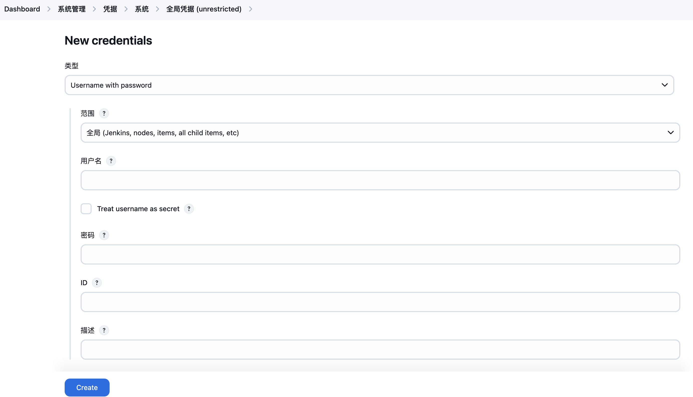
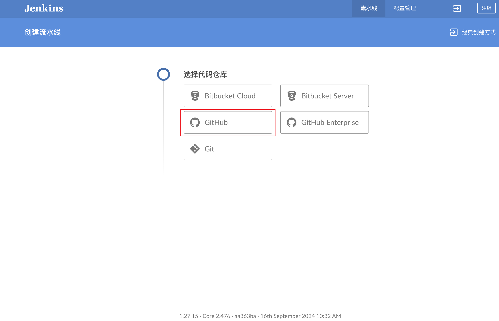

# CI/CD初体验

> Jenkins是流行的开源CI/CD服务器，以插件的方式实现扩展，其持续集成、持续部署能力，将开发者从繁琐的部署过程中解放出来。
>
> 本文介绍了基于Docker运行Jenkins容器实现CI/CD最佳实践，自动化部署解放生产力。
>
> 本文不对软件开发、发布流程与规范作详细探索，主要目标在于使用Jenkins实现开发者提交代码到GitHub，发布流程自动完成，重实践轻理论。

## 概述

此文档由介绍Jenkins简介开始，通过部署一个VitePress项目最佳实践，让读者感受并体验Jenkins的强大功能，并可以将Jenkins的CI/CD有效迁移到自己的项目中。

阅读此文档，你将收获：

1. 对Jenkins和CI/CD有一个更具体的认识
2. 学习基于Docker构建的Jenkins最佳实践
3. 部署基于VitePress的个人网站

本文适用于具备一定计算机基础和编程能力的软件开发工程师（前端&后端）、运维工程师、软件架构师以及项目管理，阅读本文章之前，需具备以下前置能力：

- Linux基础
- Docker容器
- Git：分布式开源版本管理工具
- GitHub（Gitee或Gitlab）：代码托管平台
- Web开发基础：了解nodejs和npm

## Jenkins简介

介绍Jenkins之前，首先对持续集成和持续部署进行简单介绍。

[持续集成，CI（Continuous Integration）](https://www.redhat.com/zh/topics/devops/what-is-ci-cd)：一种软件开发实践，旨在频繁地将开发人员的代码变更集成到共享的代码库中，并通过自动化的构建、测试和验证过程，确保软件的质量和稳定性。

[持续部署或持续部署，CD（Continuous Delivery | Continuous Deployment）](https://codilime.com/blog/what-is-ci-cd/)：CD由持续交付和持续部署两个阶段组成，持续交付将通过集成阶段的代码进行封装和制品，输出待发布版本和文档到仓库；持续部署从版本仓库中取出发布版本部署到开发、测试、预发布或生产环境。

从软件代码开发到部署，需要经历单元测试、集成测试、代码合并、质量审查、构建、部署等过程，该过程繁琐且需要频繁执行。CI/CD旨在将该过程流程化、自动化，有效缩短软件迭代周期，Jenkins是一款实现CI/CD的开源软件。

Jenkins由Java开发，支持多种构建风格，包括自由风格、流水线、多分支流水线，依靠强大且功能齐全的插件，整个各领域工具，使用可视化Web界面快速搭建CI/CD流水线，实现一次配置、重复执行。本文中的对软件发布的详细规范未做探讨，简单搭建一个CI/CD「草台班子」。

## 快速启动Jenkins实例

Docker的可移植性和资源隔离给开发工作带来了极大的便利。在个人电脑上进行开发实践，可以接近零成本移植到生产环境，无需繁琐的依赖安装。资源隔离保证我们宿主机环境的「干净整洁」，随用随删。

### 前置要求

为了进一步提高项目可移植性，本项目使用`docker-compose`构建容器配置。环境依赖：

- 操作系统：amd64 & Ubuntu22.04
- Docker：25.04
- Jenkins容器：jenkins/jenkins:lts-jdk17（长期支持版本）

### 快速启动

> 本实践项目docker-jenkins已发布在[GitHub](https://github.com/xiaolinstar/docker-jenkins)和[Gitee](https://gitee.com/xingxiaolin/docker-jerkins)仓库中。

克隆项目

从GitHub克隆

```bash
git clone https://github.com/xiaolinstar/docker-jenkins.git 
```

从Gitee克隆

```shell
git clone git@gitee.com:xingxiaolin/docker-jerkins.git
```

进入项目

```bash
cd docker-jenkins
```

检查挂载卷 ，本项目中`docker-compose.yaml`中的挂载卷值默认为：

```yaml
volumes:
  - '/usr/bin/docker:/usr/bin/docker'
  - '/var/run/docker.sock:/var/run/docker.sock'
  - './jenkins_home:/var/jenkins_home'
```

👀在Windows或macOS中下载Docker Desktop可能存在参数不一致，请自行检查并酌情修改

```yaml
# Macbook Pro M1pro 
# Docker Desktop
volumes:
  - '/usr/local/bin/docker:/usr/bin/docker'
  - '~/.docker/run/docker.sock:/var/run/docker.sock'
  - './jenkins_home:/var/jenkins_home'
```

启动容器

```bash
# 创建jenkins_home并在后台启动docker容器
mkdir jenkins_home && docker compose up -d 
```

检查容器状态

启动的Jenkins容器名默认为`xiaolin-jenkins`

```bash
docker ps
```

进入`xiaolin-jenkins`容器内部，查看`docker`命令

```bash
# 宿主机执行
docker exec -it xiaolin-jenkins /bin/sh
# 检查Jenkins容器内docker环境
docker info
```

查看到相应的输出则正常启动成功。

❗️xiaolin-jenkins容器内的docker环境与宿主机是相通的，共享同一个docker环境。因此在xiaolin-jenkins容器内创建的容器，在宿主机上也能查看到。

使用浏览器登录Jenkins服务网页，通过浏览器进入宿主机8080端口

- 云服务： ${IP}:8080
- 本地： http://localhost:8080

获取登录密钥，查看日志信息，获取一串密钥，用于Web端登录

```bash
docker logs xiaolin-jenkins
```

Jenkins以插件的方式支持功能扩展，目前已经有1000+插件，除了安装社区推荐的插件外，建议安装以下插件：

- Blue Ocean: BlueOcean Aggregator
- Docker Commons: Provides the common shared functionality for various Docker-related plugins
- Docker Compose Build Step: Docker Compose plugin for Jenkins

## 基于VitePress快速搭建个人网站

本项目详情内容已在另一篇文档发布：[VitePress快速搭建个人网站](vitepress-docs.md)

请完成之后再回到此文档。

## 基于Jenkins的CI/CD最佳实践

### 部署Jenkins，以「docker in docker」的方式

docker in docker部署Jenkins的好处：

- 易于扩展：依赖docker强大的镜像库，Jenkins可以构建任何依赖环境
- 易于维护：Jenkins容器可以备轻松地更新和维护，借助挂在卷`jenkins_home`方便环境保存

> 使用docker-compose快速构建Jenkins容器

创建文件夹用于保存Jenkins项目相关文件，并进入该文件夹

```shell
mkdir docker-jenkins && cd docker-jenkins
```

创建`docker-compose.yaml

```yaml
networks:
  jenkins-network:
    external: false

services:
  docker-jenkins:
    image: jenkins/jenkins:lts-jdk21
    user: root
    container_name: xiaolin-jenkins
    ports:
      - '8080:8080'
      - '50000:50000'
    networks:
      - jenkins-network
    privileged: true
    volumes:
      - '/usr/bin/docker:/usr/bin/docker'
      - '/var/run/docker.sock:/var/run/docker.sock'
      - './jenkins_home:/var/jenkins_home'
    # 设置上海时区
    environment:
      TZ: Asia/Shanghai

```

上述`docker-compose.yaml`中的挂载卷值默认为：

```yaml
volumes:
  - '/usr/bin/docker:/usr/bin/docker'
  - '/var/run/docker.sock:/var/run/docker.sock'
  - './jenkins_home:/var/jenkins_home'
```

在Windows或macOS中下载Docker Desktop可能存在参数不一致，请自行检查并酌情修改

```yaml
# Macbook Pro M1pro 
# Docker Desktop
volumes:
  - '/usr/local/bin/docker:/usr/bin/docker'
  - '~/.docker/run/docker.sock:/var/run/docker.sock'
  - './jenkins_home:/var/jenkins_home'
```

启动容器

```bash
# 创建jenkins_home并在后台启动docker容器
mkdir jenkins_home && docker compose up -d 
```

检查容器状态

启动的Jenkins容器名默认为`xiaolin-jenkins`

```bash
docker ps
```

进入`xiaolin-jenkins`容器内部，查看`docker`命令

```bash
# 宿主机执行
docker exec -it xiaolin-jenkins /bin/sh
# 检查Jenkins容器内docker环境
docker info
```

查看到相应的输出则正常启动成功。

xiaolin-jenkins容器内的docker环境与宿主机是相通的，共享同一个docker环境。因此在xiaolin-jenkins容器内创建的容器，在宿主机上也能查看到。

### Jenkins基本配置

通过浏览器进入宿主机8080端口

- 云服务： ${IP}:8080
- 本地： http://localhost:8080

获取登录密钥，查看日志信息，获取一串密钥，用于Web端登录

```bash
docker logs xiaolin-jenkins
```

安装插件路径：Dashboard-系统管理-插件管理-Available Plugins

Jenkins以插件的方式支持功能扩展，目前已经有1000+插件，除了安装社区推荐的插件外，建议安装以下插件：

- Blue Ocean: BlueOcean Aggregator
- Docker Commons: Provides the common shared functionality for various Docker-related plugins
- Docker Compose Build Step: Docker Compose plugin for Jenkins

### 在Jenkins中配置VitePress个人网站

在项目根目录下创建Jenkins脚本，命名为`Jenkinsfile`：使用docker构建项目镜像，并以容器的方式运行。
请根据个人偏好定义镜像名、版本号等。

```
pipeline {
    agent any

    environment {
        // 定义环境变量，例如 Docker 镜像仓库的 URL
        DOCKER_REGISTRY = 'xxl1997/xiaolin-docs'
        VERSION = '0.0.1'
        CONTAINER_NAME = 'xiaolin-website'
    }

    stages {
        stage('Checkout') {
            steps {
                // 检出代码
                checkout scm
            }
        }

        stage('Test') {
            steps {
                sh 'echo 项目测试'
            }
        }
        stage('Cleanup') {
            steps {
                script {
                    // 停止容器
                    sh "docker stop ${CONTAINER_NAME} || true"
                    // 删除容器
                    sh "docker rm ${CONTAINER_NAME} || true"
                    // 删除docker镜像
                    sh "docker rmi ${DOCKER_REGISTRY}:${VERSION} || true"
                }
            }
        }

        stage('Build') {
            steps {
                // 构建 Docker 镜像
                sh "docker build -t ${DOCKER_REGISTRY}:${VERSION} ."
            }
        }

        stage('Deploy') {
            // https://www.jenkins.io/zh/doc/book/pipeline/jenkinsfile/
            when {
                expression {
                    currentBuild.result == null || currentBuild.result == 'SUCCESS'
                }
            }
            steps {
                // 部署到服务器
                sh "docker run -d --name ${CONTAINER_NAME} -p 80:8080 ${DOCKER_REGISTRY}:${VERSION}"
            }
        }
    }

    post {
        success {
            // 构建成功
            echo 'Build and deployment succeeded.'
        }
        failure {
            // 构建失败
            echo 'Build or deployment failed.'
        }
    }
}
```

配置全局凭据：**请使用GitHub账户密码**



在Blue Ocean界面中创建流水线，根据提示选择代码仓库，完成项目导入。



设置完成后，GitHub项目添加完成，BlueOcean中默认配置了GitHub Webhook，每一次提交代码到GitHub仓库，就会触发项目构建和编译。


## 项目维护

VitePress将`Markdown`编程优雅的文档，用户通过增删改文档的方式对网站进行维护。优点是方便编辑、方便更改，可以根据自己的偏好轻松变更网站的结构、视图等。缺点是，编写文档、变更网站配置如同在写代码，需要一定的计算机知识门槛。

Jenkins使得项目更新变得非常轻松，在本地更新文档后，推送到GitHub，站点就会自动构建并发布，没有任何额外的工作负担。


## 参考

1. 持续集成，https://www.redhat.com/zh/topics/devops/what-is-ci-cd
2. 持续交付和持续部署，https://codilime.com/blog/what-is-ci-cd/
3. 在流水线中使用Docker，https://www.jenkins.io/zh/doc/book/pipeline/docker/
4. VitePress官方网站，https://vitepress.dev/zh/
5. 使用Jenkinsfile，https://www.jenkins.io/zh/doc/book/pipeline/jenkinsfile/

## 联系作者

如果您有需要技术咨询，或者有想法使本文档变得更好。

联系作者：xing.xiaolin@foxmail.com
