# Thunderbird解放收件箱

> 遇见Thunderbird：一个给你充分自由的邮件、日历和联系人管理应用。

邮箱轻度用户在Web网页使用账户/密码（或手机号/验证码）登录邮箱，包括QQ邮箱、139邮箱、网易邮箱等。如果邮箱连接保持时间较短，那频繁登录邮箱的动作可能令人厌烦。此外，用户往往不止一个邮箱，在不同邮箱之间切换也着实让人心累。如果你觉得邮箱特别不好用，那可能是打开方式不对，你需要「邮箱客户端」。

在个人PC上下载邮箱客户端，使用imap协议邮箱绑定有效解决上述问题。

即使在断网条件下，也可以编辑、浏览邮件。支持实时提醒、手机短信绑定，使您避免错过重要邮件。邮箱客户端提供统一平台，可以将你的QQ邮箱、公司邮箱、学校邮箱整合起来，实现一站式管理。

当今市面上比较流行的邮箱客户端有：微软的Outlook、腾讯的FoxMail，本文推荐一个更好用的邮箱客户端Thunderbird。

*本文档流程截图以MacOS版本作为演示。*

## 快速浏览

### 优雅外观、清爽简洁

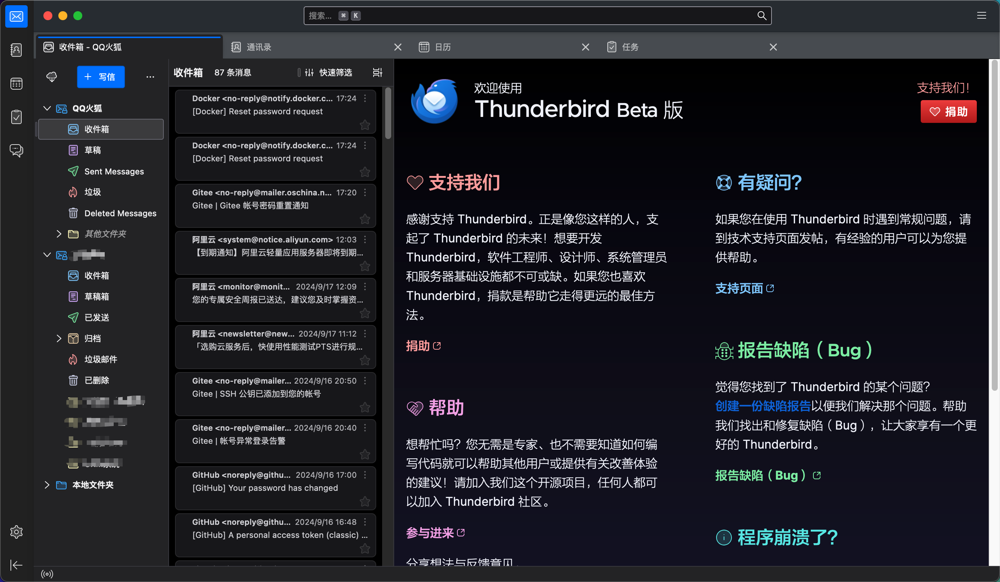
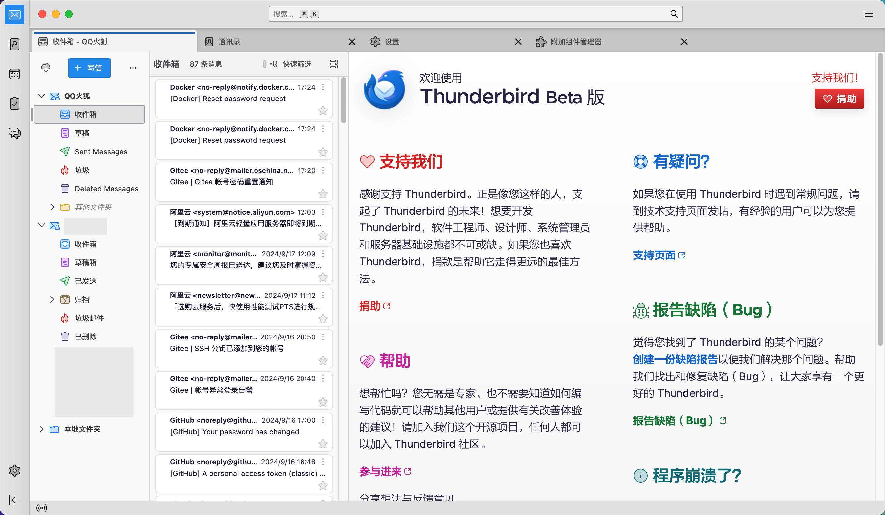

### 全平台支持

支持主流操作系统，让你在不同平台也能畅快切换：

- Windows
- MacOS
- Linux

### 开源免费，长期维护

Thunderbird由用户自愿捐助，无需收费。人人都可以是项目贡献者，任何需求和改进都可以反馈到官方。「持续更新」保证了Thunderbird长久生命力。

### 隐私安全

不会收集个人信息，不会在邮箱中插入广告，也不会盗用隐私对话内容。如果你注重个人隐私，推荐使用Thunderbird。

### 插件扩展

Thunderbird已经足以满足用户的绝大多数需求，像Chrome浏览器一样，它支持插件扩展，功能更加丰富。
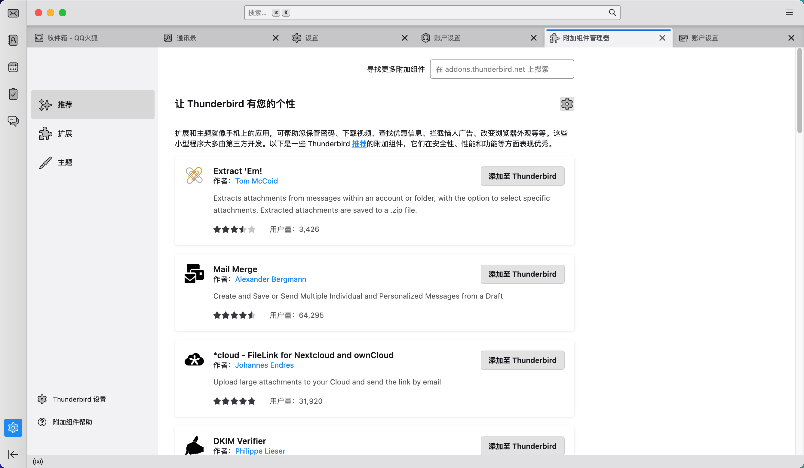

## 马上开始

### 下载安装

无需「科学上网」，可直接在[官网](https://www.thunderbird.net/zh-CN/thunderbird/all/)下载，根据操作安装指引完成。

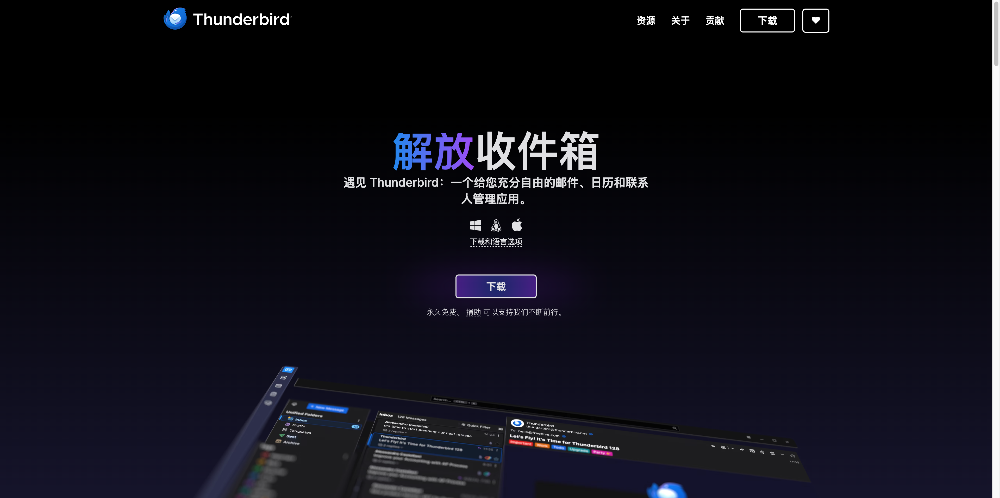

### 邮箱配置

> 只需要动手做，你可以完全不了解邮箱协议。

推荐使用imap协议：邮箱客户端支持**imap**和pop3，它们的主要区别是pop3仅支持单向电子邮件同步，仅允许用户将电子邮件从服务器下载到客户端。

绑定邮箱客户端步骤：

1. Web登录邮箱，获取imap/pop3授权码；
2. Thunderbird客户端配置。

邮箱授权码获取一般在「设置」中寻找，具体位置不尽相同，以下展示了一些主流邮箱获取授权码方式。

#### 获取Imap/Pop3授权码

**QQ邮箱**
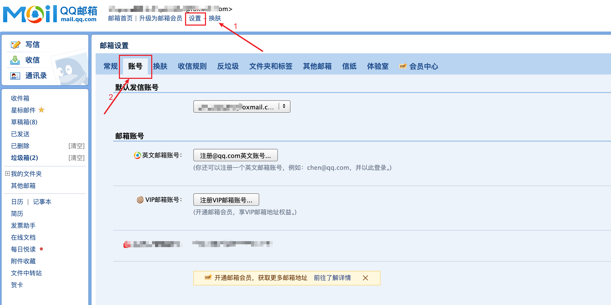
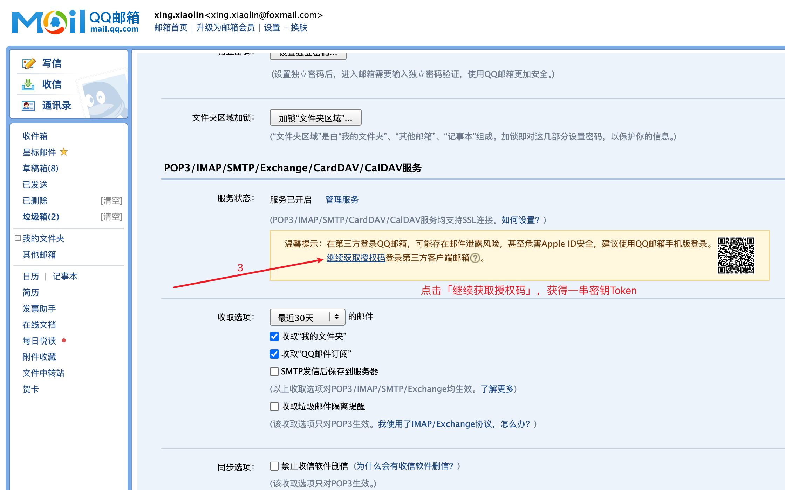

**139邮箱**
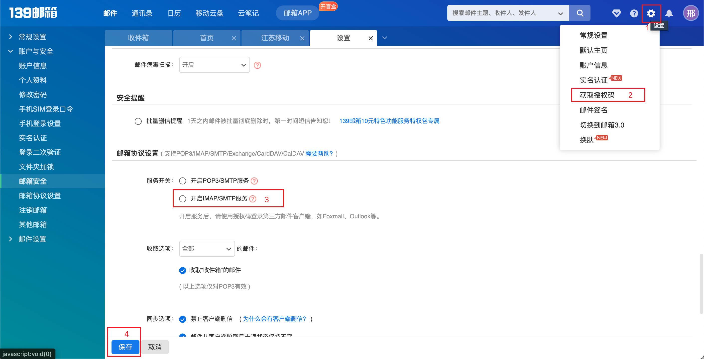

**中国移动邮箱**
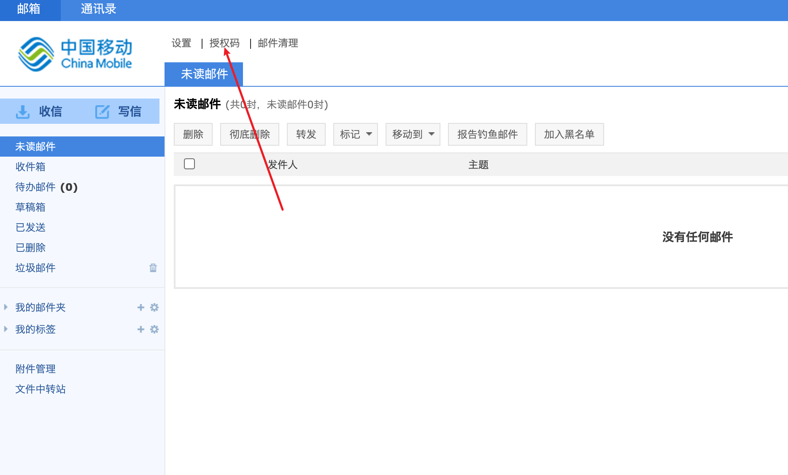

#### 绑定Thunderbird邮箱

Thunderbird无需手动协议，输入授权码则可自动协议匹配👍
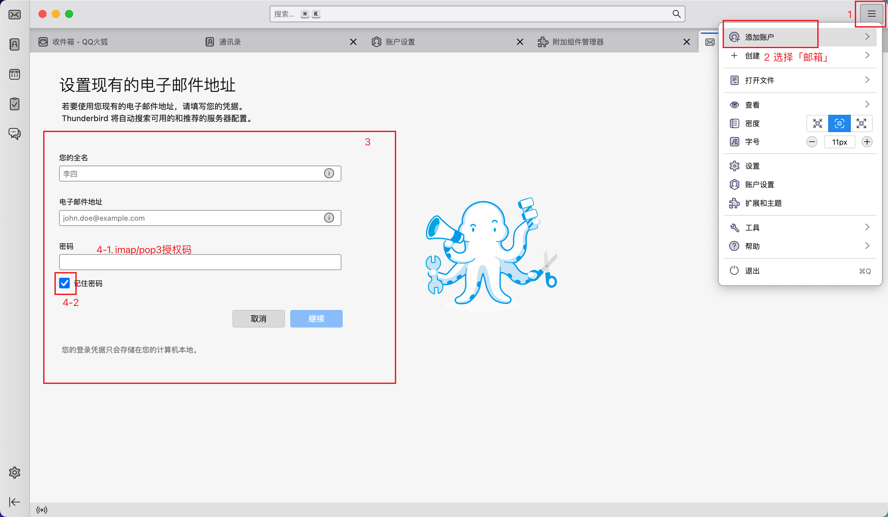

## 最佳实践

本章节介绍Thunderbird基本使用，助您快速上手提高生产力。

### 通信录

可以在通信录中区分邮箱联系人，你无需手动添加，在邮件中点击邮箱账户快速添加和编辑。
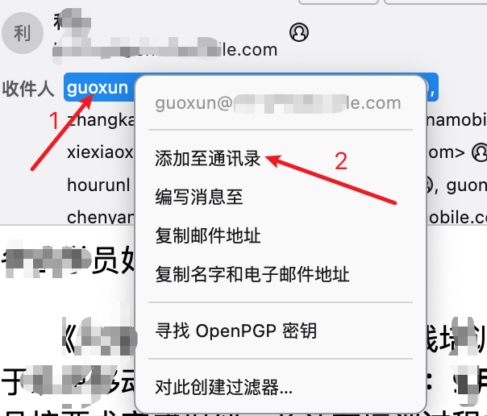

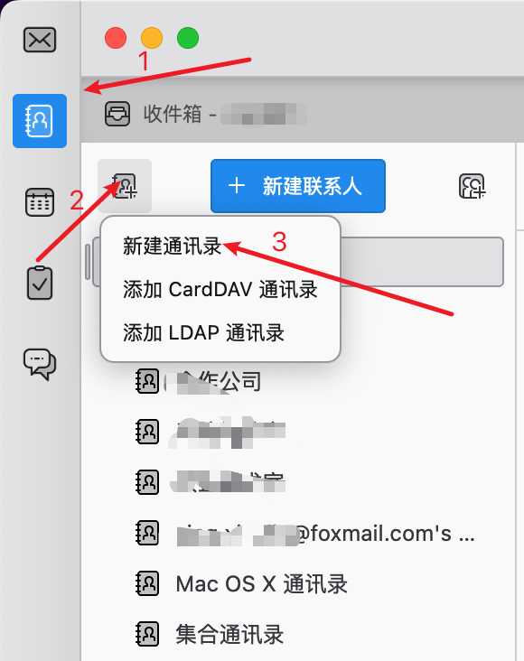

在发送邮件时，也无需可以从通信录中选择「收件人」和「抄送人」，Thunderbird客户端支持关键字匹配，自动弹出通信录中匹配的用户。
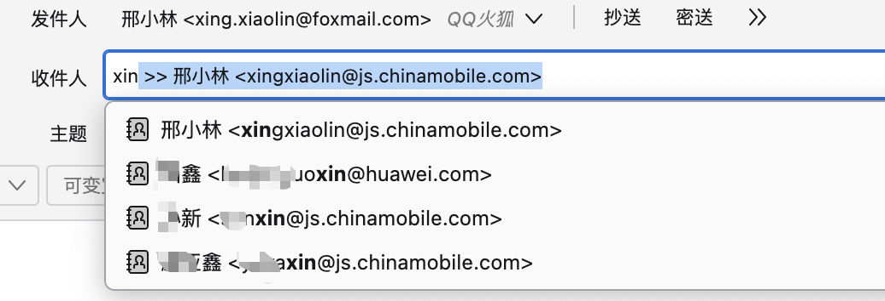

### 签名

在发送邮箱时，附带介绍个人信息的专属签名，可以提升你邮箱的商务属性。在Thunderbird中「一劳永逸」设置自己的专属签名。
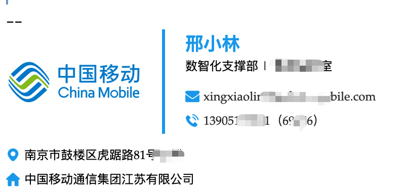

配置签名，包含以下步骤：

1. 定义签名模板（HTML格式）
2. 邮箱签名配置

#### 邮箱签名模板

推荐一个邮箱模板生成器[标小智](https://www.logosc.cn/email-signature-generator#templates)，根据自己的偏好设计专属签名模板。


根据网站提示定义模板，生成签名HTML文件，可以使用「文本编辑器」打开，并全选复制。


#### 设置模板

签名模板是以邮箱为单位的，QQ邮箱和网易邮箱（个人邮箱和上午邮箱）可以设置不同的模板。

右键点击想要设置签名的邮箱：
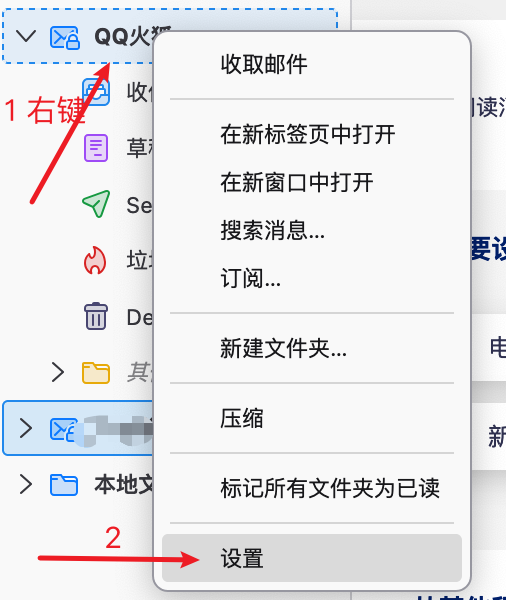

选择「签名文字」，勾选「使用HTML」，将上一步骤生成的HTML粘贴到编辑框内，无需保存自动生效。
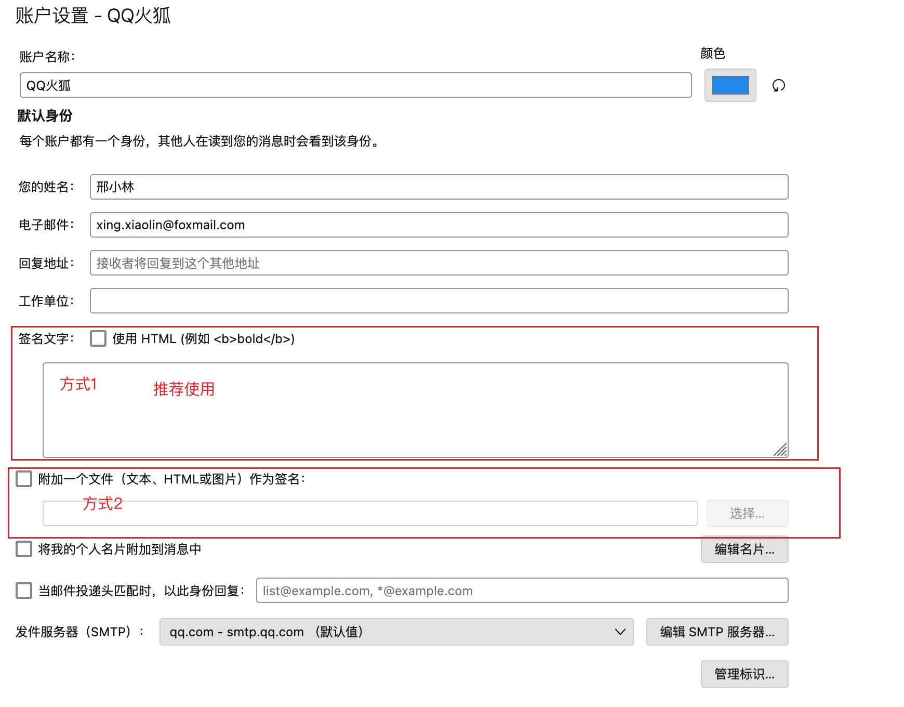

新建邮件时，会自动在邮件末尾生成个人专属签名。

**中国移动模版示例**
```html
<html>
 <head></head>
 <body>
  <table border="0" cellpadding="0" cellspacing="0" style="font-family:Palatino;font-size:16px;margin-left:0;margin-right:auto;width:440px" width="100%">
   <tbody>
    <tr>
     <td>
      <div>
       <table border="0" cellpadding="0" cellspacing="0" style="margin-bottom:10px;margin-left:0;margin-right:auto;width:auto" width="100%">
        <tbody>
         <tr>
          <td style="padding-right:20px;border-right:3px solid #1aa1ed"></td>
          <td style="padding-left:20px"><h3 style="font-size:1.125em;font-weight:700;line-height:1.75;margin:0;color:#1aa1ed">张三</h3><p style="font-size:.75em;line-height:1;margin:0 0 12px">人力资源部（党委组织部） | 培训中心</p><p style="font-size:.75em;line-height:2;margin:0"><a href="mailto:xingxiaolin@js.chinamobile.com" style="color:#333;text-decoration:none">xingxiaolin@js.chinamobile.com</a></p><p style="font-size:.75em;line-height:2;margin:0"><a href="tel:139xxxxxxxx（69xxx）" style="color:#333;text-decoration:none">13905187151（69656）</a></p></td>
         </tr>
        </tbody>
       </table>
       <div>
        <p style="font-size:.75em;line-height:2;margin:0">南京市鼓楼区虎踞路81号x楼</p>
       </div>
       <table border="0" cellpadding="0" cellspacing="0" style="margin-left:0;margin-right:auto;width:auto" width="100%">
        <tbody>
         <tr>
          <td style="padding-right:26px"><p style="font-size:.75em;line-height:2;margin:0">中国移动通信集团江苏有限公司</p></td>
         </tr>
        </tbody>
       </table>
      </div></td>
    </tr>
   </tbody>
  </table>
 </body>
</html>

```

## 参考
- [ ] 填写参考链接

## 联系作者

如果您有需要技术咨询，或者有想法使本文档变得更好。

联系作者：xing.xiaolin@foxmail.com
