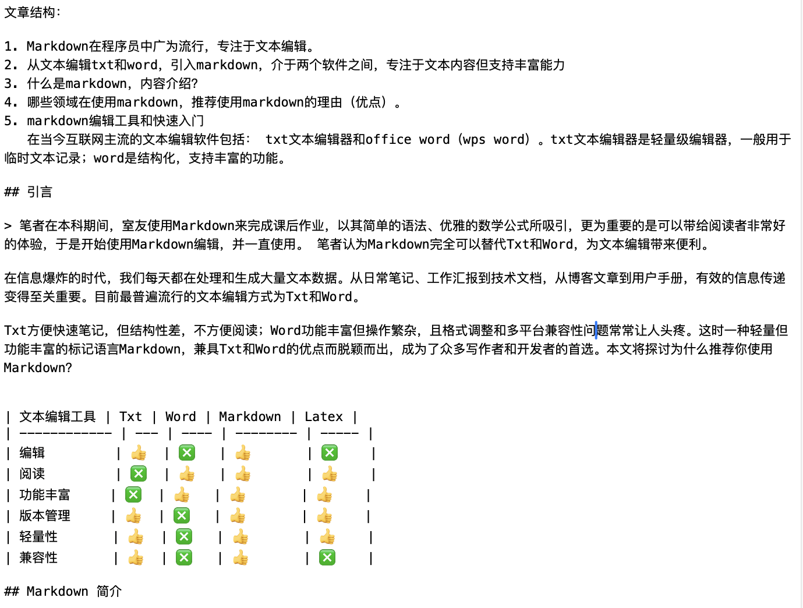

# 易读易写Markdown

## 引言

> 笔者在本科期间，室友使用Markdown来完成课后作业，以其简单的语法、优雅的数学公式所吸引，更为重要的是可以带给阅读者非常好的体验，于是开始使用Markdown编辑，并一直使用。 笔者认为Markdown完全可以替代Txt和Word，为文本编辑带来便利。

在信息爆炸的时代，我们每天都在处理和生成大量文本数据。从日常笔记、工作汇报到技术文档，从博客文章到用户手册，有效的信息传递变得至关重要。目前最普遍流行的文本编辑方式为Txt和Word。

Txt方便快速笔记，但结构性差，不方便阅读；Word功能丰富但操作繁杂，且格式调整和多平台兼容性问题常常让人头疼。这时一种轻量但功能丰富的标记语言Markdown，兼具Txt和Word的优点而脱颖而出，成为了众多写作者和开发者的首选。本文将探讨为什么推荐你使用Markdown？


| 文本编辑工具 | Txt | Word   | Markdown | Latex |
| ------------ | --- | ------ | -------- | ----- |
| 编辑         | 👍  | ❎     | 👍       | ❎    |
| 阅读         | ❎  | 👍     | 👍       | 👍    |
| 功能丰富     | ❎  | 👍     | 👍       | 👍    |
| 版本管理     | 👍  | ❎     | 👍       | 👍    |
| 轻量性       | 👍  | ❎     | 👍       | 👍    |
| 兼容性       | 👍  | ❎     | 👍       | ❎    |
| 用户基础     | 👍  | 👍👍👍 | 👍       | ❎    |

## Markdown 简介

Markdown 由约翰·格鲁伯（John Gruber）和亚伦·斯沃茨（Aaron Swartz）共同创建，它首次在2004年发布。Markdown的设计目标是实现文档「易读易写」，快速创建并编辑文档，减少格式化工作，专注于内容创造。自2004年发布以来，Markdown 迅速获得了技术写作社区的青睐。它的简洁性和易用性使得它成为编写文档、博客和笔记的首选格式。

在程序员和科研工作者中，Markdown受到了广泛的欢迎和应用。此外，Markdown 被广泛用于各种在线平台，如飞书文档、钉钉文档、腾讯文档、GitHub、Stack Overflow等。Markdown的流行也催生了许多静态站点生成器，如Jekyll、Hugo、Hexo和VitePress，它们允许用户使用Markdown编写文档，并生成静态网站。

Markdown的基础功能非常简单：以`#`开头作为段落，其数量表示层次级别，无需关注字体、段落、对齐方式在Word中让人困扰的问题，你可以由此开启Markdown编辑方式。

```markdown
# 一级标题
## 二级标题
### 三级标题
*字体加粗*
=字体高亮=
$段内数学公式$
$$段落数学公式$$
> 引用
[超链接](https://baidu.com/)
```


## 推荐使用Markdown

Markdown，作为一种轻量级的标记语言，已经成为现代文本编辑和内容创作的宠儿。它以易读、易写、易扩展和功能丰富三大优点赢得了广泛的用户基础。

首先，Markdown的视觉体验简洁直观，阅读和理解几乎不需要任何学习曲线。它的文本文件即使在没有格式转换的情况下也能保持清晰和可读，这对于快速浏览和编辑文档来说是一个巨大的优势。

Markdown的易写性体现在它的语法简单，无需复杂的操作即可添加标题、列表、链接和格式化文本，即使是新手也能在5分钟内快速上手。

Markdown的简单性使得用户快速上手，但这并不意味着Markdown功能简单，Markdown支持非常丰富的功能，如常用的图片插入、目录生成、链接引用、字体高亮、数学公式、代码块等。

易扩展性是Markdown的另一个显著特点。Markdown是结构化语言，方便git进行版本追踪，编程语言如Python、Java、JavaScript也可以方便读取其结构，很轻松地进行格式转换，如Markdown转PDF、Markdown转Word、Markdown转智能图形、Markdown转知识树等，支持各种插件和扩展以增强其功能。它适应场景广泛，从技术文档到学术论文，Markdown都能轻松应对。此外，随着大模型时代的到来，Markdown成为一种「标准格式」。

**Markdown功能快浏：**

---

编程语言代码块：

Java HelloWorld

```java
// 支持代码注释，
// 支持几乎所有编程语言的语法高亮
public class HelloWorld {
    public static void main(String[] args) {
        // Prints "Hello, World" in the terminal window.
        System.out.println("Hello, World");
    }
}
```

---

编辑Mermaid时序图：


---

Latex数学公式：

段内数学公式：$y = 2^x \cdot f(x)$

段落数学公式：

$$
\bar{s}_N \triangleq \frac{N p}{\mathbb{E}\left\{T_{\text {end }}\right\}}=\frac{\mathbb{E}\left\{\sum_{k=1}^{K_N} \sum_{m=1}^M a_m\left(t_k\right) p\right\}}{\mathbb{E}\left\{T_{\text {end }}\right\}}
$$

---

任务待办标签：

* [X]  周三前完成财务报账
* [ ]  开组会，制定本周内的工作安排
* [ ]  上周故障分析汇报

---

可阅读性好：
即使没有Markdown编辑器，纯文本方式打开也**无障碍阅读**
以源代码方式编辑轻松**复制**、**粘贴**。



综上所述，Markdown的易读、易写、易扩展和功能丰富这三大优点，使其成为了编写和分享文本内容的理想选择。

### 易读

> 您正在阅读的本篇文档，使用Markdown编辑

Markdown的易读主要体现在三点，一是结构清晰，二是视觉简洁，三是兼容性强。

文章层次分明，一级标题、二级标题、三级标题等配合目录，即使在页数非常多的文档中，也可以快速跳转和按需阅读。

分级标题是Markdown最基本的语法，所有的Markdown文本都是具有清晰的标题结构，Markdown转化为pdf或word后，支持段落结构。此外，图片、代码块、数学公式、表格也非常优雅，阅读体验非常好。

插入表格：


| A | B | C | D | E |
| - | - | - | - | - |
| a | b | c | d | e |
| 1 | 2 | 3 | 4 | 5 |

Markdown需要专门的编辑器进行格式渲染，然而本质上仍然是文本文件，无格式渲染情况下也可以轻松阅读。此外，使用Word时遇到的版本和兼容性问题，Markdown不会遇到。

### 易写

Markdown的设计哲学是让文本编辑回归简单，减少干扰。

Markdown的易写性主要体现在其**简洁直观的语法设计**上，即使是初学者也能迅速掌握并开始撰写文档。它的语法简单，如使用星号(*)表示斜体，双星号(**)表示粗体，井号(#)表示标题。

相对于Word繁杂的段落、字体、间距、标签、布局等选项和功能，使用Markdown编辑时不需要纠结这些，Markdown让作者能够**专注于内容**而非格式。

Markdown文件的**纯文本格式**确保了在任何文本编辑器中的兼容性，无需特定软件即可编辑，提高了写作的灵活性。与Txt一样，Markdown轻量，轻松支持[Git](https://git-scm.com/)版本跟踪。

此外，Markdown鼓励作者以键盘操作为主，支持撤销和重做等基本编辑功能，使得写作过程更加高效。它的多平台支持特性，让用户可以在不同的操作系统和设备上进行写作，不受环境限制。许多Markdown编辑器还提供了即时预览功能，让作者在编写的同时就能看到格式化后的内容，这不仅提高了写作的准确性，也增强了写作的愉悦感。

### 易扩展&功能丰富

Markdown作为轻量级的标记语言，很容易实现编程扩展，如：

[markmap](https://markmap.js.org/) Markdown和思维导图之间轻松转换。

<div style="text-align: center;">
  
</div>

[aippt](https://www.aippt.cn) 基于Markdown文本大纲格式快速生成PPT

<div style="text-align: center;">
  
</div>

[mermaid](https://mermaid.nodejs.cn/) 基于JavaScript的图标工具，支持流程图、时序图、类图、状态图、实体关系图、甘特图等


[VitePress](https://vitepress.dev/) 使用Markdown快速创建优雅的文档，本网站由**VitePress**搭建。

## 马上使用

### 在线体验

无需任何下载和安装，用户可以在Web网页在线编辑Markdown，并实时渲染

[Arya-在线Markdown编辑器](https://markdown.lovejade.cn/)

[Editor.md 开源在线Markdown编辑器](https://pandao.github.io/editor.md/)

[在线工具-Markdown编辑器](https://tool.lu/markdown/)

[Markdown中文官网编辑器](https://markdown.com.cn/editor/)

[字节跳动协同办公软件-飞书文档](https://www.feishu.cn/product/docs)

### Markdown编辑器

下载本地Markdown编辑器，主题优雅，支持多种文档导出方式，带来更舒适的体验。对于新手，笔者更推荐`Notable`，使用源代码格式编辑，轻松学习Markdown语法

[MarkText](https://www.marktext.cc/) 简单且优雅的Markdown编辑器，聚焦于速度和可用性

[Notable](https://notable.app/) 支持分屏编辑，更适合新手。

[Typora 收费软件](https://typoraio.cn/) 一款Markdown编辑器和阅读器，现已收费，不推荐新手。

## Markdown快速学习

分享Markdown学习和快速入门网站，本文不作详细语法介绍。
快速上手，推荐从分屏编辑模板开始：[快速开始](https://markdown.lovejade.cn/)

[Markdown官方教程](https://markdown.com.cn/)：域名契合，自称为**官方教程**

[Markdown菜鸟教程](https://www.runoob.com/markdown/md-tutorial.html)：知名程序员百宝箱网站

[Markdown Guide](https://www.markdownguide.org/getting-started/)：国外的Markdown指引网站

## 参考

[1]   https://markmap.js.org/
[2]   https://git-scm.com/
[3]   https://www.aippt.cn
[4]   https://mermaid.nodejs.cn/
[5]   https://vitepress.dev/
[6]   https://markdown.lovejade.cn/
[7]   https://pandao.github.io/editor.md/
[8]   https://tool.lu/markdown/
[9]   https://markdown.com.cn/editor/
[10]  https://www.feishu.cn/product/docs
[11]  https://www.marktext.cc/
[12]  https://notable.app/
[13]  https://typoraio.cn/
[14]  https://markdown.com.cn/
[15]  https://www.runoob.com/markdown/md-tutorial.html
[16]  https://www.markdownguide.org/getting-started/
