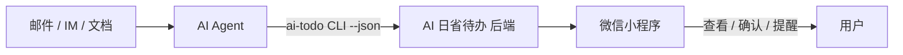

# AI 日省待办：为什么我不在小程序里做 AI 对话框

打开「AI 日省待办」微信小程序，你会发现一件反直觉的事：**没有 AI 对话框，也没有「帮我记一下」的自然语言输入框。**

这不是遗漏，而是刻意设计。本文说明背后的产品判断，以及 Agent、CLI 与小程序各自该做什么。

## 常见误解：AI 原生 = 聊天框

2025 年之后，许多产品把「接入大模型」等同于「加一个聊天入口」。待办 App 里塞对话框、日历里塞 Copilot、笔记里塞 Ask AI——用户似乎默认：**没有聊天框，就不算 AI 产品。**

我不同意这个等式。

**AI 原生**指的是：系统能被 AI Agent **稳定调用、组合与审计**，而不是界面里必须有一个对话框。自然语言理解发生在离用户最近的 Agent 层（Claude Code、OpenClaw、Cursor 等）；个人事务数据层只需要提供 **确定性的结构化接口**。

如果把 NLU（自然语言理解）也塞进待办小程序，会带来三类问题：

1. **重复建设**：每个 App 各做一套解析，质量参差，还抢 Agent 的上下文。
2. **行为不可审计**：「AI 帮我记了」往往变成黑盒，难以回放是谁、何时、写了什么。
3. **边界模糊**：用户分不清是 Agent 在编排，还是 App 内置模型在猜——出错时无处归因。

因此，AI 日省待办 **明确不做** 小程序内置 AI 聊天、不做自然语言解析。未来也不打算做。

## 痛点：Agent 能说话，待办没地方落库

如果你已经在用 AI 办公，大概经历过这个链条：

```text
领导发邮件 → 你复制给 Claude → 它总结行动项 → 然后呢？
```

「然后呢」往往卡在：

- 粘贴进系统提醒？字段不全，没有联系人上下文。
- 粘贴进飞书待办？客户端重，Agent 调 API 成本高。
- 记在笔记里？没有 DDL 提醒，更无法被脚本 idempotent 写入。

Agent **擅长理解**，但个人事务需要 **可靠存储 + 可重复调用 + 微信触达**。中间缺一层「个人事务数据层」——这就是 AI 日省待办要补的位置。

## 方案：三角分工



| 角色 | 职责 | 入口 |
|------|------|------|
| **Agent** | 理解自然语言、读外部上下文、决定创建提醒还是日历 | Claude Code、OpenClaw、Cursor + Skill |
| **CLI** | 认证、参数格式、`--json` 输出，供 Agent 稳定调用 | `npm i -g @xiaolinstar/ai-todo-cli` |
| **小程序** | 确定性 UI：列表、编辑、完成、微信订阅提醒授权 | 微信搜索 **AI 日省待办** |

**小程序是「确认面板」，不是「第二大脑」。** Agent 负责想，数据层负责记，人负责最后拍板。

## 一条完整链路

场景：领导邮件里写「周五前把 Q2 报销单提交给财务」。

1. Agent 读取邮件，识别行动项与截止时间。
2. Agent 调用 CLI（示意）：

```bash
ai-todo reminder create \
  --title "提交 Q2 报销单给财务" \
  --due "2026-07-04T18:00:00+08:00" \
  --source email \
  --external-id "<message-id>" \
  --json
```

3. 后端写入结构化提醒；用户在小程序看到新事项。
4. 用户在小程序勾选完成，或开启微信订阅提醒。

同一条 `external-id` 可幂等更新——邮件线程后续回复时，Agent 先 `reminder find` 再 update，避免重复待办。

这条链路里，**没有一步发生在小程序的聊天框里**；但用户体验是完整的：该记的记了，该提醒的提醒了，该确认的能在微信里看到。

## 与「带 AI 的待办 App」有何不同

| 维度 | 常见 AI 待办 | AI 日省待办 |
|------|--------------|-------------|
| 自然语言入口 | App 内对话框 | Agent（外部） |
| Agent 集成 | 弱或无公开 CLI | `--json` CLI + Skill |
| 数据审计 | 难追溯 | 结构化字段 + source / external-id |
| 产品边界 | 易膨胀成「全能助手」 | 只做提醒、日历、联系人 |
| 触达 | 依赖 App 推送 | 微信订阅消息 + 小程序 |

我不是反对 App 内 AI——而是认为 **个人开发者、AI 工具深度用户** 更需要的是可脚本化、可组合的数据层，而不是第九个聊天窗口。

## 人用小程序，仍然重要

不做 AI 对话框，不等于小程序不重要。

人类需要：

- **扫一眼今天有什么事**（`today` 的图形化视图）；
- **轻量修正** Agent 写错的标题或时间；
- **完成闭环**（勾选 `done`）；
- **授权微信提醒**（CLI 创建默认不开启订阅消息，需在小程序编辑页打开）。

Agent 再强，最后一步往往仍是人确认。小程序承担的就是这种 **低认知负担的确定性交互**。

## 适用谁，不适用谁

**适合：**

- 已在用 Claude Code、OpenClaw、Cursor 等，希望 Agent 管理个人事务；
- 需要 CLI / JSON、可 idempotent 写入自动化脚本；
- 想要轻量提醒 + 日历 + 联系人，不要重型项目管理。

**不适合：**

- 只想在一个 App 里和 AI 聊天记待办、不想碰 Agent；
- 需要团队协作看板、OKR、复杂项目排期。

如果属于后者，飞书、Notion、Things 等可能更合适。AI 日省待办刻意保持小。

## 总结

**AI 日省待办不在小程序里做 AI 对话框**，是因为：

1. 自然语言理解应交给离上下文最近的 Agent，而非每个垂直 App 各做一遍；
2. 个人事务层需要结构化、可审计、可被 Agent 调用的接口；
3. 小程序专注查看、确认与微信触达，才是人机协作里稳定的一环。

AI 原生 ≠ 到处聊天；AI 原生 = **Agent 能可靠地读写你的待办数据**。

---

## 下一步

- 想快速试用：微信搜索 **AI 日省待办**，创建第一条提醒
- 开发者：`npm install -g @xiaolinstar/ai-todo-cli`，见 [快速上手](./quick-start.md)
- Agent 集成：见 [Agent 接入](./agent.md)
- 产品全貌：见 [产品介绍](./product.md)
