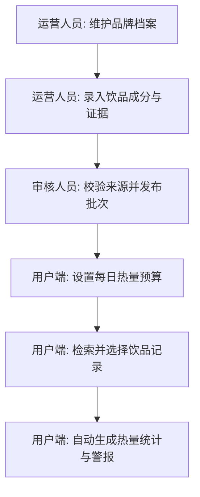

本指南将引导您快速掌握「奶茶仙人」的业务使用流，并帮助开发者搭建本地多端开发环境。

---

## 业务使用流

「奶茶仙人」系统的典型使用流程分为**运营初始化**与**用户日常打卡**两个阶段：



1. **信息维护**：运营人员在后台添加品牌菜单并录入饮品营养参数，附带数据来源。
2. **数据上线**：审核人员校对凭证后将饮品标记为 `verified` 并上线，此时用户侧可见。
3. **初始设置**：用户首次打开小程序，在「设置」中输入每日健康目标，设定热量预算。
4. **添加记录**：用户购买奶茶时，在产品列表中点击对应产品进行记录。
5. **看板反馈**：系统在首页累加摄入值，更新 ABCD 营养报告，预算超限时触发提醒。

---

## 开发环境搭建

项目采用 `pnpm workspaces` 组织的多包单仓 (Monorepo) 结构。

### 1. 安装项目依赖

在项目根目录（`drink-budget/`）下执行依赖安装，VitePress、微信小程序、Vue 3 和 FastAPI 后端所需的 Node 工具链将被自动配置：

```bash
# 安装 monorepo 工作区内所有子项目的依赖
pnpm install
```

### 2. 运行本地验证

本地开发时，可以通过以下指令随时运行单元测试与严格类型检查：

```bash
# 运行共享包的单元测试（基于 Vitest）
pnpm test

# 运行全项目 TypeScript 类型检查
pnpm typecheck
```

### 3. 微信小程序开发 (移动端)

微信小程序是当前优先交付和迭代的主终端。

1. **依赖准备**：
   ```bash
   cd apps/miniapp
   pnpm install
   ```
2. **工具导入**：
   - 打开**微信开发者工具**。
   - 选择导入项目，目录选中 `apps/miniapp`。
3. **私有配置覆盖**：
   - 团队共用 `project.config.json`，其中 `appid` 被设置为占位字符。
   - 开发者本地可自行创建 `project.private.config.json` 来填入真实的个人 AppID，此文件已被 `.gitignore` 排除，不会被提交。

### 4. H5 Web 开发

Web 端作为备用及管理预览端，使用 Vue 3 进行开发：

```bash
cd apps/web
pnpm install
pnpm dev
```

---

## 本地代码质量门禁 (Git Hooks)

项目使用 Husky 配置了严密的本地代码检查门禁，防止低质量或不安全的代码被推送到云端。

- **`pre-commit`（提交前门禁）**：
  - 自动触发 **Gitleaks** 工具，扫描暂存区中的代码，防止 API 密钥或云存储 Token 泄露。
  - 执行微信小程序私有配置文件校验，确保敏感账号不越界。
- **`commit-msg`（规范校验）**：
  - 使用 **commitlint** 检验 Git 提交信息。您的提交前缀必须符合约定式提交规范（例如：`feat(miniapp): add nutrition grade tag` 或 `fix(api): repair sqlite connection`）。
- **`pre-push`（推送前门禁）**：
  - 自动执行 `pnpm test` 和 `pnpm typecheck`。
  - 尝试模拟小程序编译和 Web 打包过程，保障云端 CI 必定能构建成功。

您也可以在本地手动运行完整门禁审计：

```bash
# 运行提交前安全审计
pnpm quality:pre-commit

# 运行推送前发布就绪性审计
pnpm quality:pre-push
```
