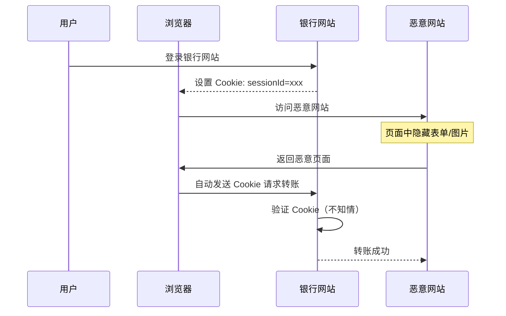
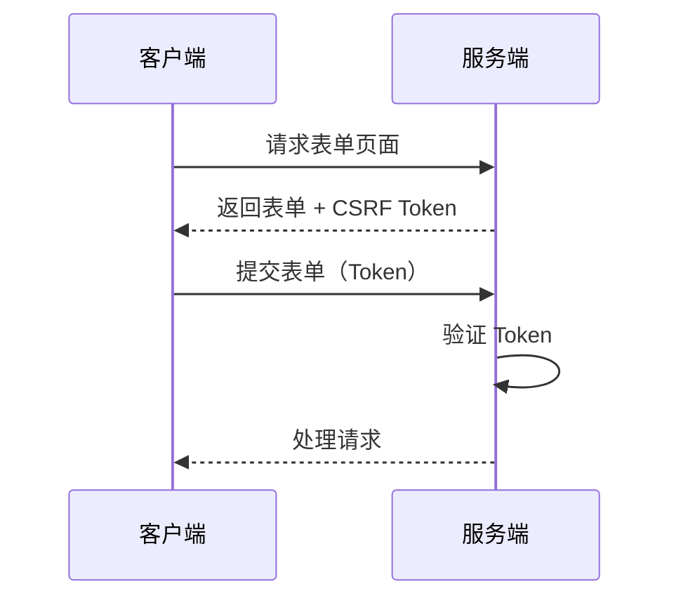

# Cookie 安全问题：跨站攻击 CSRF 与浏览器同源策略

> 本文深入探讨 Cookie 机制面临的安全威胁，包括 CSRF 跨站请求伪造攻击和浏览器同源策略的保护机制。

## Cookie 的安全威胁

Cookie 在带来便捷的自动携带机制的同时，也引入了潜在的安全风险。

### CSRF 攻击原理

CSRF（Cross-Site Request Forgery，跨站请求伪造）是一种利用用户已登录的身份，在用户不知情的情况下发起恶意请求的攻击方式。



### CSRF 攻击条件

1. 用户已登录目标网站并持有有效 Cookie
2. 用户在登录状态下访问了恶意网站
3. 目标网站的请求没有额外的 CSRF 防护措施

### 同源策略保护

浏览器同源策略（Same-Origin Policy）是 Cookie 安全的第一道防线：

| 对比项 | 同源策略 | Cookie |
| --- | --- | --- |
| 协议 | 必须相同 | - |
| 域名 | 必须相同 | - |
| 端口 | 必须相同 | - |
| Cookie 设置 | - | 可通过 `domain` 设置子域访问 |

### Cookie 安全属性

为了增强 Cookie 安全性，可设置以下属性：

```http
Set-Cookie: sessionId=abc123; Secure; HttpOnly; SameSite=Strict
```

- **Secure**：仅在 HTTPS 连接下传输
- **HttpOnly**：禁止 JavaScript 访问（防 XSS）
- **SameSite**：防止跨站请求
  - `Strict`：完全禁止跨站
  - `Lax`：导航请求允许（GET）
  - `None`：允许跨站（需配合 Secure）

### CSRF 防护措施

#### 1. CSRF Token

服务端生成随机 Token，客户端请求时携带：



#### 2. SameSite 属性

合理设置 Cookie 的 SameSite 属性：

```python
# Python FastAPI 示例
@app.get("/set_cookie")
def set_cookie(response: Response):
    response.set_cookie(
        key="session_id",
        value="xxx",
        samesite="lax",  # 或 "strict"
        httponly=True,
        secure=True
    )
```

#### 3. 双重验证

结合密码确认、手机验证码等二次验证：

```python
@app.post("/transfer")
def transfer(request: Request, user_id: str, amount: float):
    # 1. 验证 Cookie
    if not verify_session(request):
        raise HTTPException(401)

    # 2. 验证 CSRF Token
    if not verify_csrf(request):
        raise HTTPException(403)

    # 3. 二次验证（如需要）
    if amount > 10000:
        if not verify_2fa(request):
            raise HTTPException(403)

    return transfer_money(user_id, amount)
```

## 总结

Cookie 安全需要多层面防护：

- **浏览器层**：同源策略作为基础隔离
- **服务端层**：合理设置 Cookie 属性
- **应用层**：CSRF Token + 二次验证

单纯依赖 Cookie 的自动携带机制是不够的，必须结合多种防护手段。
