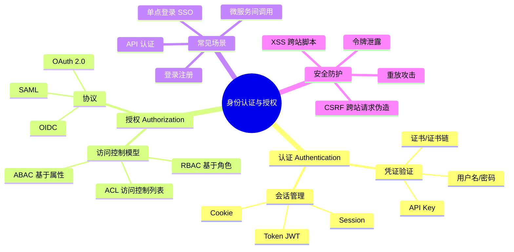
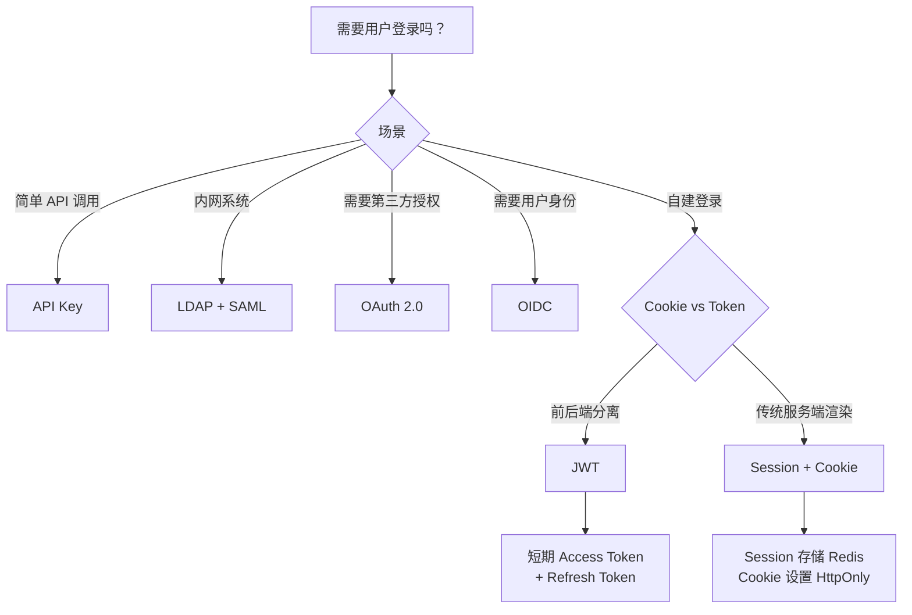

# 认证授权

认证授权是软件系统一个基础功能模块，是确保系统安全的基础能力。无论多小的系统，都需要建立认证授权机制，来保护系统的资源和数据安全。

除非你的系统是一个完全的公开系统比如本站点，不需要记录用户信息，否则总是需要建立面向用户的认证授权机制。

接触过软件系统的，我们一般会遇到以下认证授权场景：

- 用户名/密码登录
- OAuth 2.0，通过第三方平台授权登录
- SSO 单点登录，用户只需要登录一次可访问授信的多个系统，一般是子域名系统
- PAT（Personal Access Token），系统间 API 调用，无需用户名/密码登录

因为我负责的项目建设中存在多个系统间的能力调用，都会遇到认证授权问题，因此我决定开辟一个专栏来聚焦认证授权相关的技术实践，大家一起互相交流学习。

特别地，思考在大型企业中的 4A 安全管理和审计等问题，这是一个非常重要的主题。

## 系列文章

> TODO 待补充

| 文章 | 简介 |
|------|------|
| [认证授权基础](./basis-of-auth) | 认证与授权的核心概念、Cookie/Session 机制、凭证存储方案 |
| [Cookie 安全问题](./cookie-security) | CSRF 攻击原理、同源策略、Cookie 安全属性 |
| [Session 扩展](./session-scalability) | 分布式 Session、Redis 存储、高可用架构 |

## 知识图谱

---

## 常见术语

### 会话与令牌

| 术语 | 说明 |
|------|------|
| **Session** | 服务端存储的用户会话数据，通过 Session ID 关联 |
| **Cookie** | 浏览器存储的小型文本文件，常用于携带 Session ID |
| **Token** | 访问凭证的统称，通常是自包含的字符串 |
| **JWT** | JSON Web Token，一种流行的自包含令牌格式 |
| **Access Token** | 访问令牌，用于调用 API |
| **Refresh Token** | 刷新令牌，用于获取新的 Access Token |

### 协议与标准

| 术语 | 说明 |
|------|------|
| **OAuth 2.0** | 开放授权协议，定义"第三方授权"流程 |
| **OIDC** | OpenID Connect，OAuth 2.0 的上层协议，支持身份验证 |
| **SAML 2.0** | 基于 XML 的 SSO 协议，企业级 |
| **LDAP** | 轻量级目录访问协议，常用于内网用户管理 |

### 访问控制模型

| 模型 | 说明 |
|------|------|
| **RBAC** | Role-Based Access Control，基于角色的访问控制 |
| **ABAC** | Attribute-Based Access Control，基于属性的访问控制 |
| **ACL** | Access Control List，访问控制列表 |
| **PBAC** | Policy-Based Access Control，基于策略的访问控制 |

## 技术选型决策树

根据业务场景选择合适的认证方案：

### 场景对照表

| 场景 | 推荐方案 | 说明 |
|------|---------|------|
| 微服务 API 调用 | API Key + 签名 | 无状态，适合服务间调用 |
| SPA / 移动端 | JWT | 无状态，前端存储需注意 XSS |
| 传统 Web 应用 | Session + Cookie | 服务端控制，安全性较高 |
| 第三方应用授权 | OAuth 2.0 | 经典场景如"使用 Google 登录" |
| 企业级 SSO | OIDC / SAML 2.0 | 支持多身份提供商 |
| IoT 设备 | API Key / 证书 | 设备认证的特殊性 |

## JWT vs Session 对比

| 维度 | JWT | Session |
|------|-----|---------|
| 存储位置 | 客户端 | 服务端（通常 Redis） |
| 扩展性 | 水平扩展简单 | 需共享 Session |
| 失效机制 | 难以主动失效 | 可直接删除 Session |
| 数据大小 | 较大（包含完整信息） | 较小（仅存 Session ID） |
| 适用场景 | 跨域 API、无状态 | 需要快速撤销权限 |

## 安全最佳实践

1. **传输安全**：始终使用 HTTPS
2. **凭证存储**：密码使用 bcrypt/argon2 哈希
3. **Token 安全**：Access Token 短期有效，Refresh Token 单独存储
4. **Cookie 安全**：设置 HttpOnly、Secure、SameSite
5. **防止 CSRF**：使用 SameSite Cookie 或 CSRF Token
6. **防止 XSS**：严格输出编码，不信任用户输入

## 下篇预告

下一篇将深入探讨 [Cookie 安全问题](./cookie-security)，了解 CSRF 攻击原理与防护措施。
