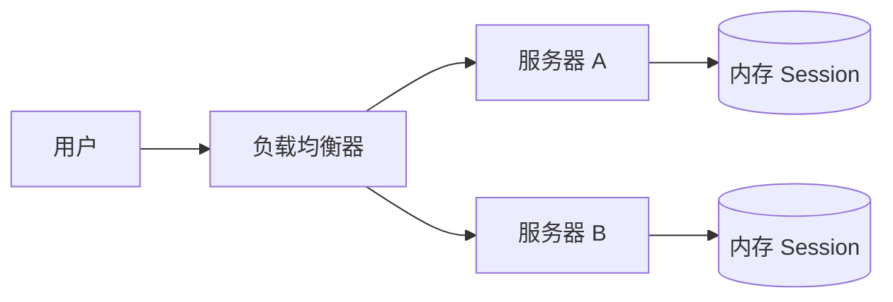
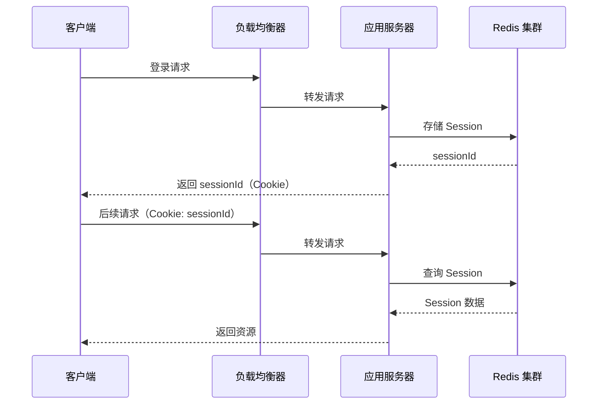
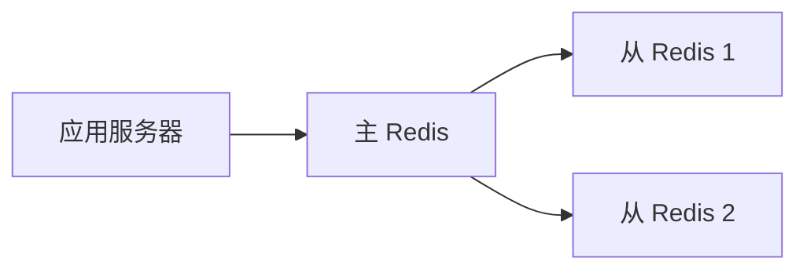
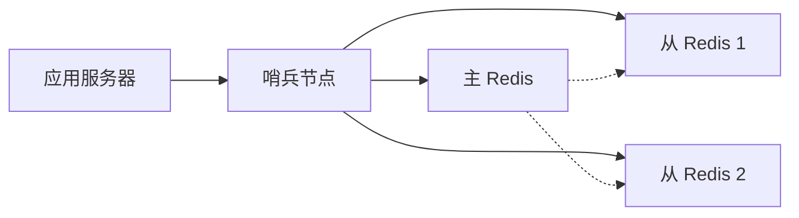
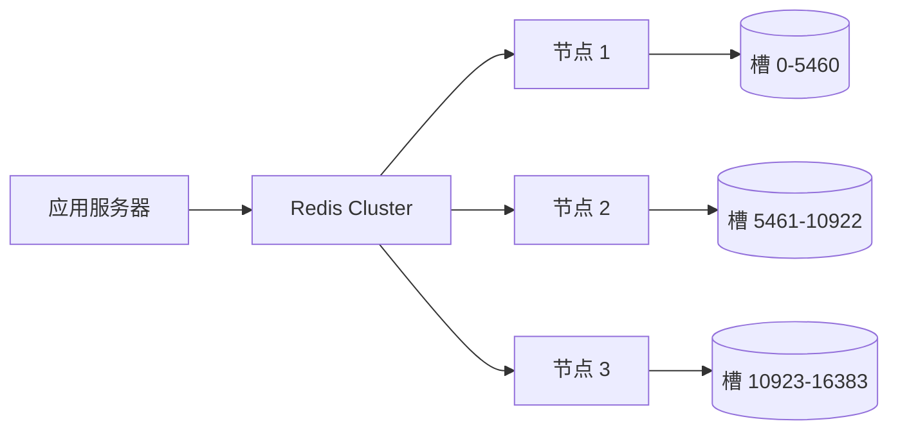
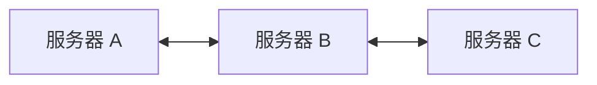

# Session 扩展：分布式与高可用

> 本文探讨单机 Session 的局限性，以及如何通过分布式缓存实现 Session 的扩展性与高可用性。

## 单机 Session 的局限性

在单机部署场景下，Session 存储在应用服务器内存中：



问题：
1. **水平扩展困难**：多台服务器间 Session 不共享
2. **单点故障**：服务器宕机则 Session 丢失
3. **资源浪费**：高并发时单机内存压力

## 分布式 Session 架构

### 基本原理

将 Session 存储从应用服务器剥离，集中在分布式缓存系统中：



### Redis Session 存储

```python
# Python FastAPI + Redis 示例
import redis
import uuid
import json

class RedisSession:
    def __init__(self, redis_client: redis.Redis):
        self.redis = redis_client

    def create_session(self, user_data: dict, ttl: int = 3600) -> str:
        session_id = str(uuid.uuid4())
        self.redis.setex(
            f"session:{session_id}",
            ttl,
            json.dumps(user_data)
        )
        return session_id

    def get_session(self, session_id: str) -> dict:
        data = self.redis.get(f"session:{session_id}")
        return json.loads(data) if data else None

    def delete_session(self, session_id: str):
        self.redis.delete(f"session:{session_id}")

# 使用
session_store = RedisSession(redis_client)

@app.post("/login")
def login(username: str, password: str):
    if verify_user(username, password):
        session_id = session_store.create_session({
            "user_id": get_user_id(username),
            "username": username
        })
        return {"session_id": session_id}
```

### 高可用方案

#### 主从复制



- 优点：读写分离，提高读取性能
- 缺点：主节点故障需要手动切换

#### 哨兵模式



- 自动故障检测与选举
- 客户端自动切换到新主节点

#### Cluster 集群



- 数据自动分片
- 每个分片可配置主从

## Session 一致性策略

### 粘性 Session

同一用户请求始终路由到同一服务器：

```yaml
# Nginx 配置示例
upstream backend {
    ip_hash;
    server 192.168.1.1:8080;
    server 192.168.1.2:8080;
}
```

- 优点：无需修改应用代码
- 缺点：服务器故障时 Session 丢失

### Session 同步

多台服务器间同步 Session：



- 优点：用户无感知
- 缺点：同步延迟、网络开销

### Session 集中存储（推荐）

将 Session 存储在独立缓存服务：

- 性能最优：无本地内存访问
- 扩展性强：独立扩容
- 高可用：缓存集群本身高可用

## 最佳实践

### Session 安全

```python
# 1. Session ID 安全生成
session_id = secrets.token_urlsafe(32)

# 2. Session 数据加密存储
from cryptography.fernet import Fernet
cipher = Fernet(fernet_key)

@app.get("/login")
def login():
    session_id = secrets.token_urlsafe(32)
    user_data = {"user_id": 123, "role": "admin"}
    encrypted = cipher.encrypt(json.dumps(user_data).encode())
    redis.setex(f"session:{session_id}", 3600, encrypted)
    return {"session_id": session_id}

# 3. 限制 Session TTL
redis.expire(f"session:{session_id}", 1800)  # 30分钟无操作过期
```

### 性能优化

```python
# 1. Session 数据精简
user_data = {
    "user_id": 123,  # 仅存 ID
    "username": "john",
    # 不要存储：权限列表（按需查询）、大对象（压缩或拆分）
}

# 2. 批量读取优化
def batch_get_users(user_ids: list):
    keys = [f"user:{uid}" for uid in user_ids]
    return redis.mget(keys)

# 3. 热数据缓存
def get_user_profile(user_id):
    cache_key = f"profile:{user_id}"
    profile = redis.get(cache_key)
    if not profile:
        profile = db.get_user_profile(user_id)
        redis.setex(cache_key, 300, json.dumps(profile))
    return profile
```

## 总结

分布式 Session 架构选择：

| 方案 | 适用场景 | 复杂度 |
| --- | --- | --- |
| Redis 集中存储 | 中大型应用 | 中 |
| Redis Cluster | 大型高并发 | 高 |
| Session 同步 | 小型应用 | 低 |
| 粘性 Session | 无状态应用 | 最低 |

核心原则：**Session 独立存储、独立扩容、高可用保障**。
