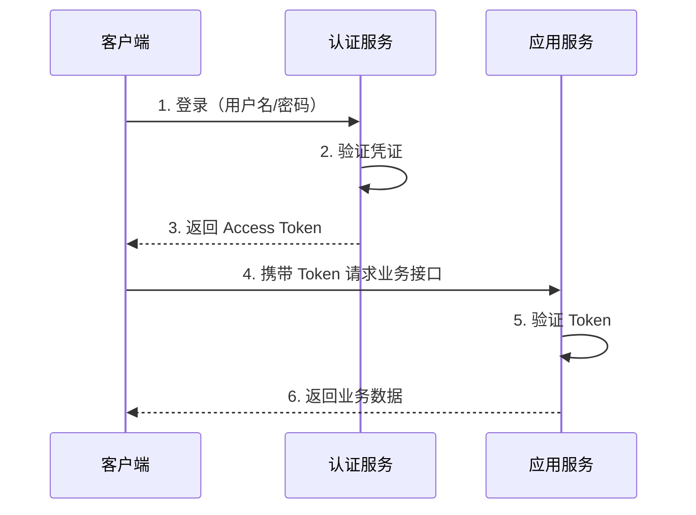
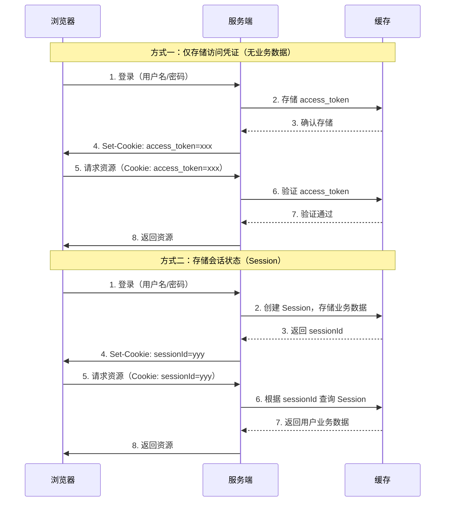

# 认证授权基础

> 本文梳理身份认证与授权领域的核心概念、常见术语与技术选型决策树，为后续深入各协议打下基础。

## 认证（Authentication）和授权（Authorization）

认证和授权的都可以使用前缀简称 Auth，可分别缩写为认证（AuthN）和授权（AuthZ）。认证是授权的前置条件或基础。

- 认证（Authentication）：验证用户身份，通常通过提供凭证（如用户名/密码）进行。
- 授权（Authorization）：根据用户身份和系统资源，判断用户是否有访问或操作的权限。

## 认证基本流程

认证是用户访问系统的第一个步骤，最基础的场景是用户通过用户名/密码登录系统，显示个人信息以及系统基础内容。我们会注意到，登录系统后一段时间内我们都可以直接访问系统。

一般使用 HTTP 协议进行基础交互协议，而 HTTP 协议的一个重要特点是无状态的，而认证是需要保持状态的。因此，先介绍最基础的认证流程：



从上述时序流程中，已经可以发现为什么不直接使用账户密码而是使用访问凭证（Access Token）呢？这样设计主要从两个方面考虑：

- 安全性：访问凭证是临时的，存在过期时间，每次登录重新获取
- 性能：访问凭证是服务端生成的，验证时与缓存一次比对，效率很高

## Cookie 和 Session 机制

上述认证流程中，访问凭证（Access Token）是如何存储或管理的呢？我们先来介绍 2 个核心的概念：Cookie 和 Session。

- **Cookie**：浏览器存储的小型文本文件，常用于携带 Session ID。
- **Session**：服务端管理用户会话数据，通过 Session ID 关联。

Cookie 是现代浏览器默认支持的一项本地缓存机制，起英文名为*小饼干*，本质上它是浏览器为认证授权而设计的一个“小口袋”，约定其来处理用户认证授权数据。


Session 英文名为*会话*，指的是客户端和服务器间的状态记录，位于服务端，是专门用来存储用户会话数据的。

从架构设计的角度，Cookie 是浏览器提供的本地缓存机制模块，而 Session 是逻辑概念（或管理模型），其具体实现可以是内存、数据库、文件系统等。

为什么 Cookie 和 Session 的概念往往一同存在？因为状态保持需要客户端和服务端的配合，配合依赖于 Cookie 和 Session。

### 访问凭证存储

既然上面说了 Cookie 是浏览器提供的专门用来处理认证授权的小口袋，那在编程实现中可显示编程设置 Cookie。在 Python FastAPI 中编程实例：

**设置 Cookie**  

```python
from fastapi import FastAPI, Response

app = FastAPI()

@app.get("/")
def setCookie():
    return {"Hello": "World"}, 200, {"Set-Cookie": "access_token=abcd1234efgh"}
```

**获取 Cookie**  

```python
@app.get("/getCookie")
def getCookie(request: Request):
    cookies = request.cookies.get("access_token")
    return {"access_token": cookies}
```

在客户端浏览器上设置 Cookie 后，后续的请求会自动携带该 Cookie，服务端可以通过请求头中的 Cookie 来获取自己所放置的数据信息。在这个过程中，客户端是透明的，不需要关注 Cookie 的处理细节，无需显示编程。

如果是普通的键值对存储如 localStorage，则需要客户端和服务端约定存储对象，客户端需要显示编程设置设置访问凭证。

不过，Cookie 的这种自动携带机制也存在一些安全风险，后续再详细介绍。

### 凭证存储方案

既然 Cookie 是为了存储用户的访问凭证，类比与钥匙，那么这个钥匙本身应该具有机密性，不能被轻易仿制。凭证仿制举例：

1. 用户 A 使用 userA 和 passwordA 登录系统，获得访问凭证 id=1390518715120260530
2. 用户 A 发现访问凭证信息为：手机号+申请日期
3. 用户 A 不知道用户 B 的账户和密码，但知道用户 B 的手机号，直接仿制凭证 id=1390518711120260603，即可登录系统。

基础的认证，无需存储业务数据，一串没有语义的随机串即可，类似于无记名门票。非授权用户难以伪装凭证，但是没有任何业务数据。

如果用户需要存储业务数据，那么便引入 Session 机制。其实很简单，就是在 Cookie 中存储 Session ID，服务端根据 Session ID 来获取用户会话 Session，其中 Session 中存储了用户的业务数据：

- Session ID 在网络中传输，不可仿制
- Session 仅存储在服务端，业务数据可明文存储

两种方式的时序图对比：



**核心区别**：

| | 方式一：访问凭证 | 方式二：Session |
| --- | --- | --- |
| Cookie 存储 | 访问凭证本身 | 仅存 sessionId（随机串） |
| 业务数据 | 无 | 存在服务端 Session 中 |
| 服务端操作 | 验证凭证是否存在 | 根据 sessionId 查询业务数据 |
| 安全性 | 凭证泄露 = 会话泄露 | sessionId 无业务含义，相对安全 |

## 总结

本文介绍了认证授权的基础知识：

- **认证（AuthN）** 解决"你是谁"的问题，**授权（AuthZ）** 解决"你能做什么"的问题
- 出于安全性和性能考虑，使用 Access Token 替代每次请求传输用户名密码
- **Cookie** 是浏览器提供的存储机制，**Session** 是服务端存储会话数据的逻辑概念
- 凭证存储方案有两种：无业务数据的访问凭证（ Cookie 直接存储）和有业务数据的 Session（Cookie 存储 sessionId）

下一篇将深入探讨 Cookie 安全问题 和 Session 扩展问题：

- Cookie 安全问题：同源策略和 CSRF 攻击
- 分布式 Session 管理：Redis、Memcached 等缓存系统