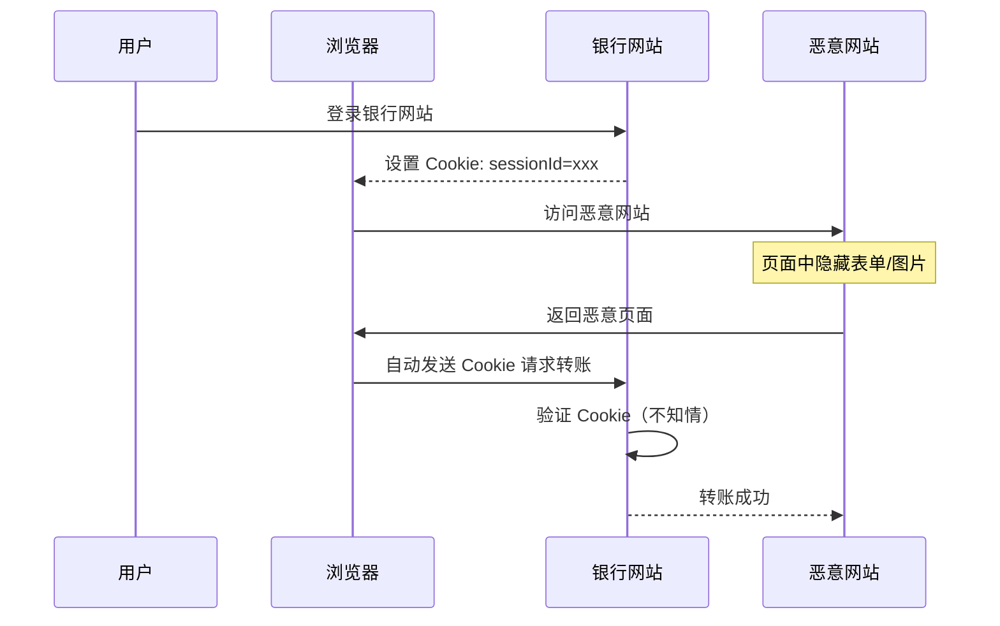
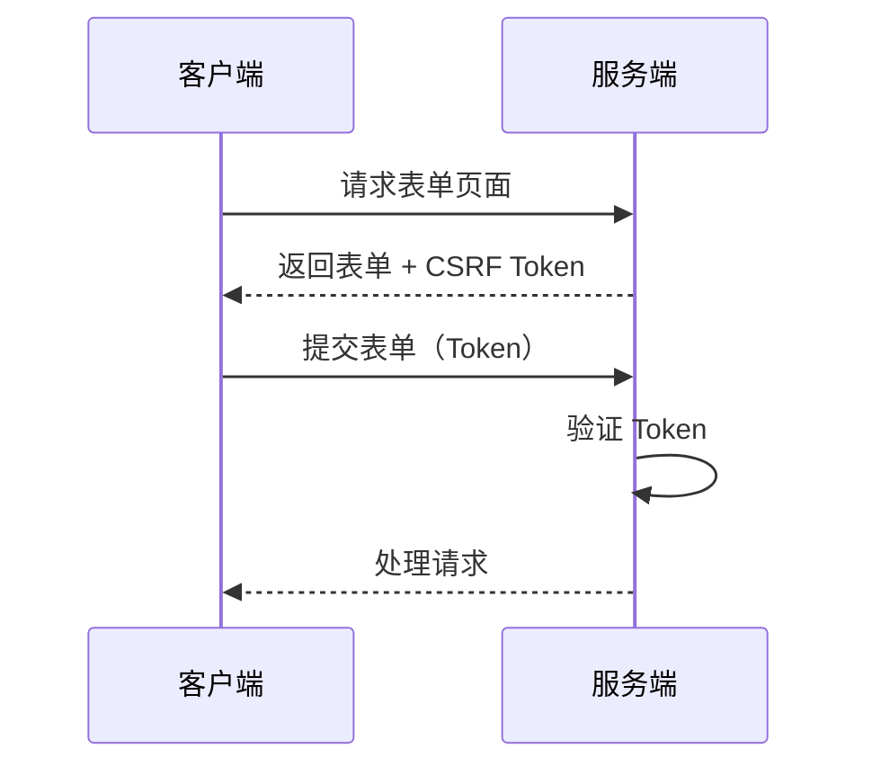

# Cookie 安全问题：泄露、滥用

Cookie 是服务端设置的，客户端在请求时自动携带，主要用于服务端识别用户身份，进而在无状态的 HTTP 协议中保持会话状态。

既然是访问凭证这种敏感信息，就必然需要考虑其可能存在的安全问题。Cookie 安全威胁主要分为三类：

- **Cookie 泄露**：窃取 Cookie 后冒充用户进行操作
- **Cookie 伪造**：分析 Cookie 组成，伪造新的 Cookie
- **Cookie 被利用**：欺骗用户使用 Cookie 执行恶意操作（Confused Deputy Attack）

反直觉地，虽然 CSRF（Cross-Site Request Forgery）命名为 Forgery 伪造，但其不属于第二类，而属于第三类 Cookie 滥用。

## Cookie 泄露

Cookie 泄露是指攻击者获取用户的 Cookie 后，冒充用户身份进行操作。

> 为什么会存在盗用自己 Cookie 中的数据，自己的 Cookie 怎么算盗用？主要的目的是代理访问，比如网络爬虫。
> 再次抢到，Cookie 中数据是服务端放置的，对用户来说是透明的，无感知的。对于开发者来说，比较了解其实现机制，就可以盗用 Cookie 中的数据。

特别地，攻击者泄露 Cookie 后执行修改密码等敏感操作，称为 **Cookie 劫持**，这会导致用户完全失去账号控制权。

### 泄露方式

1. **XSS 攻击**：通过跨站脚本注入获取 Cookie
2. **中间人攻击**：在网络传输过程中截获 Cookie
3. **物理访问**：直接访问用户设备获取 Cookie
4. **钓鱼攻击**：诱导用户在恶意网站登录，获取 Cookie

### 防护措施

#### 1. HttpOnly 属性

禁止 JavaScript 访问 Cookie，防止 XSS 泄露：

```http
Set-Cookie: sessionId=abc123; HttpOnly
```

#### 2. Secure 属性

仅在 HTTPS 连接下传输 Cookie，防止中间人攻击：

```http
Set-Cookie: sessionId=abc123; Secure; HttpOnly
```

#### 3. 敏感操作二次验证

修改密码、转账等敏感操作要求额外验证：

```python
@app.post("/change-password")
def change_password(request: Request, old_pwd: str, new_pwd: str):
    # 验证旧密码或二次验证
    if not verify_password(request.user_id, old_pwd):
        raise HTTPException(403)
    update_password(request.user_id, new_pwd)
```

## Cookie 伪造

Cookie 伪造是指攻击者分析 Cookie 组成结构，伪造虚假的 Cookie 来冒充其他用户。

### 伪造场景

一些应用为了简化设计，直接将用户信息存储在 Cookie 中：

```http
Set-Cookie: user={"username":"admin","role":"superadmin"}
```

这种设计存在严重安全隐患：

1. **权限提升**：修改 `role=admin` 获取管理员权限
2. **身份冒充**：拼接其他用户的信息直接绕过登录
3. **隐私泄露**：Cookie 中的敏感信息可被直接查看

### 防护措施

#### 1. 使用无意义的 Session ID

Cookie 中仅存储随机的 Session ID，业务数据存储在服务端：

```http
Set-Cookie: sessionId=7a2f9d4e-8b3c-11ef-9b9e-0242ac120003
```

#### 2. Cookie 签名或加密

对 Cookie 内容进行签名或加密，防止篡改：

```python
from itsdangerous import URLSafeSerializer

signer = URLSafeSerializer(SECRET_KEY)

# 设置加密的 Cookie
user_data = {"user_id": 123, "role": "user"}
encrypted = signer.dumps(user_data)
response.set_cookie("user", encrypted)

# 验证 Cookie
try:
    data = signer.loads(request.cookies.get("user"))
except BadSignature:
    raise HTTPException(401)
```

#### 3. 避免存储敏感信息

不在 Cookie 中存储用户名、手机号、角色等敏感信息。

## Cookie 滥用

Cookie 的自动携带机制在方便用户的同时，也带来了被滥用的风险。攻击者可以利用用户已登录的状态，在用户不知情的情况下发起恶意请求，这就是 **CSRF 攻击**。

### CSRF 攻击原理

CSRF（Cross-Site Request Forgery，跨站请求伪造）是一种利用用户已登录身份的攻击方式。



### CSRF 攻击条件

1. 用户已登录目标网站并持有有效 Cookie
2. 用户在登录状态下访问了恶意网站
3. 目标网站的请求没有额外的 CSRF 防护措施

### 防护措施

#### 1. SameSite Cookie 属性

阻止浏览器在跨站请求时携带 Cookie：

```http
Set-Cookie: sessionId=abc123; SameSite=Strict; HttpOnly; Secure
```

- `Strict`：完全禁止跨站发送 Cookie
- `Lax`：允许导航请求（GET）发送 Cookie
- `None`：允许跨站（需配合 Secure）

#### 2. CSRF Token

服务端生成随机 Token，要求所有请求携带：



#### 3. 验证 Origin/Referer 头

服务端检查请求来源：

```python
@app.post("/transfer")
def transfer(request: Request):
    allowed_origins = ["https://example.com"]
    origin = request.headers.get("Origin")
    
    if origin and origin not in allowed_origins:
        raise HTTPException(403)
    return process_transfer(request)
```

#### 4. 敏感操作二次验证

结合密码确认、手机验证码等二次验证：

```python
@app.post("/transfer")
def transfer(request: Request, user_id: str, amount: float):
    if not verify_session(request):
        raise HTTPException(401)
    if not verify_csrf(request):
        raise HTTPException(403)
    if amount > 10000 and not verify_2fa(request):
        raise HTTPException(403)
    return transfer_money(user_id, amount)
```

## 总结

Cookie 安全威胁主要分为三类，需要针对性防护：

| 威胁类型 | 攻击方式 | 核心防护措施 |
| --- | --- | --- |
| **泄露** | XSS、中间人攻击 | HttpOnly、Secure 属性、二次验证 |
| **伪造** | 篡改 Cookie 内容 | 使用随机 Session ID、签名/加密 |
| **滥用** | CSRF 跨站请求伪造 | SameSite 属性、CSRF Token |

**防护原则**：
- Cookie 仅存储无意义的随机 Session ID
- 设置 HttpOnly、Secure、SameSite 属性
- 敏感操作实施二次验证
- 对所有状态变更请求验证 CSRF Token