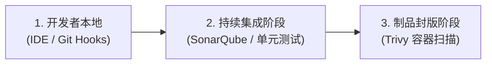

自动化流水线的好处在于「快」，而其坏处也在于「快」——如果缺乏有效的安全防护，带漏洞或低质量的代码将被以极高的速度部署到生产环境中。

为了在研发交付效率与系统稳定性之间取得平衡，我们必须引入 **质量门禁（Quality Gate）**。

质量门禁是流水线中的「自动化法官」。它是一组预先定义好的代码质量与安全标准阈值（Thresholds）。当流水线运行到特定环节时，会自动触发扫描；若未达到阈值，则流水线立即熔断并向开发者发出警告，阻止有缺陷的制品包继续向下游环境传递。

---

## 质量门禁的三个防御象限

一个健全的质量门禁体系应该在软件交付生命周期的不同阶段，层层设防：



### 1. 提交前哨：Git Hooks 与 Linter
*   **扫描时机**：代码尚未离开开发者本地机器。
*   **实施手段**：利用 Husky + Lint-staged。在执行 `git commit` 时，自动运行 ESLint / Pydantic 等静态检查，并要求格式化（Prettier）。
*   **原则**：本地阶段只做“极速”检查，不拖慢提交速度，把低级的拼写、语法和格式问题在本地解决。

### 2. 持续集成：代码合规与单元测试
*   **扫描时机**：代码推送到 Git 远程分支并触发 CI 流水线。
*   **实施手段**：
    *   **单元测试与覆盖率**：要求单元测试通过率必须是 $100\%$，且覆盖率必须达到设定阈值。
    *   **代码质量静态扫描（SonarQube）**：对代码重复率、圈复杂度、潜在漏洞（Code Smells）进行综合评估。
*   **门限基线推荐**：
    *   新代码的单元测试覆盖率 $\ge 75\%$
    *   新代码的重复率 $<3\%$
    *   阻塞性问题（Blocker）/ 严重性问题（Critical）的发生数为 $0$

### 3. 制品封版：容器镜像漏洞扫描
*   **扫描时机**：镜像构建完毕，推送到制品库（如 Harbor / Container Registry）之前。
*   **实施手段**：使用 Trivy 或 Clair 对容器镜像进行 CVE（Common Vulnerabilities and Exposures）系统漏洞和应用依赖扫描。
*   **门限基线推荐**：不允许包含 `HIGH` 或 `CRITICAL` 级别的已知 CVE 漏洞。

---

## 实践：在 GitHub Actions 中配置质量门禁

以下是一个在 GitHub Actions 中集成 **SonarQube 静态扫描** 与 **Trivy 镜像安全扫描** 的完整工作流片段：

```yaml
name: CI with Quality Gate

on:
  push:
    branches: [ main ]

jobs:
  sonar-scan:
    name: SonarQube Analysis
    runs-on: ubuntu-latest
    steps:
      - uses: actions/checkout@v3
        with:
          fetch-depth: 0  # SonarQube 需要完整 Git 历史以生成高精度报告

      - name: Set up JDK 17
        uses: actions/setup-java@v3
        with:
          java-version: '17'
          distribution: 'temurin'

      - name: SonarQube Scan
        uses: sonarsource/sonarqube-scan-action@master
        env:
          SONAR_TOKEN: ${{ secrets.SONAR_TOKEN }}
          SONAR_HOST_URL: ${{ secrets.SONAR_HOST_URL }}
        with:
          args: >
            -Dsonar.projectKey=my-web-app
            -Dsonar.sources=src
            -Dsonar.qualitygate.wait=true # [关键] 阻断流水线直至 SonarQube 计算完 Quality Gate 状态

  image-scan:
    name: Container Vulnerability Scan
    needs: sonar-scan
    runs-on: ubuntu-latest
    steps:
      - uses: actions/checkout@v3

      - name: Build Local Image
        run: docker build -t my-app:${{ github.sha }} .

      - name: Run Trivy Vulnerability Scanner
        uses: aquasecurity/trivy-action@master
        with:
          image-ref: 'my-app:${{ github.sha }}'
          format: 'table'
          exit-code: '1' # [关键] 如果发现匹配漏洞，将以退出码 1 熔断流水线
          ignore-unfixed: true
          vuln-type: 'os,library'
          severity: 'CRITICAL,HIGH'
```

---

## 质量门禁落地的“软着陆”策略

直接在团队中引入严苛的质量门禁可能会遇到阻力，甚至导致研发效率暂时性崩溃。建议采用以下渐进式推进策略：

1. **第一阶段：只报警不阻断（Warning Mode）**
   *   配置质量扫描，但把扫描任务的 `exit-code` 设为 `0`。生成报告并展示给开发者，提供整改宽限期。
2. **第二阶段：仅对新代码生效（New Code Only）**
   *   利用 SonarQube 的 "Clean as You Go" 理念，只对本次合并入的新增代码进行拦截，不追究历史代码的陈年旧账。
3. **第三阶段：红线卡口（Hard Gate）**
   *   将关键指标设为强硬卡口，无一例外。对于因特殊情况需紧急发布而无法满足门禁的代码，必须由技术委员会或 SRE 部门手动审批授予 Bypass（免检）权限。

