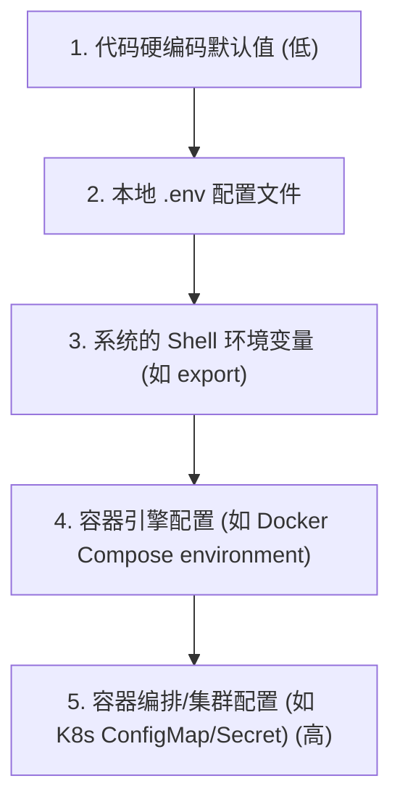

# 环境变量与配置管理，一篇文章搞懂

## 前言

在软件生命周期中，我们经常会遇到这样的问题：
*   服务的数据库连接地址改了，为什么必须要重新编译打包才能生效？
*   测试环境的 API Key 是什么？为什么不小心把生产环境的密钥提交到 GitHub 上了？
*   同一个服务镜像，怎么在不重构的前提下，分别在开发环境（Dev）、测试环境（Test）和生产环境（Prod）上运行？

随着项目规模的扩大和微服务架构的流行，**配置管理（Configuration Management）**已成为决定系统稳定性和发布效率的核心环节。本文将从云原生设计原则出发，系统梳理配置管理的最佳实践。

---

## 什么是配置？配置与代码分离

**配置**的定义是：**一切影响应用程序行为、但又不属于其核心逻辑代码的数据或设置。**

典型的配置包括：
*   **数据库连接串**：数据库主机名、端口、用户名和密码。
*   **外部服务凭证**：短信通道 Key、第三方支付证书、AI 接口 token。
*   **运行参数**：服务绑定端口、缓存超时时间、线程池大小、日志级别（Debug/Info/Error）。
*   **业务开关（Feature Flags）**：新功能是否对特定用户开放。

### 12-Factor App 的核心指导原则
著名的 **12-Factor App（云原生应用十二要素）** 中的第三条原则指出：**在环境中存储配置（Config）。**

它的核心要求是：**将配置彻底从代码中剥离。** 代码库应该保持纯净，能在不修改任何一行代码的前提下，在开发、测试、预发、生产等任何环境直接启动。如果可以在不改动代码的前提下随时开源，说明你的配置管理是合格的。

---

## 配置的承载介质：配置文件 vs 环境变量

在传统的运维中，我们习惯于使用 `.yaml`, `.json`, `.ini` 等配置文件；而在现代容器化运维中，环境变量（Environment Variables）则成为了事实标准。它们各有优劣：

| 维度 | 配置文件（YAML / JSON 等） | 环境变量（Environment Variables） |
| :--- | :--- | :--- |
| **可读性** | 极佳，支持嵌套层级结构 | 较差，多为扁平的 `KEY=VALUE` 结构 |
| **敏感信息安全性** | 差，容易随代码被误提交至 Git | 较好，可通过容器编排工具（K8s Secrets）在运行时动态注入 |
| **容器友好度** | 一般，需要将文件挂载到容器内部 | 极高，原生被 Docker / Docker Compose 完美支持 |
| **动态修改** | 较容易，可通过热重载（Hot-reload）监听文件改动 | 难，通常需要重启容器/进程以读取新值 |

### 静态配置与动态配置
*   **静态配置**：在应用启动时一次性读取，变更时需要重启服务以生效。通常使用环境变量或启动参数传入。
*   **动态配置**：在应用运行时可以不重启而实时变更（例如：动态调整日志级别、紧急关闭某支付通道）。通常需要借助微服务配置中心（如 Nacos, Apollo, Consul）或分布式 KV 存储（如 Redis, Etcd）来实现。

---

## 环境变量加载优先级

在实际开发和生产中，配置的来源很多。为了兼顾**本地开发的便利性**与**生产环境的安全性**，我们应遵循以下**由低到高**的覆盖优先级（高优先级将覆盖低优先级的值）：



### 安全规范：严禁提交 `.env`
*   **开发便利性**：本地开发时，可以在项目根目录编写一个 `.env` 文件存储本地配置。
*   **安全规范**：**`.env` 文件必须被加入 `.gitignore`，严禁提交到 Git 版本控制系统！**
*   **最佳实践**：在代码库中提交一个 `.env.example`（仅包含字段名，如 `DB_PASSWORD=your_password_here`），作为团队开发时的配置模板。

---

## 最佳实践：Python 强类型配置管理

在动态语言（如 Python）中，如果只使用 `os.environ.get("DB_PORT")`，往往会因为类型转换错误（获取到的是字符串，而需要整型）或环境变量缺失而导致运行时崩塌。

目前 Python 生态中，**Pydantic Settings** 已经成为管理环境变量与配置验证的行业标准。它具备**Fail-Fast（快速失败）**的机制——如果配置不合规，程序会在启动时立即崩溃退出，而不是在运行到特定业务逻辑时才爆出隐蔽错误。

### 1. 安装依赖
```bash
pip install pydantic-settings
```

### 2. 编写配置模型
创建 `config.py`，它会自动加载 `.env` 并在启动时校验类型：

```python
import os
from typing import Optional
from pydantic import Field, PostgresDsn
from pydantic_settings import BaseSettings, SettingsConfigDict

class Settings(BaseSettings):
    # 自动加载本地配置，但高优先级环境变量可直接覆盖它
    model_config = SettingsConfigDict(
        env_file=".env", 
        env_file_encoding="utf-8",
        extra="ignore"  # 忽略多余的环境变量
    )

    # 1. 基础配置（带硬编码默认值，多用于非敏感参数）
    APP_NAME: str = "DevOpsApp"
    DEBUG: bool = False
    PORT: int = 8080

    # 2. 敏感配置（不设默认值，启动时若环境变量缺失，Pydantic 将直接抛异常 Fail-Fast）
    DATABASE_URL: PostgresDsn
    SECRET_KEY: str

    # 3. 嵌套或可选配置
    REDIS_HOST: Optional[str] = None

# 全局单例
settings = Settings()
```

### 3. 应用中调用
在业务代码中直接以强类型方式读取，享受 IDE 的代码补全提示：

```python
from config import settings

def connect_db():
    print(f"Connecting to database: {settings.DATABASE_URL.hosts()}")
    print(f"App is running on port: {settings.PORT}")
    
    if settings.DEBUG:
        print("Debug mode is enabled.")
```

---

## 总结

1. **核心要义**：代码与配置完全分离，确保“一个镜像，多处运行”。
2. **安全准则**：密钥绝对不入库，`.env` 不提交，生产环境通过基础设施层（K8s Secret 等）注入。
3. **编程规范**：利用强类型配置框架（如 Pydantic-Settings）做配置校验，做到 **Fail-Fast**，在程序启动阶段就把配置隐患扼杀在摇篮里。