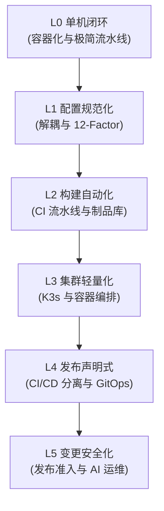

## 为什么需要「渐进式」？

在现代软件开发中，DevOps 几乎成了每个技术团队的「标配口号」。然而，对于资源有限的中小团队或个人开发者而言，盲目追求大厂的「高大上」方案往往会带来相反的效果：

*   **心智负担过重**：为了部署一个简单的 Web 站点，不仅要维护 Kubernetes 集群，还要配置 Service Mesh、Istio、复杂的可观测性链路，运维成本甚至超过了业务开发本身。
*   **过度工程（Over-engineering）**：在产品还未验证市场前，超前设计了自动化扩缩容、多活架构，导致服务器账单飙升，最后成了「杀鸡用牛刀」。
*   **安全与规范缺失**：相反，另一些团队则因为畏惧复杂性而退回到最原始的「手动上传压缩包、在服务器上手动运行进程」时代，导致配置混乱、敏感秘钥泄露。

我们倡导的 **渐进式 DevOps（Progressive DevOps）**，其核心理念是：**不超前设计，亦不因循守旧。根据团队和业务规模的实际增长，低成本、无痛地逐步引入自动化和规范。**

---

## 演进阶梯：从规范化到声明式

为了让演进路径可落地，我们将其划分为 6 个清晰的递进阶段（L0 至 L5）：

### 0. L0 级：单机交付闭环（一切运维工作的底座）

一切自动化运维的根基，都是实现「**服务可移植**」与「**流程自动化初步**」。
*   **核心动作**：将服务通过 Docker 进行容器化，并引入 Docker Compose 实现多服务本地编排；最后利用 GitHub Actions 实现代码推送即触发的极简构建与部署。
*   **最佳实践**：从手动 `scp` 的极简闭环出发，熟练掌握多阶段构建 Dockerfile 编写与 Actions 编写，达成单机环境下的自动化交付闭环。在引入容器化之前，先理解生产环境（7×24 + 公网 IP）的概念，通过 SSH + scp 完成第一次手动部署。
*   **前置专栏文章**：
    *   [01 ｜ Nginx 静态资源代理](../foundation/delivery-start.md)
    *   [02 ｜ 生产环境入门：部署到云服务器](../foundation/production-env.md)
    *   [03 ｜ 服务端应用部署：依赖、运行时与进程保活](../foundation/server-side-deploy.md)
    *   [04 ｜ Git 与 GitHub：版本管理与云端仓库](../foundation/git-github.md)
*   [05 ｜ 容器 Docker](../foundation/docker-basics.md)
*   [06 ｜ 流水线基础](../foundation/pipeline-basics.md)
*   [07 ｜ GitHub Actions](../foundation/actions.md)
*   [08 ｜ 多服务容器编排](../foundation/docker-compose.md)
*   [09 ｜ 基础篇总结](../foundation/foundation-summary.md)

### 1. L1 级：配置规范化（先标准化，后自动化）
一切运维工作的痛点，几乎都源于**配置与代码的耦合**。
*   **核心动作**：遵循 **12-Factor App** 的原则，将所有数据库凭证、API 密钥、外部服务地址从代码库中剥离。
*   **最佳实践**：本地开发使用 `.env` 文件，生产环境通过系统环境变量动态注入。在代码层面，使用结构化、强类型的配置框架（如 Python 的 `pydantic-settings`）对输入进行校验，实现 **Fail-Fast（快速失败）**。
*   **前置专栏文章**：[环境变量与配置管理，一篇文章搞懂](./environment.md)

### 2. L2 级：构建自动化（不可变基础设施的起点）
配置标准化后，下一步就是**消除环境差异**。
*   **核心动作**：实现应用容器化（Docker），确保「在我的机器上能运行，在服务器上也能运行」。通过持续集成（CI）工具自动在代码推送时触发构建。
*   **最佳实践**：编写规范的多阶段构建 `Dockerfile`；将构建出的镜像推送到私有镜像仓库（如 Harbor），并建立严格的制品版本管理与安全扫描机制，确保镜像可追溯。
*   **前置专栏文章**：
    *   [持续集成 CI：源代码到容器镜像](./ci-pipeline.md)
    *   [CI 制品源管控与「软着陆」治理](./harbor-source-control.md)

### 3. L3 级：集群轻量化（低成本云原生承载）
当容器镜像准备好后，我们面临着如何承载多个业务服务的问题。
*   **核心动作**：从小范围的手动 `docker compose` 容器编排，平滑过渡到微型容器集群管理。
*   **最佳实践**：拒绝开箱即用的重度自建 Kubernetes。选用专为边缘计算和中小规模设计的轻量级 K8s 发行版（如 **K3s**），在单台或少量云服务器上部署，既享受到了 K8s 的声明式 API 和自愈能力，又将内存开销降到了最低。
*   **前置专栏文章**：[K3s 轻量集群部署实践](./k3s.md)

### 4. L4 级：发布声明式（CD 的最高境界是拉取）
有了集群，我们必须规范发布流程，避免传统 CI 工具「直连集群」带来的安全风险。
*   **核心动作**：确立 **CI 与 CD 权责分离**，引入 **GitOps** 模式。
*   **最佳实践**：CI 只负责生成镜像并修改清单仓库；集群内部的代理程序（如 ArgoCD 或 Flux）监听 Git 仓库的变动，拉取最新状态并使之同步。这确保了集群的真实状态与 Git 仓库的声明式定义始终保持一致，天然拥有版本回滚与可审计性。
*   **前置专栏文章**：
    *   [CI 与 CD 分离：权责边界](./cicd-separation.md)
    *   [持续发布 CD：镜像到生产环境](./cd-pipeline.md)
    *   [GitOps 设计理念与实践](./gitops.md)

### 5. L5 级：变更安全化（防线建设与 AI 赋能）
所有的宕机事故，90% 都是由「变更」引起的。
*   **核心动作**：从「自动化发布」演进到「安全变更与发布防线」的建设。
*   **最佳实践**：引入发布前置的质量门限（Quality Gate），在发布流程中进行自动化冒烟测试、配置白名单校验；利用 AI 辅助审核发布日志、捕获潜在风险；通过灰度发布与自动化回滚机制，将爆炸半径降到最低。
*   **前置专栏文章**：
    *   [发布变更，AI 价值](./change-control.md)
    *   [发布变更管控](./change-management.md)
    *   [DevOps 平台思考](./devops-platform.md)

---

## 结语

DevOps 不是某个一蹴而就的终极目标，而是一个伴随业务逐步进化的旅程。从这一刻起，抛弃繁琐的「一步到位」幻觉，遵循我们的演进路线，以最适合您团队现状的步调，踏上**渐进式 DevOps** 的演进之路吧。
