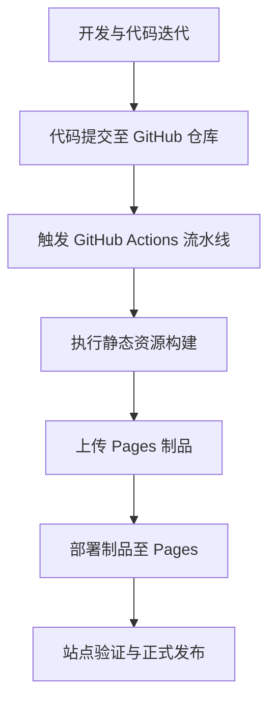

06 篇讲了 Jenkinsfile——用 Groovy DSL 描述「手动命令 → 声明式动作链」。GitHub Actions 是**托管式流水线**的另一代表：用 YAML 配置、零运维、模板即开即用。两者语法不同，「**声明式动作链 + 运维左移**」的思想完全一致。

这一篇把核心概念与两个实战合并：一篇就能上手 GitHub Actions。

## 核心概念

> 为避免中英翻译造成的歧义，关键概念保留英文。

| 概念 | 一句话 | 类比 Jenkinsfile |
| --- | --- | --- |
| **Workflow** | 一个 YAML 文件，定义自动化流程 | 一个 Jenkinsfile |
| **Event** | 触发 Workflow 的事件（push / PR / issue / 定时） | `triggers { ... }` |
| **Jobs** | Workflow 中可并行 / 串行的任务集 | `stages` |
| **Steps** | Job 内顺序执行的命令或 Action | `steps { ... }` |
| **Actions** | 可复用的扩展（GitHub 官方 / 第三方 Marketplace） | 共享库（Shared Libraries） |
| **Runner** | 实际执行 Job 的虚拟机（Ubuntu / Windows / macOS） | `agent` |

GitHub Actions 让仓库里发生**任何事件**都能触发一段自动化：

- 推送代码 → 自动跑测试 / 构建 / 部署
- 创建 issue → 自动加标签 / 派发
- 定时 crontab → 每天 6:00 自动爬数据生成报表
- 手动按钮 → 一次性执行（`workflow_dispatch`）


### 工作流文件位置

每个 workflow 是一个 YAML 文件，放在 `.github/workflows/` 目录下：

```
.github/
└── workflows/
    ├── page.yml           # VitePress Pages 部署
    ├── greetings.yml      # Issue / PR 自动欢迎
    └── cron-daily.yml     # 每天定时任务
```

GitHub 官方提供 5 大类 workflow 模板：**部署、安全、持续集成、自动化、Pages**。多数场景可以从模板起步再改。


## 实战一：Greetings 模板

在官方模板里，Greetings 工作流作用是「**新用户开 issue 或 PR 时，自动发送欢迎消息**」。

```yaml
name: Greetings

on: [pull_request_target, issues]

jobs:
  greeting:
    runs-on: ubuntu-latest
    permissions:
      issues: write
      pull-requests: write
    steps:
      - uses: actions/first-interaction@v1
        with:
          repo-token: ${{ secrets.GITHUB_TOKEN }}
          issue-message: "Message that will be displayed on users' first issue"
          pr-message: "Message that will be displayed on users' first pull request"
```

- `secrets.GITHUB_TOKEN` 是 GitHub 提供的**默认密钥**，无需额外配置
- 提交后创建一个 issue，工作流自动跑、issue 里自动出现欢迎消息
- 执行时身份是 `github-actions[bot]`


如果只想在 `opened` 类型时触发、不要 PR 消息：

```yaml
on:
  issues:
    types:
      - opened
```

模板只解决 50% 的事，**改一改触发条件和文案，就能贴合自己仓库**。

## 实战二：VitePress Pages 自动化部署

这是本项目（xiaolin-docs）实际用的 pipeline——**完全自动化**、无需手动点 GitHub Pages 设置、无需手动建 Token。

### 1. 修改 URL 配置

GitHub Pages 默认域名带仓库前缀：`https://<username>.github.io/<repository-name>/`。在 VitePress 配置里加一行：

```typescript
const basePath = process.env.GITHUB_ACTIONS === 'true' ? '/xiaolin-docs/' : '/'
```

`process.env.GITHUB_ACTIONS === 'true'` 表示「当前在 GitHub Actions 里跑」，本地 `pnpm run docs:dev` 时走 `/`，不影响本地预览。

### 2. 流水线 `page.yml`

```yaml
name: VitePress-Website Github Pages Deploy
on:
  push:                    # 触发一：push 到 main
    branches:
      - main
  workflow_dispatch:       # 触发二：手动按钮

env:
  TZ: Asia/Shanghai

jobs:
  build:
    runs-on: ubuntu-latest
    steps:
      - name: Checkout
        uses: actions/checkout@v4

      - name: Setup Pages
        uses: actions/configure-pages@v5

      - uses: pnpm/action-setup@v4
        name: Install pnpm
        with:
          version: 9
          run_install: false

      - name: Setup Node
        uses: actions/setup-node@v4
        with:
          node-version: 20
          cache: 'pnpm'

      - name: Install dependencies
        run: pnpm install

      - name: Build documentation
        run: pnpm run docs:build

      - name: Upload pages artifact
        uses: actions/upload-pages-artifact@v3
        with:
          name: 'github-pages'
          path: docs/.vitepress/dist

  deploy:
    needs: build
    permissions:
      pages: write
      id-token: write
    environment:
      name: github-pages
      url: ${{ steps.deployment.outputs.page_url }}
    runs-on: ubuntu-latest
    steps:
      - name: Deploy to GitHub Pages
        id: deployment
        uses: actions/deploy-pages@v4
```

### 3. 流水线分两段

| 阶段 | 做什么 | 输出 |
| --- | --- | --- |
| `build` | checkout → 装 pnpm/Node → 装依赖 → 构建 | 上传制品 `docs/.vitepress/dist` |
| `deploy` | 拉制品 → 部署到 GitHub Pages | 公网 URL |

`deploy` 用 `needs: build` 显式依赖 `build`——这就是 06 篇说的 `stages` 思想，只是语法更 YAML 化。

### 4. 为什么「完全自动化」

- 不需要手动开启 GitHub Pages（GitHub 自动识别 `.github/workflows/`）
- 不需要手动建 Token（用默认的 `secrets.GITHUB_TOKEN` + Pages 专用权限）
- 推送代码即部署——`git push` 完看 Actions 面板，部署进度实时滚动

## 自动化与免运维发布

GitHub Actions + GitHub Pages 一起用，达成**两层自动化**：

| 维度 | 自动化效果 |
| --- | --- |
| **构建** | 推送代码 → 自动装依赖 + 构建 |
| **部署** | 构建完 → 自动上传制品 → 自动部署到 Pages |
| **域名 / HTTPS** | GitHub 自动配 |
| **CDN** | GitHub Pages 内置 |
| **运维** | **零运维**——Serverless 架构 |

对比手动部署的 7 个步骤（构建 → 推仓库 → 拉镜像 → 创建网络 → 逐个启动容器），**`git push` 一行**搞定全部。



开发人员只需关注**开发阶段**——后续 CI / CD / 发布全部自动化。

## 实战经验

- **缓存依赖**：`actions/setup-node` 设 `cache: 'pnpm'`，第二次构建能省几分钟
- **多 Node 版本**：`matrix: { node-version: [18, 20, 22] }` 一次跑多个版本
- **凭据管理**：用 `secrets.GITHUB_TOKEN` + `permissions:` 显式声明权限，不要给过多权限
- **失败调试**：Actions 面板 → 点击失败任务 → 看 stdout 日志

## 小结

GitHub Actions 是托管式流水线代表：YAML 配置、零运维、模板即开即用，跟 06 篇 Jenkinsfile 在「声明式动作链」思想上完全一致。

两个实战覆盖了**两类典型场景**：

- **Greetings**：事件驱动 + 第三方 Action（`first-interaction`）
- **Pages 部署**：完整 CI/CD（构建 → 制品 → 部署）+ Pages 一键发布

下一步进入 [第 08 篇 · 多服务容器编排](./docker-compose.md)：07 把「托管式流水线」跑通，但**应用本身还是单一镜像**。当你的应用需要 Nginx 反代 + 应用本身 + 数据库 + 缓存一起协作时，**多个容器如何用一份声明式 YAML 一起管理**？那是 docker-compose 的领域——也是 DevOps 基础篇的最后一篇。

## 思考

1. GitHub Actions 和 Jenkinsfile 各自适合什么场景？什么情况下你会选托管式（Actions），什么情况下选自托管（Jenkins）？
2. 流水线里如果要在多个 job 间传递数据（比如 build 完的制品给 deploy 用），Actions 用什么机制？Jenkins 用什么机制？
3. `permissions` 字段为什么要**显式声明**而不是默认全开？最小权限原则在这里为什么重要？

## 参考

1. [了解 GitHub Actions](https://docs.github.com/zh/actions/get-started/understand-github-actions)
2. [GitHub Actions 工作流语法](https://docs.github.com/zh/actions/reference/workflows-and-actions/workflow-syntax-for-github-actions)
3. [GitHub Pages 快速入门](https://docs.github.com/zh/pages/quickstart)
4. [actions/upload-pages-artifact](https://github.com/actions/upload-pages-artifact)
5. [actions/deploy-pages](https://github.com/actions/deploy-pages)