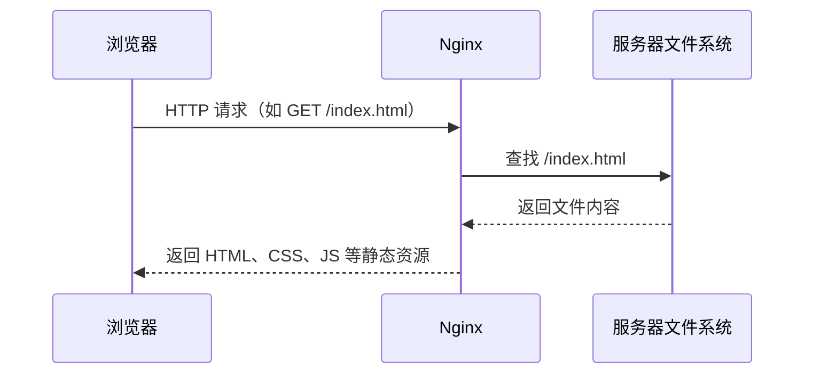

如果说编程的 Hello World 是在控制台打印一行字符，那么运维的 Hello World 则是把网站送上服务器，用户可以通过浏览器访问。

例如，你写了一个博客，希望别人能通过 `http://my-blog.com` 访问。这需要解决一个问题：**如何把本地的网站文件发布到服务器上？**

## 什么是静态资源

网站文件通常由三种资源组成——这些就是 {{term:静态资源}}：

- **HTML**：网页的结构和内容
- **CSS**：网页的样式和布局
- **JavaScript**：网页的交互和动态行为

这些文件在本地编辑完成后，需要放到服务器上，才能被浏览器访问。

## Nginx 简介

Nginx 是一个 Web 服务器，负责把静态资源返回给浏览器。

在静态网站场景中，它做 3 件事：



例如浏览器访问 `http://my-blog.com`，Nginx 返回服务器上的 `index.html`。

Nginx 还可以做反向代理、负载均衡、HTTPS、限流等事情，但这些不是本文重点。作为开发者，我们只需要关注**配置文件**。

## 安装 Nginx

在 Ubuntu 环境下安装 Nginx：

```bash
sudo apt update
sudo apt install nginx
```

安装完成后，Nginx 会自动启动。可以通过以下命令验证：

```bash
nginx -v
```

## 常用命令

```bash
# 启动
sudo systemctl start nginx

# 停止
sudo systemctl stop nginx

# 重启
sudo systemctl restart nginx

# 查看状态
sudo systemctl status nginx

# 重新加载配置（不中断服务）
sudo systemctl reload nginx

# 测试配置文件语法
nginx -t
```

安装完成后，访问 `http://localhost`，可以看到 Nginx 默认欢迎页面：

```text
┌─────────────────────────────────────────────────────────────┐
│                                                             │
│                    Welcome to nginx!                        │
│                                                             │
│  If you see this page, the nginx web server is successfully │
│  installed and working. Further configuration is required.  │
│                                                             │
│  For online documentation and support please refer to       │
│  nginx.org.                                                 │
│  Commercial support is available at nginx.com.              │
│                                                             │
│  Thank you for using nginx.                                 │
│                                                             │
└─────────────────────────────────────────────────────────────┘
```

这说明 Nginx 已经在运行，并且可以返回静态资源了。

## 配置文件结构

Nginx 最关键的是配置文件，安装后的目录结构如下：

```text
/etc/nginx/
├── nginx.conf              # 主配置文件
├── conf.d/                 # 站点配置目录（默认为空）
├── sites-available/        # 可用站点配置
│   └── default             # 默认站点配置
└── sites-enabled/          # 已启用站点（符号链接）
    └── default -> ../sites-available/default

/var/www/
└── html/
    └── index.nginx-debian.html  # 默认首页
```

`nginx.conf` 的核心内容：

```nginx
http {
    include /etc/nginx/conf.d/*.conf;        # 加载自定义站点配置
    include /etc/nginx/sites-enabled/*;      # 加载已启用站点配置
}
```

默认情况下，`conf.d/` 为空，Nginx 使用 `sites-enabled/default` 配置：

```nginx
server {
    listen 80 default_server;                      # IPv4 监听端口
    listen [::]:80 default_server;                 # IPv6 监听端口

    root /var/www/html;                            # 静态资源目录
    index index.html index.htm index.nginx-debian.html;  # 默认首页（按优先级）

    server_name _;                                 # 匹配所有域名
}
```

## 代理自定义页面

现在我们已经了解了 Nginx 的基本结构，那么如何代理我们自己的网页呢？

思路很简单：

1. 创建自定义 `index.html`
2. 复制到静态资源目录 `/var/www/html/index.html`
3. 重启 Nginx 生效

根据配置中的优先级 `index.html > index.htm > index.nginx-debian.html`，自定义的 `index.html` 会优先生效。

创建自定义页面：

```html
<!doctype html>
<html lang="zh-CN">
<head>
    <meta charset="UTF-8">
    <title>我的网站</title>
</head>
<body>
    <h1>你好，Nginx</h1>
    <p>这是一个由 Nginx 代理的静态网页。</p>
</body>
</html>
```

复制到静态资源目录：

```bash
sudo cp index.html /var/www/html/index.html
```

重启 Nginx：

```bash
sudo systemctl restart nginx
```

访问 `http://localhost`，看到“你好，Nginx”，说明自定义页面已经生效。

## 理解 root 指令

配置中的 `root` 指的是网站的根目录。例如：

```nginx
root /var/www/html;
```

这表示 `/var/www/html` 是网站的根目录，其目录下的静态资源作为网站的根目录。

访问关系如下：

| 浏览器访问 | Nginx 返回 |
| --- | --- |
| `http://localhost/index.html` | `/var/www/html/index.html` |
| `http://localhost/style.css` | `/var/www/html/style.css` |
| `http://localhost/main.js` | `/var/www/html/main.js` |
| `http://localhost/logo.png` | `/var/www/html/logo.png` |

如果目录下有子目录，例如 `test/me.html`，则访问路径为：

| 浏览器访问 | Nginx 返回 |
| --- | --- |
| `http://localhost/test/me.html` | `/var/www/html/test/me.html` |

这就是 Nginx 代理静态资源最核心的工作方式。

## 引入 VitePress

手写 `index.html` 适合理解原理，但真实文档站点通常不会手写每一个页面。

{{term:VitePress}} 是一个由 Vite 和 Vue 驱动的静态站点生成器，将 Markdown 变成优雅的文档，只需几分钟。

开发者只需要专注于两件事：

- **内容**：用 Markdown 编写文档
- **配置**：少量的站点配置文件

VitePress 负责将 Markdown 渲染构建成面向浏览器的静态资源（HTML、CSS、JS），生成一个完整的文档站点。

很多产品文档都是基于类似的站点生成器做的，例如 Vue、Vite、Rollup 等项目的官方文档。

**VitePress 首页示例：**


**VitePress 文档页面示例：**


**VitePress 开发与发布闭环工作流：**


## 安装 VitePress

VitePress 需要 Node.js v18+ 环境，推荐使用 pnpm（一个快速、节省磁盘空间的包管理器）。

```bash
# 安装 pnpm（如果尚未安装）
npm install -g pnpm

# 创建项目目录
mkdir vitepress-demo
cd vitepress-demo

# 安装 VitePress
pnpm add -D vitepress

# 初始化项目（交互式配置）
npx vitepress init
```

初始化完成后，启动开发服务器：

```bash
npx vitepress dev docs
```

> 更多细节参考 [VitePress 官方文档](https://vitepress.dev/guide/getting-started)。

## 本地调试、构建与预览

VitePress 提供三个核心命令，分别对应开发的不同阶段：

```bash
# 本地调试：开发时使用，支持热更新
pnpm run docs:dev

# 构建：生成静态资源
pnpm run docs:build

# 预览验证：本地预览构建结果
pnpm run docs:preview
```

三者的联系和区别：

| 命令 | 用途 | 特点 |
| --- | --- | --- |
| `docs:dev` | 开发调试 | 使用本地 Node.js 服务器渲染，支持热更新 |
| `docs:build` | 构建生产版本 | 生成 `docs/.vitepress/dist/` 静态资源目录 |
| `docs:preview` | 预览构建结果 | 模拟生产环境，验证构建是否正确 |

`docs:dev` 使用本地 Node.js 服务器渲染，适合开发调试。但在生产环境中，需要使用 Nginx 代理 `dist` 静态资源。整个开发与发布闭环流程可参看前文图示。

## 发布部署

构建完成后，将 `dist` 目录下的所有子文件、子文件夹复制到 Nginx 的静态资源目录：

```bash
sudo cp -r docs/.vitepress/dist/* /var/www/html/
```

注意：是将 `dist` 目录**里面的内容**复制到 `/var/www/html/` 下，而不是将 `dist` 目录本身复制过去。这样 `/var/www/html/index.html` 才能被 Nginx 正确访问。

如果需要修改 Nginx 配置（如端口、域名等），编辑 `sites-enabled/default`：

```nginx
server {
    listen 80;
    server_name your-domain.com;

    root /var/www/html;
    index index.html index.htm index.nginx-debian.html;
}
```

重新加载 Nginx 使配置生效：

```bash
sudo systemctl restart nginx
```

访问 `http://localhost` 验证部署是否成功。

VitePress 适合开发者灵活地管理静态站点，好处是仅需关注 Markdown 文档和配置文件。但需要注意的是，每次无论大小修改，均需要重新构建和发布。在运维领域，这属于一次 {{term:生产变更}}，是比较敏感的操作。

## 小结

Nginx 静态资源代理的核心很简单：

> 指定一个目录，让浏览器可以通过 HTTP 访问这个目录中的静态文件。

单个 `index.html` 用来理解 Nginx 的最小工作方式，VitePress 用来生成真实文档站点，`dist` 目录则是交给 Nginx 代理的最终静态资源。

## 思考

1. Node.js 和 Nginx 都可以作为 Web 服务器，为什么 `docs:dev` 和 `docs:build` 要区分来做？
2. 如何将站点部署到互联网上，让别人通过域名访问？
3. 每次写文章都要走一遍完全一样的步骤，能否实现自动化？

## 参考

1. [Nginx 静态资源服务器](https://docs.nginx.com/nginx/admin-guide/web-server/serving-static-content/)
2. [VitePress 部署指南](https://vitepress.dev/guide/deploy)
3. [Node.js 官网](https://nodejs.org/)
4. [pnpm 官方文档](https://pnpm.io/)

## 延伸阅读

### 其他静态站点生成器

除了 VitePress，还有许多优秀的静态站点生成器，适合不同场景：

| 工具 | 技术栈 | 适合场景 |
| --- | --- | --- |
| [VitePress](https://vitepress.dev/) | Vue + Vite | 技术文档、博客 |
| [Docusaurus](https://docusaurus.io/) | React | 技术文档、社区网站 |
| [Hugo](https://gohugo.io/) | Go | 博客、企业官网（构建速度快） |
| [Hexo](https://hexo.io/) | Node.js | 博客（中文社区活跃） |
| [Jekyll](https://jekyllrb.com/) | Ruby | GitHub Pages 默认支持 |
| [Astro](https://astro.build/) | 多框架支持 | 内容网站、博客（性能优先） |

### VitePress 主题选择

VitePress 默认主题已经非常优秀，如果需要更多定制，可以考虑：

- [默认主题](https://vitepress.dev/guide/theme-introduction)：开箱即用，适合大多数文档站点
- [社区主题](https://github.com/vuejs/awesome-vitepress#themes)：提供更多样式和功能选择
