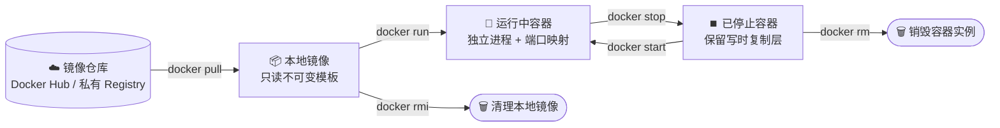

[04 篇（Git 与 GitHub）](./git-github.md) 通过 Commit 快照锁定了代码的每一次变更版本。但当代码离开仓库、准备在生产服务器运行时，03 篇留下的核心矛盾依然没有解决：**Git 锁住了代码版本，但锁不住运行环境**。

在传统物理机或裸虚拟机时代，应用部署始终深陷两难死局与环境污染。本篇正式引入 **{{term:容器}}** 与 **{{term:不可变基础设施}}** 的云原生理念，通过 Docker 将服务器从繁重的构建与环境依赖中彻底解放出来，让服务器回归本职。

## 传统部署的两难死局与环境困境

在容器技术普及前，服务端部署主要有两条经典路线，但两条路线都面临着致命的物理瓶颈：

```text
                    ┌── 路线 A：服务器即时构建 (Build in Server)
                    │    └── 致命痛点：CPU / 内存被构建打满，线上服务响应飙高甚至系统 OOM 夯死；服务器沦为杂乱的“大号开发机”
传统物理机部署的两难 ──┤
                    └── 路线 B：本地构建后传产物 (Build Locally & scp)
                         └── 致命痛点：开发机与服务器环境强异构（macOS vs Linux、GLIBC 差异、缺失 .so 库），低可移植性导致“本地能跑，线上报错”
```

### 1. 路线 A 的困境：重资源构建拖垮线上服务

在生产服务器上 `git pull` 源码后直接执行 `mvn package` 或 `pip install`：

- **资源争抢**：源码编译与依赖打包是典型的 **CPU 与内存密集型任务**，而生产服务的本职是维持稳定的常驻进程。在同一台服务器上边跑业务边编译，极易导致线上请求超时，甚至触发 Linux 内核的 OOM Killer 将核心服务强制杀死；
- **服务器变脏**：为了完成构建，服务器必须安装 JDK、Maven、Python、Node、gcc 以及各种 C 编译头文件（如 `libpq-dev`）。生产服务器逐渐堆满开发工具链，沦为不可控的 **大号开发机**。

### 2. 路线 B 的困境：环境异构与低可移植性

为了保护服务器资源，改在开发者本地电脑编译出 `jar` 或 `wheel` 产物后再 `scp` 上传：

- **环境割裂**：开发者本地通常是 macOS 或 Windows，而服务器是 Linux。尽管 Java 的 Fat Jar 自带了字节码依赖，但只要涉及底层 C 扩展、本地库或特定的 GLIBC 版本，跨机器运行时就会直接报 `GLIBC not found` 或符号找不到；
- **低可移植性**：构建动作与运行环境割裂，产物只包含了代码，没包含“运行环境本身”，造成了经典的“在我电脑上能跑，服务器上一跑就报错”。

### 3. 根源剖析：传统“可变基础设施”的必然缺陷

传统物理机运维本质上是一种 **可变基础设施**（Mutable Infrastructure，俗称宠物模式 Pets）：

- 运维人员把每台服务器当成宠物悉心照料，出了问题通过 SSH 登录上去打补丁、改配置、就地升级；
- 随着时间推移，每台机器的实际环境都会逐渐偏离初始基准，产生 **配置漂移**（Configuration Drift），最终沦为谁也无法完整复刻的“雪花服务器”（Snowflake Server）。

## 理念跃迁：云原生不可变基础设施

面对可变基础设施的泥潭，云原生架构给出了颠覆性的设计原则。

> [!NOTE]
> **💡 云原生的四大核心支柱理念**：
> 在 CNCF（云原生计算基金会）的官方定义中，云原生并非简单地“把代码部署在云上”，而是一整套构建弹性、松耦合与高自动化系统的体系标准。其核心支柱包括：**微服务**、**{{term:容器}}**、**服务网格** 与 **{{term:不可变基础设施}}**（Immutable Infrastructure）。

### 1. 核心哲学：只换不修（Replace, don't repair）

传统物理机运维与云原生运维的核心分水岭，在于对待基础设施的思维方式：

- **传统运维的“宠物模式”**（可变基础设施）：
  运维人员像对待宠物一样悉心照料每台服务器，频繁通过 SSH 登录上去打补丁、改配置、就地升级。随着时间推移，服务器产生 **配置漂移**（Configuration Drift），最终沦为谁也无法完整复刻的“雪花服务器”（Snowflake Server）。
- **云原生运维的“牲畜模式”**（{{term:不可变基础设施}}）：
  **只换不修**。任何部署组件一旦运行即处于只读不可变状态，绝对不再通过 SSH 登录生产环境就地修改。无论是修复 Bug 还是升级功能，统一通过构建全新的不可变交付物，拉起新实例，然后将旧实例彻底销毁。

### 2. 交付标准重构：不可变镜像

Docker 将“不可变基础设施”的宏大哲学在单应用层面具象化为 **不可变镜像**（Immutable Image）：

> **不可变镜像**：
> 将业务代码产物、应用依赖库、语言运行时（JDK/Python）、底层 OS 文件系统与动态链接库完整封装打包为一个自包含的只读模板。

构建只在离线构建机或 CI 流水线上执行一次并生成镜像。生产服务器上 **只安装一个 Docker 引擎**（Docker Daemon），只需拉取镜像直接运行。服务器彻底摆脱了编译器与环境依赖，**回归只跑常驻进程的本职**。

## 容器究竟是什么：Docker vs 虚拟机

理解 Docker 的关键，是破除“容器就是轻量级虚拟机”的常见误区。两者在操作系统底层有着本质的代际差异：

```text
       【传统虚拟机 (VM)】                       【Docker 容器 (Container)】
┌─────────────────────────────────┐       ┌─────────────────────────────────┐
│  App A   │  App B   │  App C    │       │  App A   │  App B   │  App C    │
├──────────┼──────────┼───────────┤       ├──────────┼──────────┼───────────┤
│ Bins/Libs│ Bins/Libs│ Bins/Libs │       │ Bins/Libs│ Bins/Libs│ Bins/Libs │
├──────────┼──────────┼───────────┤       ├─────────────────────────────────┤
│ Guest OS │ Guest OS │ Guest OS  │       │     Docker 引擎 (Daemon)        │
├─────────────────────────────────┤       ├─────────────────────────────────┤
│     Hypervisor (虚拟化层)        │       │   宿主机操作系统 (Linux Kernel)   │
├─────────────────────────────────┤       ├─────────────────────────────────┤
│          物理服务器硬件           │       │          物理服务器硬件           │
└─────────────────────────────────┘       └─────────────────────────────────┘
```

### 1. 架构底层原理对比

- **虚拟机**（Virtual Machine）：
  基于 Hypervisor 在硬件层之上进行虚拟化。每个 VM 内部都必须运行一个完整的 **客体操作系统**（Guest OS）。为了跑一个几十 MB 的后端应用，必须额外背负数 GB 的 OS 内存开销和虚拟硬件损耗，启动过程需要经历完整的系统自检与引导，耗时数分钟。
- **Docker 容器**（Container）：
  **直接共享宿主机的 Linux 内核**。Docker 没有模拟任何硬件，而是通过 Linux 内核原生提供的两大机制构建隔离环境：

  1. **Namespace**（命名空间）：提供视图隔离（让容器内的进程以为自己独占了 PID 进程树、网络协议栈、挂载点和用户体系）；
  2. **Cgroups**（控制组）：提供物理资源硬限制（严格限制该进程组最多使用的 CPU 核心数与内存上限）。

因此，**容器不是一台虚拟的电脑，而是一个运行在宿主机内核上、带有独立隔离视图与资源配额的受限原生进程**。

| 维度 | 传统虚拟机 (VM) | Docker 容器 (Container) |
| --- | --- | --- |
| **底层架构** | 硬件虚拟化 + 独立 Guest OS | **共享宿主机 Linux 内核** |
| **隔离级别** | 硬件级强隔离 | **进程级隔离**（Namespace + Cgroups） |
| **启动耗时** | 分钟级（完整 OS 引导） | **毫秒 / 秒级**（仅拉起业务主进程） |
| **磁盘与内存损耗** | 数 GB 至数十 GB（底噪极大） | **数十 MB 至数百 MB**（仅包含运行时与应用） |
| **性能损耗** | 存在指令翻译与虚拟化损耗 | **原生近乎零损耗**（原生系统调用性能） |

### 2. 为什么容器成就了不可变基础设施？

在虚拟机时代，虽然可以通过整机镜像（如 AWS AMI）实现不可变，但由于 VM 体积巨大（数 GB）且启动缓慢，每次微小的变更都销毁重建 VM 的代价过高。

**Docker 容器将不可变交付的颗粒度从“整个操作系统”精准缩小到了“单个应用进程”**。数十 MB 的体积与秒级拉起的特性，让“只换不修、直接销毁拉新”真正成为每位工程师在日常迭代中触手可及的黄金标准。

## 实体边界：镜像与容器

在操作 Docker 前，必须理清两个核心概念的动静边界：

| 概念 | 本质定义 | 类比面向对象 | 类比 Git | 运行开销 |
| --- | --- | --- | --- | --- |
| **镜像** (Image) | 只读的分层模板（包含代码、依赖、运行时与静态文件系统） | **类** (Class) | 提交快照 (Commit) | 静态存储在磁盘，不占 CPU/内存 |
| **容器** (Container) | 镜像在宿主机上的运行实例（具有可读写层与独立网络栈） | **对象** (Instance) | 工作区检出 (Checkout) | 动态常驻，占用 CPU 与内存 |



## 命令式工具集：5 大核心命令速查

掌握以下 5 条命令，即可完成单容器应用的完整生命周期闭环：

### 1. `docker pull`：拉取不可变镜像模板

```bash
# 拉取公共仓库镜像（生产环境务必显式锁定版本 tag，严禁裸用 latest）
docker pull nginx:1.27-alpine

# 从国内云厂商拉取构建好的业务镜像
docker pull registry.cn-hangzhou.aliyuncs.com/your-org/spring-app:1.0.0
```

### 2. `docker run`：创建并启动容器实例

```bash
docker run -d \
  --name my-app \
  -p 8080:8080 \
  -v /data/logs:/var/log/app \
  -e SPRING_PROFILES_ACTIVE=prod \
  --restart always \
  registry.cn-hangzhou.aliyuncs.com/your-org/spring-app:1.0.0
```

实战核心参数拆解：

| 参数 | 功能 | 运维核心价值 |
| --- | --- | --- |
| `-d` | 后台静默运行（Detached） | 让容器主进程脱离当前 SSH 终端，避免会话退出导致服务终止 |
| `--name` | 指定容器可读别名 | 为容器赋予固定标识，后续管理直接按名称执行，无需查询容器 ID |
| `-p 8080:8080` | 端口映射 (`宿主机端口:容器端口`) | 将外部公网流量经由宿主机端口转入容器内部监听端口 |
| `-v 宿主机路径:容器路径` | 数据卷目录挂载（Volume） | **实现数据持久化与配置解耦**（容器销毁重建后日志和持久化数据不丢） |
| `-e KEY=VAL` | 注入运行时环境变量 | 动态切换运行配置（如生产数据库连接串），无需重新编译镜像 |
| `--restart always` | 容器崩溃自愈与开机自启 | **直接替代传统手写 systemd unit**，容器崩溃或系统重启由 Docker 引擎自动拉起 |

### 3. `docker ps`：查看容器运行时状态

```bash
# 查看当前正在运行中的容器
docker ps

# 查看全部容器（包含已停止、异常崩溃退出的容器）
docker ps -a
```

### 4. `docker stop` 与 `docker rm`：优雅停服与实例销毁

```bash
# 优雅停止（向容器主进程发送 SIGTERM 信号，等待 10 秒后若未退出则发送 SIGKILL）
docker stop my-app

# 销毁容器实例（释放容器写时复制层与端口占用）
docker rm my-app

# 临时排查或 CI 测试场景：容器退出后自动销毁
docker run --rm -p 80:80 nginx:1.27-alpine
```

### 5. `docker rmi`：清理本地旧镜像

```bash
# 清理废弃的旧版本镜像以释放宿主机磁盘空间
docker rmi nginx:1.27-alpine
```

> [!TIP]
> **依赖约束规则**：若某个镜像正在被某个容器（即便该容器处于已停止状态）引用，执行 `docker rmi` 将报错拦截。必须先通过 `docker rm` 销毁对应容器，方可安全删除镜像。

## 实战贯穿：用 Docker 跑 03 篇的 Spring Boot 应用

在 03 篇的传统裸机部署中，要运行一个 Spring Boot 单体应用，我们必须在宿主机上经历一系列繁琐的手工步骤：安装指定版本的 OpenJDK 17、配置全局环境变量、上传 Jar 包、手写 `/etc/systemd/system/myapp.service`、配置用户权限并提防宿主机端口与系统库冲突。

引入 Docker 后，宿主机上 **完全无需安装 Java、Maven 或任何编译工具**，只需执行一条标准命令：

```bash
# 生产服务器一键拉起 Spring Boot 业务容器
docker run -d \
  --name my-spring-boot \
  -p 8080:8080 \
  -e SPRING_PROFILES_ACTIVE=prod \
  -e DB_HOST=172.17.0.1 \
  -v /opt/app/logs:/var/log \
  --restart always \
  registry.cn-hangzhou.aliyuncs.com/xiaolin-docs/spring-app:1.0.0
```

### 这一步对运维带来了哪些根本性颠覆？

1. **绝对一致的确定性交付**：
   镜像在出厂时已经将精简的 Linux 基础层、精确匹配的 OpenJDK 17 运行时和可执行 Fat Jar 封箱锁死。无论宿主机是 Ubuntu、CentOS 还是 Debian，拉起后的运行行为 100% 相同；
2. **宿主机零环境污染**：
   宿主机只运行 Docker Daemon。如果不再需要该业务，只需 `docker stop && docker rm`，宿主机干干净净，绝无任何残留文件或全局变量污染；
3. **极简优雅的保活自愈**：
   通过 `--restart always` 参数，直接获得了 Linux 开机自启与进程崩溃自动重启能力，彻底告别了手写 systemd unit 文件的繁琐与侵入性。

## 小结

至此，Docker 完美终结了传统单组件部署的两难死局：

- **告别服务器即时构建**：重资源构建任务剥离至离线环境或 CI 构建机，生产服务器只拉取镜像运行；
- **告别本地构建环境异构**：不可变镜像将代码与运行时整包交付，彻底攻克了 **低可移植性**（Low Portability）；
- **服务器回归本职**：宿主机彻底摆脱了开发工具与依赖泥潭，专注提供稳定纯粹的容器运行底座。

### 留给后续篇章的演进引线

虽然 Docker 彻底解决了 **单容器运行** 的全部痛点，但在真实生产环境中依然面临新的工程诉求：

1. **镜像从何而来？**
   生产镜像如何编写 Dockerfile，又如何在 Git 代码 push 后自动触发构建并推送到镜像仓库？这将在 [第 06 篇（流水线基础）](./pipeline-basics.md) 与 [第 07 篇（GitHub Actions）](./actions.md) 中全面展开；
2. **多组件依然繁琐**：
   在 03 篇确立的“Nginx + Spring Boot + MySQL”最小生产组合中，如果继续通过命令行一条条手动 `docker run`、手动管理端口与容器互联，依然陷入了 **高运维苦工**（High Toil）。如何用一份声明式配置文件一键启动与编排整套集群？这就是 [第 08 篇（Docker Compose 多服务编排）](./docker-compose.md) 的核心使命。

## 思考

1. 为什么说“容器只是宿主机上的一个受限进程”，而不是像虚拟机那样拥有独立的 OS 内核？这种机制带来了哪些性能与资源优势？
2. 如果在宿主机上执行 `docker run -d -p 8080:8080` 启动了容器 A，再次执行相同的命令（不改端口）启动容器 B，会发生什么？为什么？
3. 容器内部生成的日志和业务数据，在容器被 `docker rm` 销毁后会丢失吗？如何通过 `-v` 挂载参数确保数据绝对安全？

## 参考

1. [Docker 官方架构指南](https://docs.docker.com/get-started/overview/)
2. [Docker CLI 命令参考手册](https://docs.docker.com/engine/reference/run/)
3. [Docker Hub 官方镜像仓库](https://hub.docker.com/)
4. [CNCF 官方关于云原生与不可变基础设施的定义](https://github.com/cncf/toc/blob/main/DEFINITION.md)
5. [Google SRE 体系关于 Toil 的定义与实践](https://sre.google/sre-book/eliminating-toil/)