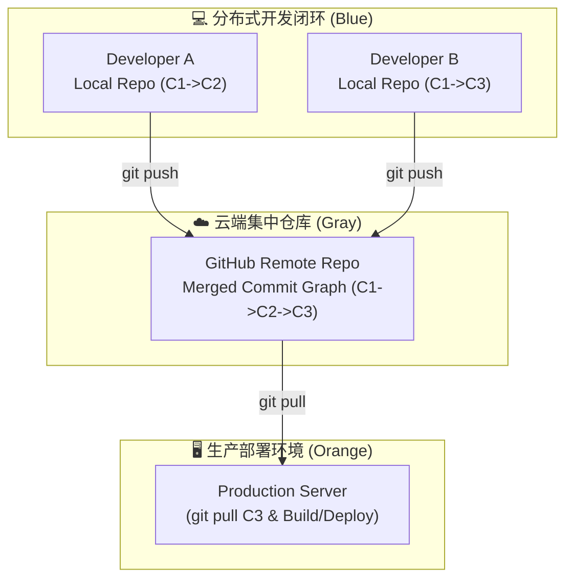

[上一篇（03 服务端应用部署）](./server-side-deploy.md)把构建动作搬到了服务器：SpringBoot 要 `mvn package`，Flask 要 `pip install`，服务器上多出源码、依赖、构建产物三套东西。这里藏着一个真问题：**服务器上正在跑的这次构建，对应哪一份代码？**

如果回答不了这个问题，回退、排查、复现都会变成“靠记忆猜”。**痛点三：没有版本追踪**——手动备份会被跳过、没有上下文、回退要重做一遍——在服务端部署场景下变得更加危险。

这个痛点在部署函数 $f(x)$ 里的体现是：**$x$（变更内容）没有锚点**。你改了什么、什么时候改的、改坏了回哪个版本、服务器上那次构建对应哪次提交——这些 $f$ 的输入信息散落在操作记忆里，没有被固化下来。

这一篇的解法是**版本管理**。

## 版本管理：03 篇痛点三的解法

[03 篇](./server-side-deploy.md) 提到服务器构建时手动备份 `dist-20260713` 的三个断点，Git 一次性补完：

| 断点 | 手动备份 | Git |
| --- | --- | --- |
| 会被跳过 | 改动小时直接覆盖 | `git commit` 是轻量操作，不会跳过 |
| 没有上下文 | 只有日期 | 每次 commit 附带修改人、时间、说明 |
| 回退要重做 | `mv` 目录 + 重启 | `git revert` / `git checkout`，秒级回退 |

核心能力：**给每一次变更拍一张带上下文的快照（commit）**。快照连成链，任何一次部署都能精确对应到链上的某一个节点。


<details>
<summary>📐 静态信息图 Prompt 与 Mermaid 结构参考</summary>



**Prompt**:
```text
Notion style minimalist line art infographic, hand-drawn marker stroke texture. 16:9 aspect ratio. Distributed Version Control & Deployment Architecture: Top-left (blue accent #1890ff): 'Developer A (Local Repo)' with laptop showing local commit chain (C1 -> C2). Bottom-left (blue accent #1890ff): 'Developer B (Local Repo)' with desktop showing local commit chain (C1 -> C3). Center (neutral gray accent #8c8c8c): 'GitHub Remote Repo' with large cloud icon containing merged commit graph (C1 -> C2 -> C3), receiving 'git push' arrows. Right (orange accent #fa8c16): 'Production Server' with server rack pulling commit (C3) via 'git pull' to build and deploy. Clear hand-drawn diagrams, legible labels, rich structure filling the 16:9 canvas cleanly. White background, black line art. No drop shadows, no gradients.
```

- 产物路径：`docs/public/images/img-git-github/diagram-git-distributed-collaboration.png`
- CDN 引用：`https://media.xiaolin.fun/docs/img-git-github/diagram-git-distributed-collaboration.png`
</details>

## Git：给变更拍快照

**Git 是本地工具，不依赖 GitHub 也能完整使用。** 它在你的电脑上管理版本历史，不需要联网、不需要注册账号。GitHub 是后面才加的一层——先把本地的 Git 用明白。

### 运维场景 × 命令

这不是通用 Git 教程，而是“运维拿 Git 干什么”对应的最小命令集：

| 运维场景 | 命令 | 说明 |
| --- | --- | --- |
| 初始化项目版本管理 | `git init` | 把当前目录变成 Git 仓库 |
| 声明忽略文件（防误传依赖/密钥） | 创建 `.gitignore` | 写入 `node_modules/`、`venv/`、`.env` 等 |
| 改了配置 / 代码，先看看改了啥 | `git status` / `git diff` | commit 之前必看，确认改动范围 |
| 确认没问题，记录这次变更 | `git add .` → `git commit -m "说明"` | 拍快照——这就是 $x$ 的一次锚定 |
| 出问题了，查“当时改了什么” | `git log --oneline` + `git diff A B` | 事后排查的入口 |
| 出问题了，要回退 | `git revert <commit>` | 生成一次“反向 commit”，不丢历史 |
| 想回到某个历史版本看看 | `git checkout <commit>` | 临时切到旧版本，看完切回来 |

> **关键习惯与分支概念**：
>
> 1. **养成第一习惯**：新建项目第一步务必先创建 `.gitignore`，防止第三方依赖包（如 `node_modules/`、`venv/`）和敏感配置文件（如 `.env` 密钥）误提交。
> 2. **单主线模式即可**：前期无需引入复杂的分支策略，保持在默认主分支 `main` 上顺着线性快照链向前推进即可。多分支与变基留到复杂协同场景。

### 快照链：比备份目录可靠在哪

备份目录只有“旧”和“新”两个状态，而 commit 历史是一条链：

```text
A → B → C → D
```

每个节点都知道自己从哪里来，也能随时回到任意节点。想回退到 B，不需要手动 `mv` 目录，只需要告诉 Git“我要回到 B”即可。

这条链还解决了 02 篇提到的“版本不一致”问题——本地构建的 `dist` 对应哪次 commit、服务器上跑的又是哪次 commit，都有据可查。

## Commit 信息：开发者最该写好的那一行

`git init` / `add` / `push` 都会变成肌肉记忆，**唯独 commit 信息写什么，过去时常是一件伤脑筋的事**——三个月后排查问题的人、接手代码的新同事、回溯事故的运维，先看的都是这一行。`"update"` / `"fix bug"` / `"tmp"` 这类含糊写法，会让历史变成“考古谜题”。

### Conventional Commits：把 commit 信息结构化

[Conventional Commits](https://www.conventionalcommits.org/) 是社区主流的 commit 格式规范：

```text
<类型>[可选作用域]: <简短说明>

[可选正文]

[可选脚注]
```

最常见的类型前缀：

| 前缀 | 用途 |
| --- | --- |
| `feat` | 新功能 |
| `fix` | Bug 修复 |
| `docs` | 仅文档变更 |
| `refactor` | 重构（既不修复 bug 也不新增功能） |
| `test` | 添加或修改测试 |
| `chore` | 构建、依赖、工具链等杂项 |
| `perf` | 性能优化 |
| `style` | 代码格式（不影响语义） |

格式化的价值在于**让 commit 信息变成可机读的结构化数据**：

- **CI/CD 自动化**：`feat:` 触发 minor 版本号、`fix:` 触发 patch 版本号、`BREAKING CHANGE` 触发 major。
- **CHANGELOG 自动生成**：工具按类型分组输出变更摘要，无需人工整理。
- **排查提速**：扫一眼前缀就知道本次改动的性质，无需打开 diff。

### AI 时代的新挑战：从“靠自觉”到“靠工程化治理”

过去写 commit 信息是开发者的“软素质”——靠自觉、靠 code review 提醒、靠团队规范约束。在 AI Agent 时代则升级为 **“靠工程化治理”**：自动提交拦截、Conventional Commits 强校验（commitlint）、自动信息填充、commit 质量门禁（pre-commit + 服务端分支保护）等议题本文暂不展开。

详见 [《AI Agent 时代下重新审视 Git》](../../../ai/theory/git-in-ai-agent-era.md)。

## GitHub：让快照离开本地硬盘

Git 在本地管理版本——但本地硬盘坏了，历史一起没了。而且手动 scp 上传代码本身就是 02 篇的痛点。GitHub 解决两件事：

1. **备份**：本地仓库同步到云端，硬盘坏了历史还在。
2. **传输**：服务器通过 `git clone` / `git pull` 拿到代码，不需要 scp。

### 首次关联与推送

在使用 `git push` 推送到远程仓库前，需要确保本地已经完成了初始化并提交了至少一次 commit：

```bash
# 1. 在本地项目根目录初始化并提交代码
git init
git add .
git commit -m "feat: initial commit"

# 2. 关联远程仓库（请将下面的地址替换为你自己的 GitHub 仓库 URL）
git remote add origin https://github.com/your-username/your-repo.git

# 3. 推送到远程主分支
git push -u origin main
```

之后三条核心命令：

| 命令 | 方向 | 作用 |
| --- | --- | --- |
| `git push` | 本地 → GitHub | 把本地新 commit 送到云端 |
| `git pull` | GitHub → 本地 / 服务器 | 把云端新 commit 拉下来 |
| `git clone` | GitHub → 任意机器 | 首次把整个仓库（含历史）复制过来 |

有了 GitHub，02 篇的 scp 部署可以升级为：

```bash
# 服务器上
git clone https://github.com/your-username/your-repo.git
cd your-repo
# 构建 + 部署……
```

每次更新，服务器上 `git pull` 就拿到最新代码——不再需要手动 scp。

### 推荐用 SSH 协议：非对称密钥替代密码

HTTPS 协议每次推送都要输入用户名密码（或 Personal Access Token），CI/CD 场景下基本不可用。**推荐改用 SSH 协议 + 非对称密钥**：本地生成密钥对，把公钥交给 GitHub，之后推送用私钥签名、GitHub 用公钥验签——全程不传密码，CI 也能免密跑。

#### 三步配好 SSH

1. **本地生成密钥对**：

   ```bash
   ssh-keygen -t ed25519 -C "your_email@example.com"
   ```

   一路回车即可，会在 `~/.ssh/` 生成 `id_ed25519`（私钥）和 `id_ed25519.pub`（公钥）。

2. **把公钥复制到 GitHub**：

   打开 `~/.ssh/id_ed25519.pub`，复制全部内容。登录 GitHub → **Settings** → **SSH and GPG keys** → **New SSH key**，粘贴并保存。

3. **验证连通性**：

   ```bash
   ssh -T git@github.com
   ```

   看到 `Hi username! You've successfully authenticated...` 即表示配置成功。

> [!WARNING]
> **私钥千万不能泄漏！** 私钥（`id_ed25519`）留在本地和目标服务器，绝对不能提交到 Git 仓库，更不能公开发布。用 `.gitignore` 忽略 `.env` 等敏感文件；万一误推，应立刻轮换密钥，而不是仅删除文件再提交。

## Git 在部署路径中的位置

03 篇确立的服务端部署范式：

> 构建产物（fat jar / wheel + 依赖声明）→ 进程拉起 → 后台挂着 → 验证 + 排查

Git 是这条范式的**前置能力**——没有版本管理，部署无法可追溯：

- **构建产物可追溯**：每次 `git commit` 是产物的一次锚定——服务器上跑的是哪次 commit、有谁改了什么、出问题回哪个版本，都有据可查。
- **部署可重现**：`git checkout <commit>` → 构建 → 部署，每一步都有精确锚点。
- **回退变成重跑**：出问题 → `git revert` 反向 commit → 重新跑一遍部署 → 回到上一个稳定状态。
- **03 篇“没有版本追踪”痛点彻底解决**：手动备份会被跳过、没有上下文、回退要重做——Git 一次性补完。

**Git 不是“开发者的工具”，是服务端部署范式能运转的前提**——没有版本管理，$x$（变更内容）是模糊字符串；有了 Git，$x$ 是 commit hash 锚定的精确快照。

## 不只是开发者：Git 的适用范围

Git 在公众视野里几乎和“程序员”绑定——但这是职业视角的误读。Git 是面向所有人的版本管理工具，本质和 Word 的“修订模式”、Excel 的“修改记录”是同一类需求——只是做得更彻底、更通用、更可协作。它不挑职业，只挑**内容形态**：纯文本最擅长，二进制能存但有代价。

### 为什么特别适合纯文本

Git 的快照是按文件整体存的，但只有**纯文本**能让它发挥最大价值——文本可读、可搜索、可对比、可合并。绝大多数职业的核心产出物都是文本：代码、配置、需求文档、合同条款、论文、小说章节。**所有人都需要版本管理，只是大多数人叫它“另存为 -v2-final.docx”**。

### 与 Markdown 的天然协同

Git 和 Markdown 是**事实上的最佳搭档**——一份 `.md` 文件同时是 Git 的理想内容和几乎所有文档平台的输入：

- **Git 看 Markdown**：纯文本，diff / merge 完美工作，“改了哪一段、删了哪一句”一目了然。
- **Markdown 看 Git**：单文件极小（一份项目文档通常几十 KB，`.docx` 动辄几十 MB）——仓库体积可控、`git clone` 毫秒级。
- **编辑器友好**：VS Code / Obsidian / Typora / JetBrains 全家桶都原生支持 Git + Markdown，开箱即用。
- **平台中立**：同一份 `.md` 可以渲染到 VitePress / GitHub Pages / GitBook / Notion / 自建站 / 微信公众号，不被任何厂商锁定。
- **AI 友好**：LLM 天然生成与解析 Markdown，AI 写的文档可直接 commit，CI 可自动校验格式。

这正是 Git × Markdown 流行的根本原因：**写作者只需要“想清楚写什么 + 用 Git 管理变更”，下游的渲染、分发、协同全部交给生态**。

### 一切即代码：公式、图表、基础设施都可进 Git

Markdown 不只是“写文章”，它**把代码化的思维带进了文档**——以前嵌在 Word 里的复杂对象，现在都能用纯文本承载、随 Git 进版本管理：

- **数学公式**：Markdown + KaTeX（行内 `$...$`、块级 `$$...$$`）让 LaTeX 公式直接写在文档里，渲染为网页公式——不再需要 Word 那种“嵌入对象”的黑盒。
- **架构图**：Markdown + Mermaid 让流程图、时序图、ER 图、状态图用纯文本语法画出来——diff 可读、改动可追溯、版本可比较。
- **基础设施**：Dockerfile、docker-compose、GitHub Actions、Jenkinsfile、Ansible、Terraform——这些“基础设施即代码”的配置文件本身就是声明式代码，天然适合 Git。

**一句话总结**：**一切即代码，代码即可版本管理**。把“贴在 Word 里的截图 / 嵌入对象”换成“写在 Markdown 里的公式、Mermaid、IaC 配置”，就同时获得 diff 可读、版本可追、轻松渲染、**极其方便迁移**——一份 `.md` 走到任何平台都能渲染，不用担心厂商锁定。

### AI 原生协作新范式

在 AI Agent 时代，“Git + Markdown + 声明式配置”成为了人类与 AI 协作的**公共语言**：AI 编写 Markdown 文档并提交 commit，人类审阅、合并；CI 自动校验格式、自动构建、自动部署。

后续篇章中，我们将继续基于这种模式展开：

- **基础设施即代码（IaC）**：05 篇 Docker / Docker Compose、06 篇流水线基础、07 篇 GitHub Actions 都会落到这一层——服务器配置不再“贴控制台截图”，而是写在仓库里的 YAML / Dockerfile。

### 适合什么、不适合什么

| 内容类型 | 是否适合 Git | 原因 / 替代方案 |
| --- | --- | --- |
| 代码、配置、Markdown、LaTeX | ✅ 非常适合 | 纯文本，diff/merge 全自动 |
| 设计文档 / 需求文档（结构化文本） | ✅ 适合 | 同上 |
| 图片（少量、偶尔改） | ⚠️ 可用 | 二进制版本管理，diff 不可读 |
| 图片（频繁改 / 大量） | ❌ 不适合 | 仓库膨胀、无法合并——用 DAM / 对象存储 |
| 视频、音频、大型 3D 素材 | ❌ 不适合 | 单文件几百 MB，用对象存储 |
| Office 文档（.docx / .xlsx） | ⚠️ 凑合 | 内部 zip+xml，diff 不可读——用 Word / 飞书协同 |
| 数据库、生产数据 | ❌ 极不适合 | 用迁移工具管 schema，数据本身做备份 |

**简单原则**：主产出物是文本 → 用 Git；主产出物是大文件或频繁变的二进制 → 专用工具（图床、对象存储、专业 DAM、Word 协同）。

## 小结

Git 是本地版本管理工具，不依赖 GitHub 也能独立使用——它在你的电脑上管理版本历史，给每一次变更拍带上下文的快照。GitHub 是云端托管平台，解决备份和传输问题。

对运维而言，Git 的核心价值是让 $x$（变更内容）有了精确锚点：每次部署对应哪次 commit、出问题回哪个版本、服务器上跑的是什么代码，都有据可查。这是后续所有自动化（流水线、容器化、GitOps）的基础——05 篇的 Docker、06 篇的 Jenkinsfile，都建立在“代码有版本”这个前提之上。

## 思考

1. `git commit -m "update"` 这样的说明有什么问题？Conventional Commits 前缀（如 `feat:` / `fix:`）对自动生成日志与版本发布有什么帮助？
2. 如果有人直接在服务器上修改了代码（没走 Git），再执行 `git pull` 会发生什么？正确的服务端更新流程应该是什么？
3. 如果 GitHub 仓库误上传了密码或 API Key，只删除文件再提交一次够不够？正确做法是什么？

## 延伸阅读：其他 Git 托管平台

GitHub 不是唯一的 Git 托管平台。选择时主要看**网络可达性**和**功能需求**：

| 平台 | 特点 | 推荐场景 |
| --- | --- | --- |
| [GitHub](https://github.com) | 全球最大开源社区，CI/CD（GitHub Actions）生态完善 | 个人开发者、开源项目 |
| [GitLab](https://gitlab.com) | 一站式 DevOps（代码 + CI + 镜像仓库 + CD），可自托管 | 中小团队、企业内网 |
| [Gitee](https://gitee.com) | 国内直连、无需科学上网，功能与 GitHub 类似 | 国内开发者、网络受限环境 |

三者底层都用 Git，`git push` / `git pull` 命令完全一样——只是远程地址不同。选哪个取决于你的网络环境和团队需求，不影响本地 Git 的使用。

## 参考

1. [Git 官方文档](https://git-scm.com/doc)
2. [GitHub 官方文档](https://docs.github.com)
3. [Conventional Commits](https://www.conventionalcommits.org/)
4. [GitHub Hello World](https://docs.github.com/en/get-started/start-your-journey/hello-world)
