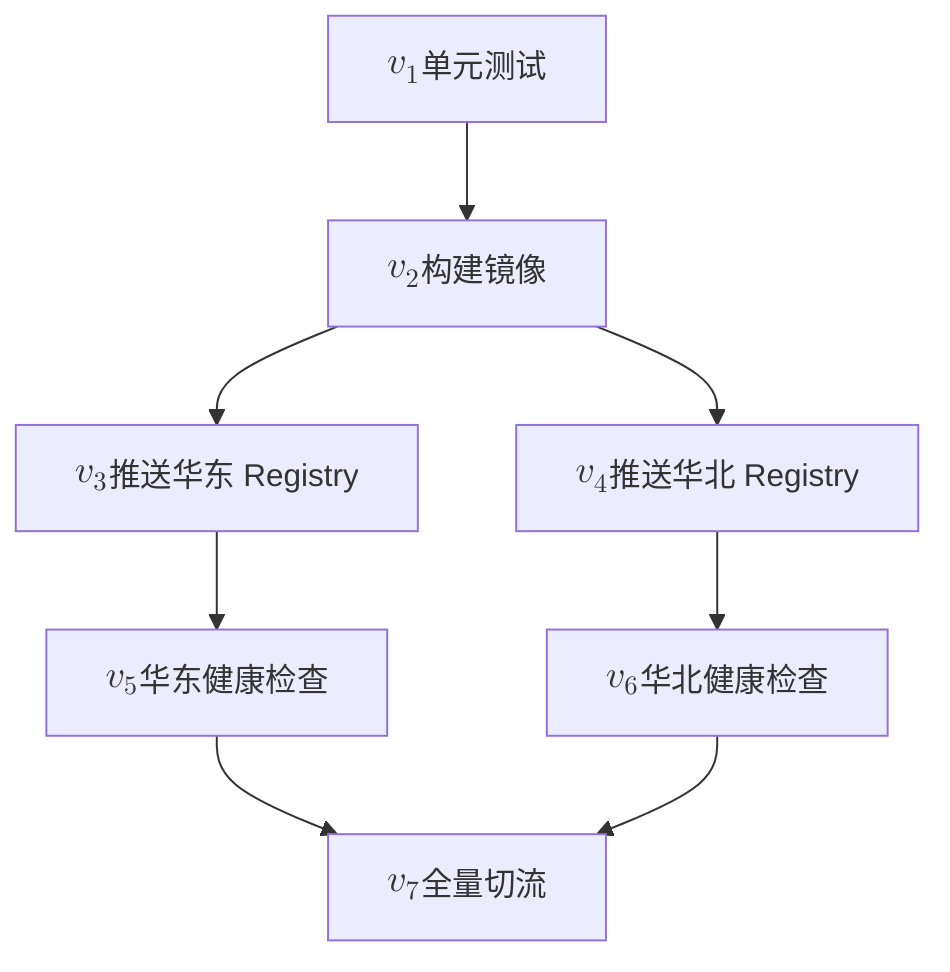
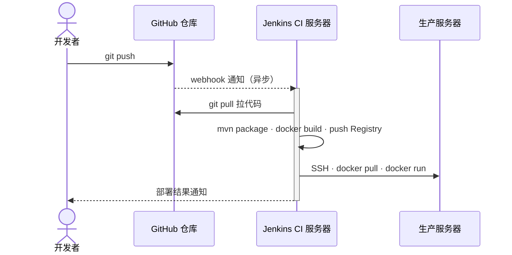

05 篇用 Docker 把「运行环境」封装成不可变镜像，攻克了 03~04 篇留下的可迁移性与服务器污染两大死局。但 05 末尾自己也点明：**每一条部署路径的最后一步，依然要人去执行**。

把 03~05 篇走过的几种部署模式摆在一起看，这条「人 → 服务器 → 命令序列」的链路从未消失：

| 模式 | 上线步骤 | 执行主体 |
| --- | --- | --- |
| **进程模式（03~04）** | `ssh → cd → git pull → mvn package → systemctl restart → curl /health` | 人 ssh 进去逐条敲 |
| **容器模式（05）** | `ssh → docker pull → docker run → curl /health` | 人 ssh 进去逐条敲 |

两种模式**形式上等价**——都是从 SSH 登录开始，以健康检查收尾，**唯一的差别只是中间的「业务动作」换了一组命令**。漏一步、记错顺序、上线时心慌的问题**没有被容器化消解**，只是换了个执行现场。

这一篇做两件事：

1. **把重复命令固化成命令式 shell 脚本**——把「上次怎么做的」沉淀为「这次照着跑就行」，自动化运维的第一步；
2. **介绍 Jenkinsfile**——把脚本搬进代码仓库，让每次 `git push` 自动触发整条流程，初步触及「**基础设施即代码**」（IaC）的思想。

> **术语**：这里的「**命令式**」（imperative）指「一步步告诉系统**做什么、按什么顺序做**」——shell 脚本、`bash`、`python` 都属于命令式。与之相对的「**声明式**」（declarative）指「只描述**要什么**、让引擎自己决定怎么做」——K8s YAML、Terraform HCL、GitHub Actions YAML 是声明式。本篇的关键转折点是：**命令式脚本无法直接表达 DAG 拓扑与并行**——这是升级到流水线引擎的根本原因。

## 命令式脚本：把动作序列固化进 shell

把「上线步骤」写成一份 shell 脚本，是一切自动化的**最小可行起点**——一行命令能跑通的事，不要每次让人敲。shell 是典型的**命令式语言**：每一行是一条命令，shell 按书写顺序逐条执行，依赖靠 `&&`、`||`、`;` 串联。

承接 05 篇的容器模式部署，可以把上线动作固化成一个 `deploy.sh`：

```bash
#!/usr/bin/env bash
set -euo pipefail

# 1. 拉取镜像
docker pull your-registry/app:${VERSION:-latest}

# 2. 停掉旧容器
docker rm -f app || true

# 3. 启动新容器
docker run -d --name app -p 8080:8080 \
  -e DB_URL="${DB_URL}" \
  your-registry/app:${VERSION:-latest}

# 4. 健康检查
sleep 5
curl -fsS http://localhost:8080/health
echo "deploy ${VERSION:-latest} ok"
```

部署时不再登录服务器手动敲命令，而是：

```bash
ssh ubuntu@server "VERSION=1.2.0 ./deploy.sh"
```

**对比改动**：每次上线还是需要 SSH 一次，但**剩下的命令交给脚本**——人能记错的地方，脚本不会；人能漏掉的 `set -e`，脚本自带。

### 把 05 篇的 Job 接到命令式脚本上

05 篇的「最小生产变更」已经定义了 4 个 Job：

- $J_1$（**DB**）：装 MySQL / 导入 schema / 启动服务
- $J_2$（**App**）：部署 Spring Boot
- $J_3$（**Nginx**）：写 `nginx.conf` / `nginx -s reload`
- $J_4$（**verify**）：`curl -fsS /api/health`

**关键点**：自变量 $x$ 的**范围**决定要跑哪些 Job——**不是每次都全量跑 4 个**。

- 只改了前端代码 → 整个 App Job 都不用跑（DB 也不动）；
- 只改了 `nginx.conf` → 只需要重载 Nginx，App / DB 都不需要动；
- 只改了 DB schema → 才需要 $J_1$；同时改了 App → 还需要 $J_2$。

所以 05 篇的「4 个 Job」不是说每次上线都要全打一遍——而是**根据 $x$ 的范围按需挑选**。

**复杂度降级：Job 内的串行步骤从 $n$ 收编到 $1$**——对**单个 Job** $J_i$ 来说，05 篇里还是「ssh 上去手敲」的一条条命令——一个 Job 内部有 $n$ 个串行步骤（ssh → pull → rm → run → sleep → curl……），**每一步都是一次独立的执行单元**：漏一步、记错顺序、心慌。

这一篇做的事：**对每个 Job 用 1 个 shell 脚本实现**——把 $n$ 个步骤**收编**到一个文件里。从外部看，整个 Job 就是一次脚本调用：

```bash
#!/usr/bin/env bash
# app.sh —— 一个 Job 内的 $n$ 步被收编到一个脚本里
set -euo pipefail

docker pull your-registry/app:${VERSION:-latest}
docker rm -f app || true
docker run -d --name app -p 8080:8080 \
  -e DB_URL="${DB_URL}" \
  your-registry/app:${VERSION:-latest}

sleep 5
curl -fsS http://localhost:8080/health
echo "app ${VERSION:-latest} ok"
```

部署时只要：

```bash
VERSION=1.2.0 ./app.sh
```

$n$ 个步骤**数量没变**，但**对外的复杂度从 $n$ 降到了 $1$**——所有步骤被收编到一个 `.sh` 文件里，对外只是一次「调用」：**人能记错的地方，脚本不会**；`set -euo pipefail` 让脚本自带失败兜底。

> 这就是命令式脚本带来的核心复杂度降级：**Job 内的串行步骤，对外的复杂度从 $n$ 收编到 $1$**。

多个 Job 之间用 `&&` 串联（前者失败则后者不启动）：

```bash
./db.sh 1.2.0 && ./app.sh 1.2.0 && ./nginx.sh 1.2.0 && ./verify.sh 1.2.0
```

`&&` 仍然只表达**串行**——05 篇的「$J_1 \to J_2 \to J_3 \to J_4$」拓扑序，用命令式 shell 的串行原语压扁成一行。**单 Job 内部是命令式脚本，Job 之间的串联也是命令式脚本**——这是命令式自动化的全部内容。

### 对 shell 脚本的初步划分：Job 与 step

把上面的 4 个 Job 落到工程实践里，会自然长出两个粒度的拆分——**Job 与 step**：

- **Job**：对一个**完整目标**的封装——把「把 DB 起好」「把 App 部署完」这类业务动作打包成**一个独立的 shell 文件**（`db.sh` / `app.sh`）；
- **step**：Job 内部更细的子动作——`docker pull`、`docker run`、`mysql ping`、`curl /health`。

常见的划分原则有三条：

1. **前后端分开**：`app.sh` 进一步拆成 `frontend.sh` 和 `backend.sh`——失败域隔离，前端没起好不会拖垮后端，可以单独重跑；
2. **verify 内置到 Job 作为 last step**：每个 Job 跑完不是「无脑返回 0」，而是自己在最后用 `curl` 或 `mysql ping` 验证一下，确认**这个 Job 的约定结果**真的达成了；不像 04 篇那样「上线靠记忆」；
3. **Job 之间用 `&&` 串联**：依赖关系靠命令式 shell 的串行原语表达——前面的 Job 没成功，后面的 Job 不会启动。

举一个拆细后的例子（Job 内含多个 step，verify 作为 last step）：

```bash
#!/usr/bin/env bash
# app.sh —— 一个 Job 内部用 step 表达 + verify 内置
set -euo pipefail

# step 1: 拉镜像
docker pull your-registry/app:${VERSION:-latest}

# step 2: 停旧容器
docker rm -f app || true

# step 3: 起新容器
docker run -d --name app -p 8080:8080 \
  -e DB_URL="${DB_URL}" \
  your-registry/app:${VERSION:-latest}

# last step: verify（不是再写一个 verify.sh，而是把验证内置进来）
sleep 5
curl -fsS http://localhost:8080/health
echo "app ${VERSION:-latest} ok"
```

把 Job / step 这套拆分明确化之后，命令式 shell 也就走到了尽头——它能解决「**单 Job 内的串行 step**」与「**Job 之间的串行串联**」，但两个更深层的诉求会撞上结构性边界。这两个边界，正是 06 篇要引入流水线引擎的动机。

### 边界一：多机协作与并行拓扑

业务从单台服务器扩到 5 台、10 台、100 台时，「同一份 `deploy.sh`」要在 $N$ 台机器上各跑一次。命令式 shell 只能写 `for server in ...; do ssh ...; done`——这是**串行**展开，遇到慢的机器、慢的网络会拖垮整体进度。真实场景里这 $N$ 台机器之间的部署**有并行机会**：先全量重启前 5 台、健康检查通过后再并行重启后 5 台。

命令式 shell 想做的是「**按拓扑序执行**」——$v_3$ 与 $v_4$ 没依赖就并行、$v_7$ 必须等 $v_5$ 与 $v_6$——但它只能用 `&` 把任务丢后台、用 `wait` 同步，**硬模拟**这种拓扑关系：

```bash
ssh h1 "./app.sh" &
ssh h2 "./app.sh" &
ssh h3 "./app.sh" &
wait
```

`wait` 不知道谁依赖谁、谁等谁；每加一台机器都要再敲一行 `&` 和一行 `wait`——维护项随机器数量线性增加，拓扑关系变复杂后，整体管理复杂度会快速上升。


::: details 📐 静态信息图 Prompt 与路径参考（左侧：shell 命令流 / 右侧：DAG 依赖图）

**Prompt**：

```text
极简手绘马克笔信息图，16:9 横版。主题为「shell 命令流 vs DAG 依赖图」：
- 左侧「shell 命令流」：自上而下 5 条命令序列方块（h1, h2, h3, h4, h5），
  每条都是 ssh + ./app.sh；h1/h2/h3 末尾各有一个 "&" 标记，h3 之后接
  一个虚线框「wait」；最下方红色标签「并行靠硬模拟 · 维护成本指数上涨」
- 右侧「DAG 依赖图」：顶部 1 个「build」节点向下展开为 h1/h2/h3/h4/h5
  共 5 个并列节点（横向并排、无连线），下方一个「healthcheck」节点
  接收来自 5 个节点的箭头汇入；右侧绿色标签「引擎按图自动调度」
左右两栏用一条细灰线分隔；顶部居中标题「边界一：shell 无法建模生产变更的操作拓扑」。
暖白背景、黑色线稿；所有自然语言使用简体中文；无阴影、无渐变、无 3D。
```

- 产物路径：`docs/public/images/img-pipeline-basics/infographic-shell-flow-vs-dag.png`
- 站点引用：`https://media.xiaolin.fun/docs/img-pipeline-basics/infographic-shell-flow-vs-dag.png`

:::

**边界一的本质**：shell 脚本**无法有效建模生产变更的操作拓扑**。前者是「拓扑排序」（按依赖排出的命令序列）的命令式模拟，后者是「DAG」（直接表达依赖关系的数据结构）的声明式描述。两者的差别不在语法，在「能不能让工具直接看到依赖图」——**shell 给你一条命令流（并行与依赖靠人维护）；DAG 给你一张依赖图（引擎自己调度）。**

引入流水线引擎的根本动机，就是把「按拓扑序执行」从「shell 里硬模拟」升级到「引擎读 DAG 自动调度」——下一节的 DAG 就是这条路的展开。

### 边界二：shell 脚本的健壮性危机

边界一是「能不能表达拓扑」，边界二是「**表达对了能不能稳定跑**」——这是代码层面的问题，与拓扑无关。

在终端里根据手册敲指令，是一种**随机应变**的过程：人可以读报错、现场判断、决定下一步——「这个文件不存在就跳过」「这一步报错就回滚」「看起来不对先 abort」。这种灵活是**人**提供的，不是命令本身提供的。

**shell 脚本把这件事翻转了**——它意味着「所有操作预期都完成」：每一步都按事先写死的逻辑跑，没有人会现场救你。**三层后果**随之而来——

**步骤越多，出错概率指数叠加**——$n$ 个独立步骤，每个步骤的成功率 $(1-p)$（如 $p = 0.01$），整条流水线的成功率 $(1-p)^n$ **随 $n$ 指数下降**。5 步约 $95\%$，15 步就只剩 $86\%$。**步骤越多越脆弱**——这不是 shell 的错，是数学事实。

**失败模式不可预测**——网络抖动、磁盘满、镜像拉取超时、API 限流、配置漂移……每一种都可能让一个步骤不按预期走。脚本不会停下来问你「下一步怎么办」，它只会按事先写好的逻辑硬跑，要么继续、要么 `exit 1`。

**防御性编程 = 补丁代码**——现实里 shell 不可避免地演化出这些补丁：

```bash
docker rm -f app || true            # 旧容器不存在也不能崩
sleep 5 || true                     # sleep 失败？无所谓
curl -fsS ... || curl -fsS ...      # 重试一次
[ -f /tmp/xxx ] && rm -f /tmp/xxx   # 文件可能不存在
set -euo pipefail                   # 任一步失败就退出
```

`|| true`、`set -e`、`&&` 串联……每出现一次新失败模式就加一条防御，**写到最后都是补丁代码**：核心逻辑被层层防御淹没，新人接手时已经看不出「这个脚本到底想干什么」。

**边界二的本质**：shell 把「**终端中的随机应变**」固化成「**事先写死的流程**」——步骤越多、健壮性越差、可读性越糟。**一般的流水线引擎也没有解决这个问题**——它能帮你跑得更快、跑得更自动，但每个 step 内部的 shell 仍然是 shell，**代码健壮性的债务最终仍要靠 shell 自身去还**。

更深层的兜底（事务、迁移脚本、版本回滚、变更审批、灰度发布）要靠更上层的 IaC 体系（Terraform / K8s）——本篇点到为止，07 / 08 / 进阶篇会陆续展开。

### 流水线引擎解决了哪个

把这两个边界与 06 篇的命题对齐：

- **边界一**：流水线引擎是「**解药**」——它用 DAG 拓扑替代硬模拟并行，用引擎调度替代手工 `&&`；
- **边界二**：流水线引擎是「**配角**」——shell 脚本的健壮性仍要靠脚本自身、IaC 工具、组织流程来兜底。

下一节展开——**流水线引擎如何面向 DAG 建模**，把边界一彻底解决。

## 流水线引擎：面向 DAG 建模

继续把 $f$ 拆细：**生产变更**很少是「一条直线」。它通常长得像这样——**有先后、有并行、有汇总**：



这种「局部并行、整体有序」的拓扑，**线性箭头写不出来**——$v_3$ 与 $v_4$ 之间没有依赖，可以同时跑；$v_7$ 必须等 $v_5$ 和 $v_6$ 都成功。

把它抽象成数据，就是一张**有向无环图**（Directed Acyclic Graph, **DAG**）：

- **节点 $v_i$**：每一个具体动作（pull / build / test / deploy / check）；
- **有向边 $v_i \to v_j$**：$v_j$ 必须在 $v_i$ 完成后才能开始；
- **无环**：从任意节点出发沿边走不会回到自己——保证不会死锁；
- **拓扑序 $\tau$**：满足所有边方向的一个节点排列，是 $f$ 实际可执行的顺序。

DAG 自然支持**并行**：没有边相连的节点之间没有依赖，可以并行执行；只有存在路径 $v_i \to v_j$ 时才有先后。这种「局部并行、整体有序」是现实工程里**最常见**的形态——比纯线性链条更接近真实流程。

### 流水线引擎是什么

**流水线引擎**（Pipeline Engine）是「读 DAG、按拓扑序调度执行」的中间层。它要做的事不复杂，归结起来五件：

- **读**：解析一份声明文件（YAML / Groovy DSL），把节点和依赖关系建立成 DAG；
- **调度**：按拓扑序决定节点执行顺序与并行度，自动起 worker；
- **触发**：监听 webhook / 定时 / 手动，接收变更信号；
- **运行**：把节点分发给合适的执行机（agent / runner），记录 stdout / stderr；
- **收尾**：成功 / 失败 / 不稳定分别处理（post 块），发送通知。

> **一句话定义**：流水线引擎 = 「**DAG 解析器 + 拓扑序执行器 + 触发与通知中心**」。

它本质上就是为「shell 硬模拟并行 / 手工 `&&`」而生的替代品——引擎直接读 DAG、自动调度，把 06 篇的边界一彻底解决。

### 流行的流水线工具一览

| 工具 | 形态 | 声明语法 | 推荐场景 |
| :--- | :--- | :--- | :--- |
| **Jenkins** | 自托管 | Groovy DSL（Jenkinsfile） | 传统架构、深度定制、插件生态最丰富 |
| **GitHub Actions** | SaaS | YAML（`.github/workflows/*.yml`） | 个人 / 开源项目首选，模板即开即用 |
| **GitLab CI** | 自托管 / SaaS | YAML（`.gitlab-ci.yml`） | 与 GitLab 仓库一站式集成 |
| **Tekton** | 自托管（K8s 原生） | YAML | K8s 深度用户，流水线即 K8s CRD |
| **Argo CD** | 自托管（GitOps） | YAML / Kustomize | 云原生 GitOps 持续部署 |
| **阿里云效 / 腾讯云 CNB** | SaaS | YAML | 国内云生态、企业研发协同 |

> 07 篇会展开 **GitHub Actions** 作为托管式流水线的代表；本篇剩余以 **Jenkins** 为代表，介绍 Declarative Pipeline 与 Jenkinsfile。

### 角色分工：人画 DAG，引擎跑剩下的一切

到这里，06 篇的核心命题可以用一句话收束——**让运维工程师只关注「业务形状」（DAG 怎么画），剩下的工程实现全部交给流水线引擎。**

具体来说，**人**（开发者 / SRE / 运维）关心的是：节点是什么（$v_i$）、节点间依赖是什么（$v_i \to v_j$）、每个节点内部做什么 shell——这是「业务形状」；**流水线引擎**关心的是：DAG 解析、拓扑序计算、并行调度、agent 分发、日志记录、状态追踪、失败通知、凭据管理——这些「工程实现」的事。两者**互不越界**。

这就是「**关注点分离**」（Separation of Concerns）在自动化运维里的最终落地——人描述「**要什么**」（DAG 是期望状态），引擎决定「**怎么做**」（调度、执行、可观测）。**人关心业务形状，引擎关心工程实现**——这是 06 篇从手动 `ssh` → shell 脚本 → DAG → 引擎整条递进的本质收益。

## Jenkins：把运维动作托管给独立引擎

前面的章节用 shell 脚本固化命令序列、用 DAG 把动作拓扑画出来、用流水线引擎解决「shell 硬模拟并行」的边界一，但**谁来运行这些脚本、跑得对不对、有没有日志、谁能在什么时候触发**，脚本自身回答不了。**Jenkins** 就是为这些问题而生的 CI/CD 引擎——本节先介绍 Jenkins 自身（是什么、5 项基本能力、典型架构），再讲它在 06 篇里的角色：从早期最小部署、Jenkinsfile 把脚本纳入仓库，到平面分离思考与 Master/Agent 演进，最后以运维左移收尾。

### Jenkins 是什么

**Jenkins** 是目前最流行的**自托管持续集成**（CI）**引擎**，由 Java 编写、2004 年开源、插件生态极其丰富。它的核心定位是——**把「构建 + 测试 + 部署」这套动作从开发者的笔记本剥离出来，集中到一个独立、可信、可审计的执行平台**。

**5 项基本能力**：

- **监听触发**：webhook（`git push`）、定时（cron 表达式）、手动点击、上下游任务触发；
- **构建执行**：在 agent 上跑 shell / Maven / Gradle / Docker 等命令，串行或并行；
- **日志收集**：所有 stdout / stderr 永久保留在控制台，可查询、可下载、可归档；
- **结果通知**：邮件 / Slack / 企业微信 / Webhook——失败时按预设动作推；
- **权限管理**：用户 / 角色 / 凭据（Credentials Store）——谁能触发、谁能批准、谁能改流水线。

**典型架构**：**Master + Agent**——Master 只做调度（监听、解析、派发、收集、通知），Agent 才真正跑命令。这层分离让 Jenkins 能横向扩展，也能应对多语言、多环境的任务。

Jenkins 不是唯一的 CI 引擎，但它有几个独特点——**自托管**（数据与构建都在自己的服务器上）、**插件生态最丰富**（1500+ 插件）、**声明文件 Groovy DSL**（Jenkinsfile，下几节展开）。理解了 Jenkins 就理解了「CI/CD 引擎」这件事的标准形态。


### 早期最小方案：一台 CI 服务器兼顾构建与部署

Jenkins 最早、最朴素的部署形态就是：一台专门的服务器，自居「CI server」，装 JDK / Maven / Git / SSH / Docker，监听 git push 的 webhook，自动跑构建并部署到生产。



部署步骤大致是：

1. 在 Jenkins 这台机器上：监听 `git push` → `git pull` 拉代码 → `mvn clean package` 打 jar → `docker build` 打镜像 → `docker push` 到 Registry；
2. SSH 到生产服务器：`docker pull` → `docker rm -f app` → `docker run ...`。

Jenkins 服务器装 JDK / Maven / Docker 是它的本职工作（构建 + 镜像）；生产服务器只跑容器，05 篇确立的「服务器回归本职」在这里被严格遵守。两者职责清晰、不交叉污染。这就是「独立使用一个虚拟机来部署和管理多台虚拟机和应用进程」的最朴素形态。


### Jenkinsfile：把生产变更脚本提前写好

早期最小方案已经能跑，但**运维动作如何沉淀**这件事仍然不优雅。

在 CI 服务器上启动 Jenkins 服务（直接运行或 Docker 启动）后，运维人员通过浏览器登录到 Jenkins 提供的 Web UI 进行管理：

- **手动写 shell**：构建步骤都写在 Jenkins UI 的文本框里，「Build Steps → Execute shell」里直接敲 `mvn package`、`docker build`、`ssh ... docker run` 等命令；
- **手动配密钥**：数据库密码、SSH 私钥、镜像仓库 token 都在 Jenkins Credentials 界面里逐条添加；
- **手动配环境变量**：每个 Job 的参数化构建、触发器、环境变量都在 UI 上点点填填。

这套做法的痛点很直接：

- **可迁移性极差**：所有配置绑死在 Jenkins 实例里——一旦 Jenkins 进程崩溃、服务迁移、Jenkins 升级失败需要重装，这些**手动敲的命令、配置的环境变量、添加的凭据全部丢失**；
- **没有审计**：UI 上谁改了什么、什么时候改的——**没有可追溯记录**，多团队协作时尤其痛苦；
- **没有 review**：构建步骤改了，没法走 PR review；改错了回滚只能凭记忆；
- **没有版本管理**：配置改了就改了，**没有 diff、没有回滚**——退回到 04 篇之前那种「上线靠记忆」的状态。

Jenkinsfile 就是为了解决这些问题——**把生产变更的脚本提前写好、纳入代码仓库**：

```text
your-app/
├── src/                ← 应用代码
├── pom.xml
├── Jenkinsfile         ← 流水线声明（与代码同仓库）
└── README.md
```

Jenkinsfile 是放在仓库根目录的文本文件，由 Jenkins 引擎读取并执行。它把原本散落在 UI 里的构建步骤**沉淀为一份可 review、可版本管理的代码**——这就是 06 篇开篇所说的「**把命令序列写进文件**」在 Jenkins 世界的具体落地。

> 早期 UI 配置的真实样子：Blue Ocean 是 Jenkins 现代化的流水线编辑入口，下面是从 GitHub 仓库导入流水线的 UI——所有配置、shell 命令、密钥都手动点点填填。

### Jenkinsfile vs shell 脚本：编码位置、部署、可迁移性

Jenkinsfile **不是替代** shell 脚本，而是在 shell 脚本之上**加了一层结构化封装**——把「散落的命令」变成「可声明的流水线」。以 05 篇定义的 $J_1$（DB）+ $J_2$（App）+ $J_4$（verify）三件套为例，同一组生产变更用两种方式实现——

**shell 散落方案**：在 Jenkins UI 的「Build Steps → Execute shell」文本框里手敲

```bash
ssh ubuntu@app << 'EOF'
docker pull your-registry/app:${VERSION:-latest}
docker rm -f app || true
docker run -d --name app -p 8080:8080 \
  -e DB_URL=jdbc:mysql://db:3306/app \
  your-registry/app:${VERSION:-latest}
EOF

ssh ubuntu@db << 'EOF'
docker pull mysql:8
docker rm -f db || true
docker run -d --name db -e MYSQL_ROOT_PASSWORD=xxx mysql:8
EOF

ssh ubuntu@app "curl -fsS http://localhost:8080/health"
```

**Jenkinsfile 方案**：放在仓库根目录 `your-app/Jenkinsfile`，与应用代码一起 review

```groovy
pipeline {
    agent any
    stages {
        stage('DB') {
            steps {
                withCredentials([sshUserPrivateKey(credentialsId: 'db-key', keyFileVariable: 'SSH_KEY')]) {
                    sh 'ssh -i $SSH_KEY ubuntu@db "docker pull mysql:8 && docker rm -f db || true && docker run -d --name db mysql:8"'
                }
            }
        }
        stage('App') {
            steps {
                withCredentials([sshUserPrivateKey(credentialsId: 'app-key', keyFileVariable: 'SSH_KEY')]) {
                    sh 'ssh -i $SSH_KEY ubuntu@app "docker pull your-registry/app:${VERSION} && docker rm -f app || true && docker run -d --name app -e DB_URL=jdbc:mysql://db:3306/app your-registry/app:${VERSION}"'
                }
            }
        }
        stage('Verify') {
            steps {
                // 将 APP_HEALTHCHECK_URL 配置为 Jenkins Agent 可访问的实际地址
                sh 'curl -fsS "${APP_HEALTHCHECK_URL}"'
            }
        }
    }
}
```

两套实现**完成同样的事**，但 4 个维度上有本质区别：

**编码位置**：shell 在 Jenkins UI 的「Execute shell」文本框里，看不见、审不了、改动无历史；Jenkinsfile 在 `your-app/Jenkinsfile`，与应用代码同仓库，PR review 一并被审视。

**可迁移性**：shell 方案换一台 Jenkins 就丢失（需要重新敲命令、配密钥、配环境变量）；Jenkinsfile 跟着 Git 走，Jenkins 进程崩溃，重装一台，`git clone` 拉回流水线，agent 镜像统一声明（`agent { docker { image 'maven:3.9' } }`），环境零差异。

**部署动作**：shell 方案依赖「人记得点 Build Now」；Jenkinsfile 配合 webhook 自动触发，`git push` → Jenkins 自动跑完。

**可审计性**：shell 方案 UI 改动无痕迹、谁改了什么无记录；Jenkinsfile 在 Git 仓库里，`git log` + PR review + commit author 全留痕，事故可追溯。

**核心收益**：**编码位置 + 可迁移性 + 部署动作 + 可审计性**，这四点把 Jenkinsfile 从「shell 脚本的另一种写法」变成「**运维动作的代码化**」。


### Jenkinsfile 部分解决边界二

回到 06 篇的边界二——**shell 脚本的健壮性危机**。Jenkinsfile **部分解决**了其中「**生产变更脚本的可迁移性**」子问题：把生产变更脚本从一个机器搬到另一个机器时面临的依赖 / 路径 / 凭据问题。

- **环境依赖**：单独 shell 脚本在不同机器上 Maven / JDK 版本可能不同 → Jenkins 服务器环境固定，构建工具链一致；
- **路径差异**：脚本散落在 `/opt/scripts` 等各处 → Jenkinsfile 部署在仓库、统一 checkout；
- **凭据管理**：密钥写在脚本里（提交 Git 会被看见） → Jenkins Credentials Store，Jenkinsfile 只引用 ID（如 `credentialsId: 'my-deploy-key'`）；

  
- **可追溯性**：脚本跑完即结束，没有执行历史 → Jenkins 控制台保留所有执行日志、状态、耗时；
- **审计**：谁跑的、什么时候跑的、跑了什么 → 全部记录在 Jenkins，可查可改。

> Jenkinsfile **没有完全解决**边界二——shell 节点内部的代码健壮性（步骤指数叠加、失败模式不可预测、补丁代码）**仍要脚本自身去还**。它只解决了「**给生产变更脚本一个稳定、可复现的运行环境**」——**部分解决**。

## 思考与架构演进

### 控制平面与业务平面

回过头看早期最小方案，**它其实已经暗含了一个重要的架构原则：把环境拆成两个平面**。

以典型的 5 台服务器为例：

- **控制平面（1 台）**：部署 Jenkins + CI 构建所需的依赖库（JDK / Maven / Git / SSH / Docker），承担 webhook 监听、代码拉取、镜像构建、部署调度——**不承载对外生产业务**；
- **业务平面（4 台）**：每台只部署 Docker，只承载业务进程、提供服务——05 篇确立的「服务器回归本职」在这里被严格遵守。

控制平面与业务平面的关键区分：

- **职责分离**：控制平面负责「**如何跑**」（构建 + 部署 + 调度），业务平面负责「**跑什么**」（业务进程 + 服务）；
- **资源隔离**：构建任务是 CPU / 内存密集型（`mvn package` / `docker build`），把它放在业务服务器上会与线上请求抢资源——05 篇的两难死局之一；
- **故障隔离**：控制平面挂掉，业务平面仍能继续服务（只是新版本发布受影响）；业务平面挂掉，控制平面仍可重新部署；
- **安全隔离**：凭据（SSH 密钥 / Registry token）只在控制平面持有，业务服务器不需要知道这些敏感信息。

> **架构上可以混部**（让一台服务器部分承担两种角色），**但不推荐**——单台故障同时影响控制 + 业务、构建资源争抢线上请求、凭据管理边界模糊，这些都是混部会复发的常见痛点。

**Jenkins 是这个分离思想的具体物理体现**：它把「构建 + 部署」这件事从业务服务器剥离出来，集中到一个独立的、专门的平面。后续 Master / Agent、容器化 agent、K8s 流水线等更复杂的形态，都是在这个分离基础上的继续深化——**K8s 的 master / node 也是同一思想**：master 是控制平面、node 是业务平面（只部署 kubelet + 业务容器），与本节一脉相承。

### 运维左移：把运维动作编程为基础设施，提交到 Git

传统运维的场景大致是这样的：

1. 开发完成后，由开发人员**交付一个运维文档**——或是对开发架构的基本介绍，或是最基础的部署步骤介绍；
2. 没有特别添加的内容，**生产变更由运维重复执行**——读文档、手动 ssh、敲命令、记笔记；
3. 如果有添加的内容，**更新运维文档**，再交付给运维。


::: details 📐 静态信息图 Prompt 与路径参考

**Prompt**：

```text
极简手绘马克笔信息图，16:9 横版。主题为「传统运维场景：开发面向运维人员交付」：
- 左侧「开发角色」：开发者人物头像 + 笔记本电脑图；笔记本电脑屏幕里
  显示代码窗口；开发者手里拿着一份 Markdown 文档图标；左上方蓝色
  标签「开发交付运维文档」
- 中间「手动交接线」：一条虚线箭头从左侧指向右侧，箭头中标注
  「人工交接 · 靠记忆/文档」；中间红色标签「面向人」
- 右侧「运维角色」：运维人员人物头像 + 服务器机柜图；运维人员
  正在用 SSH 客户端连服务器，命令行终端闪烁；服务器图标里跑着
  一摞进程方块；右上方黄色标签「读文档 + 手动敲命令」
左右两栏用一条细灰线分隔；底部统一一条横线标注
「运维手册面向人 · 文档是载体 · 人是执行者」。
暖白背景、黑色线稿；所有自然语言使用简体中文；无阴影、无渐变、无 3D。
```

- 产物路径：`docs/public/images/img-pipeline-basics/infographic-traditional-ops.png`
- 站点引用：`https://media.xiaolin.fun/docs/img-pipeline-basics/infographic-traditional-ops.png`

:::

这套模式的核心特征是「**运维文档面向人**」——文档是载体、运维人员是执行者。**开发和运维是天然分开的两个角色**：**开发面向运维人员交付**，运维负责把开发交付的产物搬上生产。两个角色之间有一道**手动交接线**——开发把 jar 传给运维，运维手动 ssh、敲命令、记运维笔记。这条交接线是 06 篇所有问题的根源：

- **交接靠记忆、靠文档**——没有可审计；
- **部署靠人**——没有可迁移（换人 / 换机器都要重新积累）；
- **故障排查靠经验**——没有可追溯。

**运维左移的本质**：把「运维动作」**从运维的脑子里和跳板机上**，**搬到开发的代码仓库**——**开发直接编程好** Jenkinsfile / docker-compose.yml / Terraform 脚本，**作为基础设施**（Infrastructure as Code）**提交到 Git**。不是「运维消失了」，而是**运维的隐性经验变成了显性的基础设施代码**。

落地路径压缩成 **写 → 存 → 跑 → 审** 四字——开发者把 Jenkinsfile / docker-compose / Terraform 与业务代码一起进 PR review（**写**），所有变更进 Git 历史可追溯（**存**），`git push` 触发 webhook、Jenkins 按 DAG 自动调度、一键执行（**跑**），触发者 / 审批者 / 执行者 / 结果——全部在 Jenkins 控制台可查（**审**）。

走完这 4 步，前后变化是这样的——

- **角色分工**：从「开发面向运维人员交付」→「**开发面向运维工具交付**」；
- **上线步骤**：从「某个人脑子里的隐性知识」→「仓库里显性、可版本管理的代码」；
- **事故排查**：从「经验 + 翻日志」→「Git 历史 + Jenkins 控制台 + 任务运行记录」。

> **一句话收束**：**运维要做的工作，由开发直接编程好，作为基础设施提交到 Git**。传统运维的「运维手册面向人」，Jenkinsfile 把它变成了「运维程序面向程序」——**没有负责生产变更的运维，或者该工作被极大简化**。运维左移不是新理念，而是 shell 脚本化 + Jenkins 引擎 + Git 仓库这三件事累积到一定程度的必然结果——**先有自动化脚本（脚本可复用），再有自动化引擎（脚本可触发），再有自动化仓库（脚本可版本管理）**，三者合在一起，运维动作就从「上线那一刻的临时操作」变成「开发阶段的显性代码」。

Jenkinsfile 不是完整的 IaC（完整 IaC 包括 Terraform、Ansible、K8s YAML 等），但**它的思想一致**——把基础设施 / 运维动作写进代码、用 Git 管理、用流水线执行。**先有 shell 脚本、再有 Jenkinsfile，再走向 Terraform / K8s**——是同一条路上从简单到完整的递进。

## 小结

06 篇沿着「**重复运维步骤可以自动化**」这条线索，做了五层递进——**自动化**把 05 篇手敲的命令固化进 shell 脚本，让重复动作从「人」搬到「文件」；**拓扑**要求从「线性序列」升级为「**DAG**（有序无环图）」来表达动作之间的依赖；**并行**是 DAG 的核心价值，**让引擎按拓扑序调度**，无依赖的动作天然并行，这是命令式 shell 做不到、需要外部引擎介入的根本原因；**引擎**层引入 **Jenkins 为代表**的流水线引擎，把脚本纳入代码仓库，由引擎按 DAG 自动调度，做到触发、日志、失败通知的闭环；**可迁移性**是最后一层——shell 脚本从一台机器搬到另一台就崩，**Jenkinsfile** 把生产变更脚本纳入仓库，**部分**解决可迁移性，让运维知识不再绑死 Jenkins 实例。

贯穿 5 层的核心观察：**「上线要从一次生产变更落到一个结果」这件事没变**——变化的是抽象层级（手敲 → shell → DAG → 引擎 → 文件即基础设施）。

下一篇 [07 篇 · GitHub Actions](./actions.md) 是更现代的 CI/CD 流水线工具——云端托管、零运维、YAML 纯声明式，对新手入门、一人公司或中小型团队特别友好，是 Jenkins 的纯声明式替代方案。

## 思考

1. 把上线步骤固化进 `deploy.sh` 之后，「幂等」具体怎么保证？脚本里哪一行最容易因为重跑而炸？
2. 命令式 shell 脚本无法直接表达 DAG 拓扑——如果你手里只有 shell，要让 $v_3$ 与 $v_4$ 并行、$v_7$ 等 $v_5$ 与 $v_6$，你会怎么写？这种写法有哪些脆弱点？
3. Jenkinsfile 文档自称为 "Declarative Pipeline"，但 `steps { sh '...' }` 内部仍然是命令式 shell。这种「顶层声明、内部命令」的混合范式，给你带来哪些便利、又埋下哪些隐患？相比之下，**真正纯声明式的 GitHub Actions YAML** 又是怎么解决的？

## 参考

1. [Jenkinsfile 语法参考](https://www.jenkins.io/doc/book/pipeline/syntax/)
2. [Jenkins Pipeline：Declarative vs Scripted](https://www.jenkins.io/doc/book/pipeline/#declarative-versus-scripted-pipeline-syntax)
3. [基础设施即代码（IaC）概览](https://en.wikipedia.org/wiki/Infrastructure_as_code)
4. [Terraform 文档](https://developer.hashicorp.com/terraform/docs)
5. [GitHub Actions 文档](https://docs.github.com/en/actions)
6. [Kubernetes 文档](https://kubernetes.io/docs/home/)
