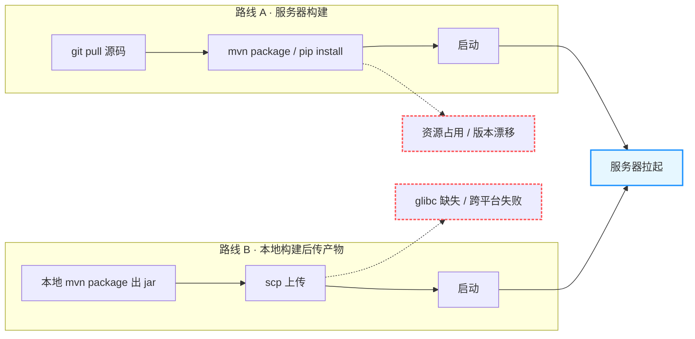

前两篇我们处理的对象都是「一堆 HTML / CSS / JS」——构建产物是文件，部署动作是把文件放进 Nginx 目录。这一篇要迈出新的一步：**当部署对象从「静态文件」变成「需要运行时、依赖库、外部服务的后端进程」时，前两篇的工具还够用吗？哪里不够？**

这一篇围绕两个新问题展开：

1. **在哪构建**：服务器构建，还是本地构建后传产物？
2. **在哪跑**：让进程 24 小时后台挂着：怎么启动 + 怎么脱离终端，让进程在公网反代下持续响应？

## 前后端都是同一种服务器进程

03 篇要解决的问题很具体：**怎么把后端进程（Spring Boot / Flask）像 Nginx 一样稳定挂起**——让客户端访问时不会看到 502。

链路看起来是这样：

```
前端：浏览器 → Nginx(:80/443，公网入口) → 读 dist/ 文件 → 返回 HTML/CSS/JS
后端：浏览器 → Nginx(:80/443，公网入口) → 反代到 :8080 → Java/Python 进程 → 返回 JSON
                                 ↑
                          这一段由 Nginx 维护
                          后端进程一般监听内部端口，不直接暴露公网
```

**这是典型部署示意**——它假设已经用 Nginx 反向代理。但**本篇不要求 Nginx**：后端进程**默认**直接监听 :8080/8000 即可（个人开发者起步、内网服务、K8s 内部都这样）。**当规模上去**、需要软负载 + 网络隔离 + 浏览器跨域规避 + 静态资源代理 + TLS 终止 等能力时，Nginx 才是最佳实践。

**前后端对等**：两者都是云服务器上某个进程在监听端口、读请求、返回响应。区别只在**部署对象类别**：

| 维度 | 前端部署 | 后端部署 |
| --- | --- | --- |
| 部署对象 | `dist/` 文件系统层 | 带运行时的进程（jar / wheel + JVM / Python） |
| 部署动作 | scp 文件到 Nginx 目录 | scp 产物 + 拉起进程 + 监听端口 |
| 进程类型 | Nginx | Java / Python |
| 客户端可见 | Nginx 进程（直接打） | Nginx 反代后的后端进程（客户端只看到 502） |

依赖上看，后端比前端厚一叠：除了 Nginx 这层「系统级」依赖，还要叠加 `pom.xml` / `pyproject.toml` 这层「业务级」依赖，版本要对齐、编译环境要齐备、跨平台要一致。**部署对象从文件系统层抬到带运行时层，是这一篇要讲的关键跃迁**——进程挂起的难度也跟着抬一档，但**运维动作的本质是同一种**（拉起、监听、保活）。

接下来我们要先建立**静态资源 / 动态资源**的概念——这是 03 篇讨论"在哪跑"的前置知识。

## 静态资源与动态资源

Web 服务器按其服务的资源类型分为两类——这是 03 篇讨论"在哪跑"的前置概念。

### 静态资源：Nginx 直接服务

- **服务的对象**：HTML / CSS / JS / 图片 / 字体等文件
- **特点**：文件本身不变化，服务器只做"读文件 → 返回"的动作
- **典型 Web 服务器**：Nginx、Apache、Caddy
- **本系列**：02 篇里 Nginx 已经在做这件事——把 `dist/` 里的文件读出来返回

### 动态资源：Tomcat / gunicorn

- **服务的对象**：请求触发服务端代码 → 动态生成 HTML / JSON 等内容
- **特点**：每次请求都要跑代码、读数据库、调用其他服务
- **典型 Web 服务器**：
  - **Java 侧**：Tomcat（Spring Boot 默认内嵌）
  - **Python 侧**：gunicorn / uvicorn（WSGI / ASGI）
- **本系列**：03 篇要解决的就是这个问题——怎么让动态资源服务稳定挂起

### 静态与动态的核心差别

| 维度 | 静态资源 | 动态资源 |
| --- | --- | --- |
| 服务对象 | 文件（最终形态） | 触发的代码 |
| 服务动作 | 读文件 → 返回 | 跑代码 → 生成内容 |
| 计算成本 | 几乎为 0 | 每次请求都跑 |
| 缓存友好性 | 文件可缓存 | 难缓存（每次结果可能不同） |
| 典型 Web 服务器 | Nginx | Tomcat / gunicorn |

到这里"前端 / 后端"和"静态 / 动态"两个二分法对齐了：前端用 Nginx 处理静态资源，后端用 Tomcat / gunicorn 处理动态资源。

动态资源服务器的具体实现，就是 Java Spring Boot（内嵌 Tomcat）和 Python Flask（用 gunicorn 部署）这两个服务端应用栈——下一节展开。

## 服务端应用开发

03 篇讨论的**服务端应用**，是**承载业务逻辑的进程**——接收请求、调用代码、读数据库、动态生成响应。02 篇里的 Nginx 是同类进程（监听 :80），但处理的是**静态文件**，属基础设施层。03 篇要解决的是这类业务进程怎么挂稳——**默认**直接监听 :8080/8000，不依赖 Nginx 反代。**规模上去时**才考虑 Nginx 反代作为最佳实践——它提供软负载 + 网络隔离 + 浏览器跨域规避 + 静态资源代理 + TLS 终止能力。

当下最流行和常见的两个栈：**Java SpringBoot** 和 **Python Flask**。

### Java SpringBoot

Spring 生态的脚手架——开箱即用，约定大于配置（starter）、Java 后端的事实工业标准。

- **监听端口**：默认 8080
- **依赖声明**：`pom.xml`（Maven）/ `build.gradle`（Gradle）
- **启动命令**：`java -jar app.jar`（内嵌 Tomcat 作为 Servlet 容器）
- **关键优势**：fat jar 把代码、依赖、JDK 运行时打成一个自包含的产物，跨机器传产物最方便
- **关键约束**：JVM 启动 5–15 秒；classpath / 堆内存 / GC 绕不开

### Python Flask

轻量 WSGI 微框架——"小而精"，适合 API / 中小服务。

- **监听端口**：默认 8000（生产用 gunicorn）
- **依赖声明**：`pyproject.toml`（PEP 621 标准）
- **启动命令**：`gunicorn app:app`（生产，WSGI server）/ `python app.py`（仅 dev，Flask 自带 dev server）
- **关键优势**：上手快、生态深
- **关键约束**：跨机器传产物要看 Python 解释器 + 系统库的脸色；C 扩展包（如 `psycopg2`、`numpy`）最易踩坑

### 服务端应用栈基础

Spring Boot 和 Flask 对开发者、运维工程师都是**必须了解的基本知识**——一个跑在 JVM 上、fat jar 自洽；一个跑在 Python 解释器上、虚拟环境与系统库强耦合。

## 三栈构建对比

03 篇（本文）先给两类构建路线把脉，下一篇（04 Git 与 GitHub）会给出「版本管理」这层解法。三栈横向对比：

| 步骤 | 前端（VitePress / Vite） | Spring Boot（Java） | Flask（Python） |
| --- | --- | --- | --- |
| 依赖声明 | `package.json`（npm） | `pom.xml`（Maven） / `build.gradle`（Gradle） | `pyproject.toml`（PEP 621 标准） |
| 依赖管理 | `pnpm install` | `mvn dependency:resolve` / `gradle dependencies` | `pip install -e .` / `uv sync` |
| 构建产物 | `dist/` 静态文件 | 可执行 jar / war | 源码 + 虚拟环境 / `pip freeze` 锁文件 |
| 启动命令 | 无（产物是文件，由 Nginx 读） | `java -jar app.jar` | `python app.py`（生产用 `gunicorn app:app`） |
| 配置文件 | （基本不用） | `application.yml` / `application.properties` | 环境变量 / `config.py` |
| 外部依赖 | （基本没有） | MySQL 驱动、Redis 缓存等 | MySQL 驱动、Redis 缓存等 |

### 两类构建部署路线，相同的痛点

**路线 A · 服务器构建**：`git pull` 源码 → 服务器上 `mvn package` / `pip install` → 启动。

- Maven 首次下载依赖要十几分钟；`pip install psycopg2` 这类带 C 扩展的包需要服务器装 `libpq-dev`。
- 服务器 CPU/内存被构建过程占用，可能影响正在运行的线上服务。
- 本地是 Java 17，服务器是 Java 11——构建直接失败。

**路线 B · 本地构建后传产物**：本地 `mvn package` 出 jar / 本地 `pip install` 出 wheel → 上传 → 服务器启动。

- Spring Boot 的 jar 相对干净（自带依赖），跨机器跑成功率高。
- Flask 的 `pip install` 产物是**针对构建时的操作系统编译的 `.so` 文件**——本地 macOS 编译后上传到 Linux 服务器常常 `GLIBC_2.28 not found`；即便本地是 Linux，挪到镜像 / glibc 版本不一致的服务器同样可能出问题。
- 「在我电脑上能跑」——本地环境 ≠ 服务器环境，本地产物 ≠ 服务器能用的产物。

两种路线都解决不了所有问题。**Spring Boot 因为自带 fat jar 比 Flask 更「可移植」，但两类栈共享同一个根本问题：构建动作和运行环境是割裂的——我们只传了代码和依赖，没传「运行环境本身」。**

**补充说明**：前端**也**有构建路线问题——`npm run build` 也是资源密集型任务（大型 webpack / vite 工程 CPU 内存吃紧）。但**因为前端产物是 `dist/` 静态资源 + 可迁移性强**（HTML / CSS / JS / 字体跨系统一致），**这两个痛点（资源占用 / 跨平台）的影响轻得多**——本地构建后 `scp` 上去即可，与 02 篇的路径完全一致。**前端"也"字背后的逻辑**：产物的强可迁移性**自然补偿**了构建痛点的影响。



<details>
<summary>📐 静态信息图 Prompt（可选升级）</summary>

如需升级为 Notion 极简线稿静态信息图，可喂给 Codex / Antigravity：

​```
Notion style minimalist line art infographic, hand-drawn marker stroke texture.
16:9 aspect ratio.

Left side (蓝色 #1890ff): 路线 A · 服务器构建
  - 流程：git pull 源码 → mvn package / pip install → 启动
  - 痛点：资源占用 / 版本漂移（红色虚线标注）

Right side (橙色 #fa8c16): 路线 B · 本地构建后传产物
  - 流程：本地 mvn package 出 jar → scp 上传 → 启动
  - 痛点：glibc 缺失 / 跨平台失败（红色虚线标注）

Bottom (灰 #8c8c8c): 共同根问题 = 构建与运行环境割裂 → 05 篇 Docker 解决

Clean white background with lots of negative space. No gradients, no 3D effects, no shadows.
​```

预期产物路径：`docs/public/images/img-server-side-deploy/diagram-build-route-a-vs-b.png`
CDN 引用：`https://media.xiaolin.fun/docs/img-server-side-deploy/diagram-build-route-a-vs-b.png`
</details>

## 三类被低估的运维痛点

上面那两类痛点——「构建时长」「跨平台产物不一致」——更多是**技术视角**。真实部署还会撞上**运维视角**的三类问题，跟栈无关，跟「在哪构建」有关。

### 痛点 1 · 服务器会变「脏」

只要走「服务器构建」路线，服务器就不可避免地变脏：

- 装 Java？装 `maven`，配置 `JAVA_HOME` 和 `MAVEN_OPTS`。
- 装 Python？装 `pip`，可能再装 `pyenv`、再装 `virtualenv`。
- 装 Node？装 `nvm`，挂一堆 npm 全局包。

更麻烦的是**版本对齐**：本地 Java 17，服务器也是 Java 17——这条不靠自动工具很难守住。半年后本地的项目换到 Java 21，服务器没升，构建直接失败。**生产服务器成了「另一台开发机」**，还要小心不要让 apt 升级顺手把 JDK 也升级了。

「在服务器上跑业务进程」和「在服务器上装构建工具」是两类完全不同的责任——混在一起，服务器就开始变得不可控。

### 痛点 2 · 构建是重资源任务，进程是轻资源任务

服务器的工作是**运行一个常驻进程**——Spring Boot 应用监听 8080，每秒处理几十个请求，CPU / 内存占用稳定。

构建不一样。`mvn package` 第一次要下载几百 MB 依赖、还要编译 Java 源码；`pip install numpy` 要从源码编译 C 扩展。**编译 / 链接是 CPU 密集 + 内存密集**——短时间把 CPU 打满、内存吃光。

如果在同一台服务器上**边跑线上服务边构建**：

- 构建期间响应延迟飙升
- 极端情况下 OOM（Out of Memory）导致应用进程被内核杀掉
- 更隐蔽：构建过程产生的临时文件、缓存目录、`target/` / `.venv/` 等占用磁盘

把构建和运行**混在同一台机器上**，短期能跑，长期必出问题。

### 痛点 3 · 网络环境不对等

「本地能装的东西，服务器不一定能装」——这不是机器差异，是**网络环境差异**：

- **本地**（Mac / 办公网）：访问 `docker.io`、`registry.npmjs.org`、`repo.maven.apache.org`、`pypi.org` 通常很顺畅。
- **云服务器**（特别是国内云）：上面那些源常常慢、不稳、甚至被墙。要么挂代理，要么换镜像源，要么干脆「构建在本地做，产物传上去」。

这意味着「服务器构建」路线在网络层就多一道门槛——除非你提前配好镜像源 / 私有仓库 / 代理，否则 `mvn package` 等上十几分钟是常态。

### 三类痛点的共同方向

| 痛点 | 表面症状 | 根本原因 |
| --- | --- | --- |
| 服务器变脏 | 包管理器冲突、版本不一致 | 构建工具和运行时共用一台机器 |
| 构建打满资源 | 线上服务卡顿 / OOM | 构建任务和运行任务共享资源 |
| 网络不对等 | 依赖下载慢 / 失败 | 服务器网络环境受限 |

三类痛点指向**同一个方向**：**构建动作不该和运行动作挤在同一台服务器上**。大型企业通常有两条成熟路径——

- **专门的 Build Server / CI Server**（构建机）：资源密集型服务器专门跑构建（CI 流水线或 Build Farm），与运行服务器物理分离
- **容器化（05 篇）**：把"代码 + 依赖 + 运行时"打成一个镜像，服务器只**跑**这个镜像，不再装任何构建工具

两条路径作用维度不同——前者剥离"构建动作"，后者打包"运行环境"——**可以叠加使用**。本系列的渐进路径是**先谈容器化**（更轻、个人开发者起步成本低），后续如果需要再聊 Build Server 的工程实践。

痛感解药——把"代码 + 依赖 + 运行时"打包成镜像——是 05 篇 Docker 的事。眼下的问题更朴素：**服务器上已经构建出来了，怎么让进程稳定挂起、每天 24 小时不挂？**

## 让后端进程稳定挂起 24 小时

后端进程要长期运行——不是"调试一次按 Ctrl+C 退出"那种开发期模式。**默认**进程直接监听 :8080/8000（Spring Boot 默认 8080，Flask + Gunicorn 默认 8000），关了就有 502。**规模上去时**才考虑 Nginx 反代作为最佳实践——它提供软负载 + 网络隔离 + 浏览器跨域规避 + 静态资源代理 + TLS 终止能力。本篇先讲"默认路径"。

启动命令：

```bash
# Spring Boot（通常监听 8080；可走 Nginx 反代，也可直接暴露公网）
java -jar app.jar

# Flask（生产用 gunicorn；通常监听 8000，同上）
gunicorn -w 4 -b 0.0.0.0:8000 app:app
```

启动之后还要管两件事——**前台调通**和**后台挂稳**：

| 维度 | 前端（Nginx） | 后端（Java/Python 进程） |
| --- | --- | --- |
| 进程类型 | 你装的 Nginx（02 篇 `apt install nginx`） | 你启的 JVM / Gunicorn |
| 端口 | 80 / 443（公网） | 8080 / 8000（内部，由 Nginx 反代进来） |
| 部署对象 | 文件系统层（`dist/`） | 带运行时层（jar / wheel + 进程） |
| 启动慢 | 无 | JVM 启动 5–15 秒；Flask/Gunicorn 几乎瞬时 |
| 配置变更 | 极少（站点配置） | DB 连接串、密钥、特性开关（环境变量或配置文件） |
| 日志 | Nginx access log | 应用 stdout + 框架日志（Spring Boot / Flask） |
| 内存管理 | Nginx 自身 worker | JVM 堆内存 `-Xmx`、Python 进程数 |

**前后端对等**：Nginx 也是进程——它一样需要后台挂稳。02 篇里你用 `apt install nginx` 装了它，它默认通过 systemd 拉起；Java / Python 进程和它没有本质不同，只是后端的"后台挂稳"在这一篇才刚开始。

进程从「前台调试」切换到「后台挂稳」的最朴素方式：

```bash
# 临时调试：终端关了就退出
java -jar app.jar

# 临时后台：终端关了仍在跑
nohup java -jar app.jar &

# 后台脱离终端：日志走文件，进程不占前台
nohup java -jar app.jar > /var/log/myapp.log 2>&1 &
```

启动后立即做这两件事：

```bash
# 1. 验证进程在跑
ps -ef | grep java          # Spring Boot
ps -ef | grep gunicorn      # Flask

# 2. 验证可访问
curl -I http://your-public-IP:8080     # Spring Boot 健康检查
curl -I http://your-public-IP:8000     # Flask / Gunicorn

# 3. 排查时抓日志
journalctl -u myapp -n 100 -f           # systemd 方式
tail -f /var/log/myapp.log              # nohup + log 文件方式
```

进程挂了，验证命令先告诉你为什么不挂；下一步再考虑怎么让它自动活过来。

**Spring Boot 独有**：

- JVM 启动慢、预热慢；要理解 classpath、堆内存、GC。
- fat jar 让「跨机器传产物」这条路线**变得可行**——它把代码、依赖、JDK 运行时打成一个自包含的产物。对比 02 篇的 `dist/` 是文件系统层的纯静态文件，jar 已经是**带运行时**的产物，是镜像层前一步。这就是 Spring Boot 的天然优势。

**Flask 独有**：

- Flask 自带的 `app.run()` 是 dev server，**生产环境不能用**（性能差、稳定性差、无并发处理）。
- 生产用 `gunicorn`（同步）或 `uvicorn`（异步 ASGI）这类 WSGI / ASGI server。


## 服务端部署范式

这一篇确立**服务端部署范式**——与 02 篇"前端部署范式"并列：

- **02 篇前端范式**：`dist/` 静态文件 → scp → Nginx 静态资源代理
- **03 篇服务端范式**：构建产物（fat jar / wheel + 依赖声明）→ 进程拉起 → 后台挂着 → 验证 + 排查

详细路径：

**构建产物**（fat jar / wheel + 依赖声明 `pom.xml` / `pyproject.toml`）→ **进程拉起**（`java -jar` / `gunicorn`）→ **后台挂着**（nohup / systemd）→ **验证 + 排查**（`ps -ef` / `curl -I` / `journalctl`）

放到生产部署里，这条路径通常长这样：

**客户端 → Nginx(:80/443) → 反代到 :8080/8000 → 后端进程** —— Nginx 充当"软负载 + 网络隔离 + 浏览器跨域规避 + 静态资源代理 + TLS 终止"多个角色（延伸阅读展开过）

但**本篇不要求 Nginx**——服务端进程**默认**直接监听 :8080/8000 即可。**当规模上去、需要软负载 + 网络隔离 + 浏览器跨域规避 + 静态资源代理 + TLS 终止**时，Nginx 才是最佳实践。**本篇讲的是"后端进程怎么挂稳"**——这条路径与 Nginx 是否启用无关。

这一篇揭示的根本问题：**构建动作和运行环境割裂**——05 篇 Docker 用"把运行时打包成镜像"来根治。


## 小结

这一篇更准确的定位是**范式显式化**：前端和后端在「服务器进程」这件事上是**同一个东西**——区别只在于**部署对象从文件系统层抬到带运行时层**：前端的 `dist/` 是文件，后端的 jar / wheel 是带运行时的产物。**链路结构没变**（用户 → Nginx → 处理 → 返回），变的只是 Nginx 后面那个进程是什么、谁负责拉起、谁负责保活。

前后端都要管这三件事，只是**后端要把它们从「默认隐藏」抬到「显式动作」**：**构建策略**（构建动作在哪做）、**进程生命周期**（启动、监听、重启）、**进程保活**（死了谁拉起）。Spring Boot 自带 fat jar 让产物更可移植，Flask 跨机器则要看 Python 解释器和系统库的脸色——两类栈共同痛点都是「代码 / 依赖 / 运行环境割裂」。

下一步进入 [第 04 篇](./git-github.md)：版本管理解决代码追踪问题，但运行环境一致性需要后续容器化——05 篇的 Docker 将登场。

## 思考

1. Spring Boot 的 `java -jar app.jar` 和 Flask 的 `python app.py` 都启动了，但哪一个在生产环境**不应该用**？为什么？
2. 服务器上 `pip install psycopg2` 失败提示缺 `libpq-dev`，这属于「服务器构建」还是「本地构建」路线的问题？
3. `nohup java -jar app.jar &` 和 `systemctl start myapp` 有什么区别？服务器重启后谁会活下来？
4. 这一篇比前两篇的部署动作多出了**哪一类新动作**？

## 延伸阅读：Nginx 角色的单一职责

前面把前后端统一为"同一种服务器进程"——这是入门理解。更精确地说：**Nginx 在典型部署里同时承担两个角色**。

### Nginx 的两个角色

- **Web 服务器**：处理静态资源（HTML / CSS / JS / 图片 / 字体）
- **反向代理 / 软负载**：把请求转给后端服务（Spring Boot / Flask）

这两个角色在常见部署里**是同一个 Nginx 进程同时承担的**——节省资源，但**把两个职责耦合在同一个进程里**。

### 浅显理解的边界

"前端比后端薄一层"其实是说：前端把"软负载"和"Web 服务器"**合并**在一层里。看起来简单，底层是**复用了软负载 + Web 服务器的双重能力**——这两件事归一个进程，所以"前端那一层"实际承担了后端要做的事的一半。

### 单一职责的最佳实践

把这两个角色**分离**到不同进程或服务：

| 角色 | 承担者 | 职责 |
| --- | --- | --- |
| Web 服务器（静态） | CDN / Nginx / Apache | 只读静态文件 |
| 反向代理 / 软负载 | Nginx / Envoy / HAProxy | 只做流量分发 |
| 业务服务 | Spring Boot / Flask | 处理业务逻辑 |

这样做的好处：

- **职责分离**：每个组件做一件事
- **可替换**：CDN 替代 Nginx 做静态、Envoy 替代 Nginx 做反代，互不干扰
- **可扩展**：静态和动态可以独立扩容

### 现实妥协

对个人开发者 / 小项目而言，**单个 Nginx 同时承担两个角色是务实选择**——省运维、省成本。规模上去后再考虑分离。

## 参考

1. [Spring Boot 官方文档](https://spring.io/projects/spring-boot)
2. [Flask 官方文档](https://flask.palletsprojects.com/)
3. [systemd 单元文件](https://www.freedesktop.org/software/systemd/man/systemd.unit.html)
4. [gunicorn 部署指南](https://docs.gunicorn.org/en/stable/deploy.html)
