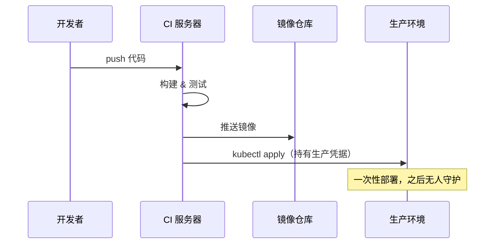
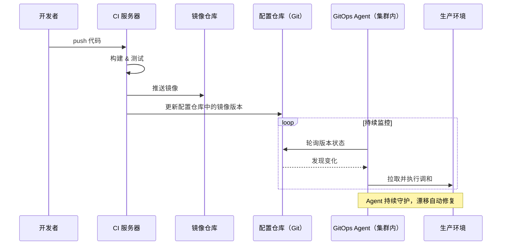

# GitOps，让 Git 成为运维的唯一入口


> GitOps 是独立于 Kubernetes 的运维理念，核心是以 Git 为唯一真相来源、持续调和实际与期望状态。本文从运维、开发、管理三个视角说明 GitOps 解决的具体问题，再深入理念、原则与实践，覆盖从 Docker Compose 到 K8s 的多场景落地方案。

提到 GitOps，很多人第一反应是 Argo CD 和 Kubernetes——这个联想并没有错，它们确实是 GitOps 理念目前最具代表性的落地载体。但 **GitOps 本身是一种运维理念**，Argo CD 和 Kubernetes 是它的实践工具，而不是它的边界。

无论是用 Docker Compose 管理的中小项目，还是用 Terraform 维护的云基础设施，只要遵循"以 Git 作为系统状态的唯一真相来源、通过自动化实现持续调和"这套思路，就是在践行 GitOps。

这篇文章梳理 GitOps 理念本身、它与 IaC 和声明式配置的依赖关系、为何与 Kubernetes 深度耦合，以及从轻量到复杂的落地实践。

关键词：GitOps、DevOps、IaC、声明式配置、CI/CD

## 起源：一次生产故障催生的理念

2014 年，**Alexis Richardson** 与同事在英国伦敦创立了 Weaveworks，专注于降低 Kubernetes 和容器技术的使用门槛。公司核心产品之一是开源工具 **Flux CD**，自身也在大规模运营一套基于 K8s 的 SaaS 平台 Weave Cloud。

在早期的生产实践中，工程师们持续踩坑：

- 团队成员通过 `kubectl` 直接修改集群配置，导致实际运行状态与配置文件频繁脱节——**配置漂移**成了日常隐患
- 一旦出现故障，无法快速确认"生产环境当前到底是什么状态"，回滚依赖重跑旧的 Pipeline，慢且不可靠
- CI 服务器持有集群的高危权限，是长期悬挂的安全隐患

**真正的转折是一次生产事故。** 某次计划变更导致 Weave Cloud 几近瘫痪。工程师们的解法是：找到 Git 中上一个已知稳定的配置版本，重新部署——整个恢复过程**不到一小时**完成。

这次事故让团队意识到：他们无意间已经在践行一套更可靠的工作方式。所有系统状态都存在 Git 里，恢复只需回退 Commit，变更历史清晰可查，权限边界也因此收敛。

Alexis Richardson 随后将这套经验整理命名，于 **2017 年**以博文形式对外发布，正式提出 **GitOps** 这个概念。

> Weaveworks 于 2024 年初停止商业运营，但 Flux CD 作为独立开源项目，仍在 CNCF 社区持续维护。这个概念本身早已超越了提出它的公司。


## 什么是 GitOps

GitOps 的核心只有一句话：**将 Git 仓库作为系统期望状态的唯一真相来源，通过自动化机制持续使实际状态向其靠拢。**

三个关键词：

- **Git 仓库**：配置、基础设施定义、部署描述——统统进 Git，统统走 PR
- **期望状态**：系统应该长什么样，由代码定义，而不是靠人操作出来
- **持续调和**：自动化代理不断对比期望状态与实际状态，发现偏差就修复

这套思路的本质是把"变更操作"从"人手动执行命令"变成"提交代码触发自动化"，把不可追踪的操作记录变成 Git Commit 历史。

## 为什么需要 GitOps

一个系统在生产环境上跑着，但没有人能快速回答"现在线上是什么版本、上次改了什么、是谁改的"——这不是罕见的情况，而是大多数团队的日常。

变更通过各种路径进入生产：有人直接执行了 `kubectl edit`，有人手动上传了配置文件，有人在服务器上改了一行 shell 脚本。每一次"临时操作"都在悄悄让实际状态偏离有记录的期望状态。积累到一定程度，出了故障就很难溯源，回滚更是靠经验和运气。


这种困境有一个共同的根源：**变更的入口太多，且大多数不可追踪。**

GitOps 给出的答案不是更严格的流程管控，而是从架构上消灭问题——把 Git 变成唯一合法的变更入口，让系统通过自动化持续对照 Git 中的定义来修正自身状态。变更有没有经过审批，一眼可查；出了问题能不能快速恢复，有没有明确的回退点，不再依赖某个人的记忆。

这套秩序对不同角色有不同的意义，但它们的底层都是同一个问题的解法。

## 核心原则

理解了 GitOps 能解决什么，再看它依赖哪些原则来实现：

- **声明式（Declarative）**：系统期望状态用声明式语言描述，而非命令式步骤——定义"目标是什么"，而不是"怎么做到"。
- **Git 作为单一真相来源（Single Source of Truth）**：所有配置变更只能通过 PR 进入。禁止直接在生产系统手动执行变更命令——这是 GitOps 的纪律底线。
- **版本化与可审计（Versioned & Auditable）**：每一次变更对应一次 Commit，完整历史即天然审计日志。任意版本可回滚，任意时刻可溯源。
- **持续调和（Continuous Reconciliation）**：自动化代理持续监控实际状态与 Git 中定义的期望状态，发现漂移（Drift）时自动修复，而非等待人工发现后介入。


## 与 IaC、声明式配置的关系

GitOps 建立在两个已有概念的基础之上：

**基础设施即代码（IaC）** 解决"如何用代码描述基础设施"，代表工具是 Terraform、Ansible、Pulumi，使基础设施可版本化、可复现。

**声明式配置** 是描述期望状态而非执行步骤的编写方式，Kubernetes YAML 是最典型的例子，`docker-compose.yml` 也是声明式的。

GitOps 是在这两者之上加了一层**流程规范与自动化闭环**：

```text
IaC（描述能力）
  + 声明式配置（表达方式）
  + Git 工作流（唯一变更入口）
  + 自动化调和（执行闭环）
= GitOps
```

没有 IaC 和声明式配置，系统状态无法被代码完整描述；没有 Git 工作流和调和机制，代码改了也只是代码，不会自动反映到生产环境。

## GitOps 与 Kubernetes 的关系

**GitOps 不需要 Kubernetes，但两者高度契合并非巧合——它们在设计哲学上共享同一套内核。**

Kubernetes 的运作方式是声明式的：YAML 文件好比一份"菜单"，描述的是期望的最终状态，而非烹饪步骤。提交之后，K8s 的控制器（Controller）负责持续对比"菜单上写的"与"厨房里实际跑着的"，不断调整直到两者一致——这个过程就是控制循环（Reconciliation Loop）。

GitOps 在此之上又加了一层相同的循环：Git 仓库中的某一次 Commit，代表了整个系统的期望部署状态。GitOps Agent（Argo CD、Flux CD）持续对比"Git 里定义的"与"集群中实际运行的"，发现偏差就触发同步。

两层调和叠在一起，构成了从代码到运行容器的完整链路：

```text
Git 仓库状态
    │  GitOps Agent 调和（Argo CD / Flux CD）
    ▼
Kubernetes 集群配置（YAML / Helm Chart）
    │  K8s Controller 调和
    ▼
实际运行的容器与服务
```


这就是为什么"K8s + GitOps"在实践中如此自然，它们是同一种哲学在不同层次的一致体现。

不过 GitOps 不只属于 K8s，相同的思路适用于任何能被声明式代码描述的系统：

| 场景 | 声明式描述 | 调和机制 |
|------|-----------|---------|
| Docker Compose 项目 | `docker-compose.yml` 存 Git | CI 脚本 SSH 到服务器执行 `docker compose up -d` |
| 云基础设施 | Terraform `.tf` 文件 | Atlantis 或 Terraform Cloud 自动 Plan & Apply |
| 服务器配置管理 | Ansible Playbook | AWX / Semaphore 自动执行 |
| Serverless 函数 | SST / Pulumi 配置文件 | 对应平台的 CD 流程 |

**GitOps 的门槛不是 K8s，而是"系统状态能否被声明式代码完整描述"。**

## 与传统 CI/CD 的根本差异

在展开之前，先回答一个常见的疑问：**Argo CD 算不算 CI/CD？**

算。Argo CD 是标准的 CD（持续部署）工具。但它实现 CD 的方式和传统 CI/CD 有根本的不同——这正是理解 GitOps 的关键所在。

### Push 模式：传统 CI/CD

传统 CI/CD 是一条**事件驱动的流水线**：代码提交触发 CI 构建，构建成功后 CI 服务器持有集群凭据，主动将新版本"推"进生产环境。Pipeline 是整个交付流程的主体和指挥者。



这个模式的问题在于：CI 服务器需要持有生产环境的高危操作权限；部署完成后没有人持续检查实际状态是否"还和部署时一样"，配置漂移无人察觉。

### Pull 模式：GitOps

GitOps 把逻辑反转了。CI 的职责收窄到"构建镜像 + 更新配置仓库"，不再直接碰生产环境。生产环境内部运行一个 Agent（Argo CD / Flux CD），持续监控 Git 仓库的版本状态，一旦发现 Git 中的期望状态与集群实际状态不一致，就主动拉取并执行调和。



外部系统对生产环境只有 Git 的读权限，生产环境的写操作完全由内部 Agent 自主完成。

### 两种模式的本质差异


| 维度 | 传统 CI/CD（Push） | GitOps（Pull） |
|------|-------------------|----------------|
| 交付主体 | Pipeline 是指挥者，主动 Push | Git 状态是真相，Agent 持续对齐 |
| 权限模型 | CI 服务器持有生产高危凭据 | Agent 在内部，外部只需 Git 读权限 |
| 部署触发 | 事件驱动（代码提交触发流水线） | 状态驱动（Git 版本与实际状态不一致即触发） |
| 状态一致性 | 部署后无持续守护，易漂移 | 控制循环持续对比，漂移自动修复 |
| 审计追踪 | 依赖 Pipeline 日志 | Git Commit 即完整审计链路 |
| 故障回滚 | 重跑旧 Pipeline | `git revert` 一键回滚 |

**GitOps 不是替代 CI/CD，而是重新定义了 CD 的主体**：从"Pipeline 说部署就部署"，变成"世界应该和 Git 保持一致，Agent 负责让它成真"。CI 做集成与构建，CD 做状态对齐与调和——职责边界更清晰，安全边界也更收敛。


## 工具选型（K8s 场景）

在 Kubernetes 环境中，Argo CD 和 Flux CD 是最主流的两个 GitOps 工具，均为 CNCF 毕业项目：

| 维度 | Argo CD | Flux CD |
|------|---------|---------|
| 界面 | 功能完整的 Web UI，可视化友好 | 无内置 UI，依赖 CLI + Grafana 看板 |
| 上手难度 | 对新手友好，概念清晰 | 更 K8s 原生，需熟悉 CRD 模式 |
| 多集群管理 | 内置项目隔离和多集群支持 | 通过资源组合实现，更灵活 |
| 适合场景 | 应用层部署，团队需要可视化看板 | 平台工程，基础设施层，高度定制 |

## 总结

GitOps 是从一次真实的生产故障中提炼出来的运维理念，而非凭空设计的方法论。它的核心逻辑简单而有力：把 Git 仓库的版本状态作为系统的唯一真相，依靠自动化 Agent 持续守护实际状态与之对齐，把不可追踪的手工操作变成可审计的代码变更。

这套理念与 Kubernetes 高度契合，但边界远不止于此。无论是 Docker Compose 的小项目还是云原生的大集群，只要系统状态能被声明式代码描述，GitOps 就能在此之上建立起秩序——变更有记录，漂移能自愈，故障可回溯。引入的不是一个工具，而是一套可信赖的交付纪律。


## 参考资料

- [GitOps: What You Need To Know - Atlassian](https://www.atlassian.com/git/tutorials/gitops)
- [What is GitOps? - Red Hat](https://www.redhat.com/en/topics/devops/what-is-gitops)
- [GitOps - Weaveworks（原文博客，2017）](https://www.weave.works/blog/gitops-operations-by-pull-request)
- [The Story of GitOps - CDW](https://www.cdw.com/content/cdw/en/articles/cloud/the-story-of-gitops.html)
- [Argo CD Documentation](https://argo-cd.readthedocs.io/)
- [Flux CD Documentation](https://fluxcd.io/docs/)
- [CNCF GitOps Working Group Principles](https://github.com/open-gitops/documents/blob/main/PRINCIPLES.md)
- [Alexis Richardson - GitOps & Weaveworks（Semaphore CI 访谈）](https://semaphoreci.com/blog/2021/06/14/gitops.html)