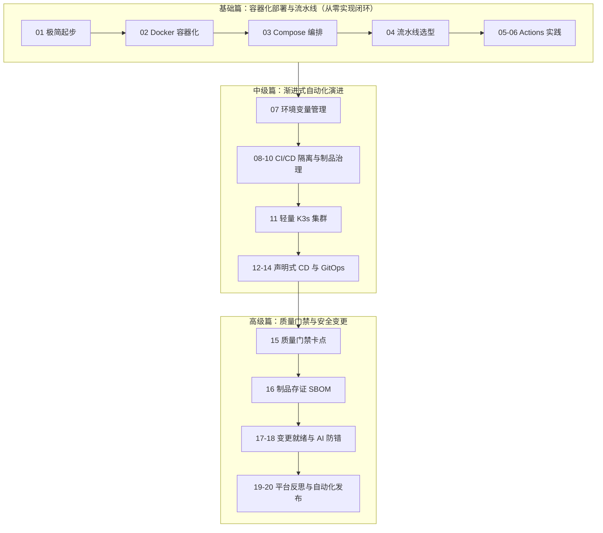

DevOps 方法论与实践经验。本站 DevOps 板块设计了「**双轨并行、五阶递进**」的渐进式运维学习路线，帮助团队和个人以最低的学习与维护成本，低心智负担地推进自动化运维落地。

---

## 渐进式运维学习路线图

---

## 专栏文章目录

### 1. 开篇词
*   [00 ｜ 渐进式运维导读](./cicd/progressive-devops-intro.md) — 探寻中小团队与个人开发者的渐进式 DevOps 演进路径。

### 2. 基础篇：容器化部署与流水线（从零实现闭环）
以容器化、Docker Compose 多服务编排与 GitHub Actions 流水线为核心，从零实现自动化交付闭环。

| 序号 | 核心文章 | 说明 |
| :--- | :--- | :--- |
| **01** | [01 ｜ 极简交付闭环起步](./foundation/delivery-start.md) | 从零构建极简交付闭环的起点与目标规划 |
| **02** | [02 ｜ 应用容器化实践](./foundation/docker-practice.md) | 容器化技术演练：将静态站点打包进 Docker |
| **03** | [03 ｜ 多服务容器编排](./foundation/docker-compose.md) | 声明式多服务治理：Docker Compose 容器编排 |
| **04** | [04 ｜ 流水线工具选型](./foundation/pipeline-tools.md) | DevOps 工具链选型：常见 Pipeline 工具对比 |
| **05** | [05 ｜ Actions 基础](./foundation/actions-basic.md) | 云原生流水线起步：GitHub Actions 核心概念 |
| **06** | [06 ｜ Actions 实战](./foundation/actions-practice.md) | 工作流自动化编写与 GitHub Actions 实战调试 |

### 3. 中级篇
拒绝过度工程，引入低成本、无痛的标准化自动化及声明式发布。

| 序号 | 核心文章 | 说明 |
| :--- | :--- | :--- |
| **07** | [07 ｜ 环境变量配置管理](./cicd/environment.md) | 12-Factor 配置与代码分离：环境变量深度实践 |
| **08** | [08 ｜ CI/CD 权责分离](./cicd/cicd-separation.md) | DevOps 权责边界设计：持续集成与发布的分离 |
| **09** | [09 ｜ 持续集成流水线](./cicd/ci-pipeline.md) | 不可变基础设施落地：持续集成实战流水线 |
| **10** | [10 ｜ 私有镜像仓库治理](./cicd/harbor-source-control.md) | 容器制品源治理：私有 Harbor 搭建与版本晋级 |
| **11** | [11 ｜ 轻量 K3s 集群](./cicd/k3s.md) | 轻量级云原生集群：K3s 容器服务低成本落地 |
| **12** | [12 ｜ 持续发布流水线](./cicd/cd-pipeline.md) | 自愈集群部署：持续发布 (CD) 流水线生产落地 |
| **13** | [13 ｜ 交付边界与灰度](./cicd/what-is-cd.md) | 交付边界探索：持续发布与部署交付的灰度策略 |
| **14** | [14 ｜ GitOps 发布实践](./cicd/gitops.md) | 声明式状态自愈：云原生 GitOps 架构设计与落地 |

### 4. 高级篇
构筑发布防御红线，通过质量门禁、存证、AI 防错确保系统极高可用性。

| 序号 | 核心文章 | 说明 |
| :--- | :--- | :--- |
| **15** | [15 ｜ 质量门禁卡点设计](./cicd/quality-gate.md) | 流水线质量门禁 (Quality Gate) 防御机制设计 |
| **16** | [16 ｜ 制品防篡改与 SBOM](./cicd/sha-SBOM.md) | 制品哈希防篡改与软件物料清单 (SBOM) 存证 |
| **17** | [17 ｜ 变更管控就绪清单](./cicd/change-management.md) | 发布防御红线：变更管理与就绪条件审查清单 |
| **18** | [18 ｜ 变更防错与 AI 价值](./cicd/change-control.md) | 发布准入防线：AI 在变更安全阻断中的价值 |
| **19** | [19 ｜ 一站式平台反思](./cicd/devops-platform.md) | 一站式 DevOps 平台的心智反思与架构演进 |
| **20** | [20 ｜ 全局自动化发布](./cicd/cloud-native-cicd.md) | 搞定无状态应用、数据库及静态文件的全自动化发布 |

### 5. 加餐篇
典型场景的部署案例与核心运维基础。

| 序号 | 核心文章 | 说明 |
| :--- | :--- | :--- |
| **21** | [21 ｜ 静态网页发布](./cicd/front-dist.md) | Web 静态站点发布实战与 CDN 部署 |
| **22** | [22 ｜ Spring 应用部署](./cicd/spring.md) | Spring Boot 服务端开发部署与 JVM 优化 |
| **23** | [23 ｜ 多模块 Git 协作](./cicd/git-submodule.md) | Git Submodule 父子项目协作与依赖同步 |
| **24** | [24 ｜ SRE 核心能力](./cicd/devops-core.md) | SRE 运维能力建设与系统性容灾图谱 |

---

## 专栏：Exception 异常架构（00～08）

从架构原则到编程落地，覆盖异常分类、处理策略、模块规划与全局集成。先修阅读：[异常处理指南](/sre/architecture/exception-guide)。

| 序号 | 文章 | 说明 |
| --- | --- | --- |
| 00 | [异常设计 00：四项核心原则](./exception/exception-00.md) | 系列开篇，确立设计原则 |
| 01 | [异常设计 01：基础概念与机制](./exception/exception-01.md) | 异常机制与基础概念 |
| 02 | [异常设计 02：异常分类体系与边界](./exception/exception-02.md) | 分类体系与边界 |
| 03 | [异常设计 03：异常抛出时机与原则](./exception/exception-03.md) | 何时抛、如何抛 |
| 04 | [异常设计 04：声明式处理理念](./exception/exception-04.md) | 声明式处理理念 |
| 05 | [异常设计 05：系统性处理的思维革命](./exception/exception-05.md) | 从单点到体系 |
| 06 | [异常设计 06：异常模块规划与文件结构](./exception/exception-06.md) | 文件结构与模块划分 |
| 07 | [异常设计 07：异常类与错误码设计](./exception/exception-07.md) | 类层次与错误码 |
| 08 | [异常设计 08：全局异常处理器项目集成](./exception/exception-08.md) | 系列终篇，一行集成 |
