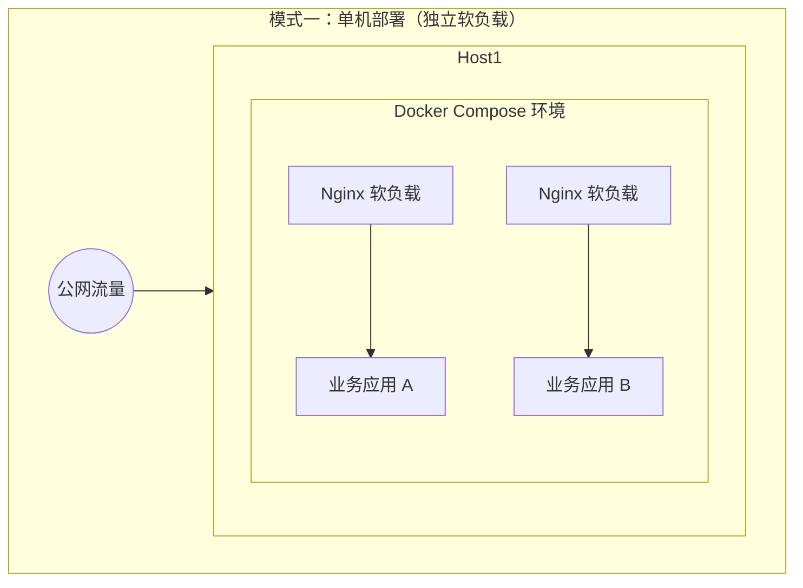
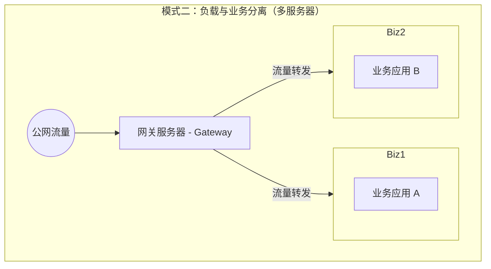
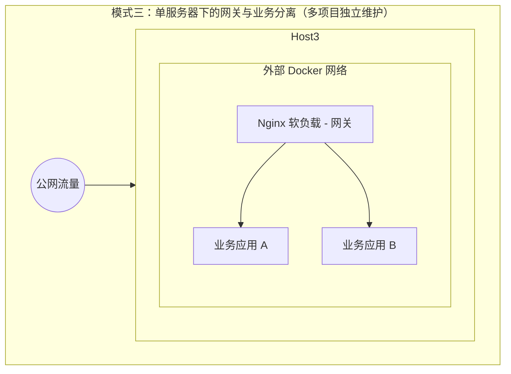

# 两台服务器，撑起多个项目


独立开发者手握多个项目，云服务器怎么选？怎么部署？SSL 证书和备案怎么搞？本文是我作为独立开发者给出的实践路线。

## 写在前面

AI 技术的发展给个人开发者送来了春风，我在工作之外的闲暇时间，也积极在 OPC（One Person Company，一人公司）上做探索尝试。现在已经维护了 2 个网站、一款微信小程序，另一款微信小程序在开发进程中。

不是大厂，也不是初创团队，只是一个人写代码、运营、维护。面对云服务商密密麻麻的产品列表，我既不需要 K8s 集群，也不想花大价钱买闲置算力，我只想花最少的钱，把项目稳稳跑起来。

起初我只有一台轻量应用服务器，运行着我的个人网站，后来随着业务增加，我又购买了一台同配置服务器，运行微信小程序。只有一台服务器，可以跑多个项目吗？答案是肯定的。然而，从我的实践来看，2 台服务器是个人开发者比较理想的配置。

一台**网关节点**，承担公网暴露、证书签发、流量转发的功能；一台**业务节点**，运行静态资源网站、小程序、Flask 后端等。本文围绕我实际探索经验，分享四个关键决策：**服务器选型、部署方案、HTTPS 证书、ICP 备案**，希望能给后来者提供借鉴或参考。

## 服务器选型

服务器选型可以从多个角度来考虑。以个人开发者的视角，不用考虑大规模集群部署，前期也不需要考虑多中心与高可用。应优先关注**价格**和**运维方便性**，其次关注性能和扩展性。在服务器选型上，可以仅从 Serverless 和 云服务器上做选择。前者无需关注基础设施运维，仅支持按需付费（相对更贵），后者可以提供更大的灵活性，也更便宜（支持包月包年）。

因此个人开发者前期（甚至很长一段时间）应聚焦在云服务器上即可，不要被 Serverless 概念迷惑。

### 类型选择

市面上的云服务器主要分两类：

- **轻量应用服务器**（如阿里云轻量云服务器、腾讯云 Lighthouse）
- **标准云服务器**（如阿里云 ECS、腾讯云 CVM）

参考腾讯云给出的轻量应用服务器与云服务器 CVM 的主要区别和优势：


从技术实现上，我对两种云服务器的理解更多应该从**运维复杂度**角度考虑：

**轻量应用服务器（Lighthouse）：开箱即用的“全家桶”。在技术实现上，它通过简化 VPC 网络和存储配置，把计算、存储、带宽做成了高度绑定的套餐。它的最大魅力在于**灵活性和极低的学习成本。我可以通过镜像市场随时更换预装了环境的系统（比如今天想研究 Python，可以一键重装为预装环境的镜像；明天想换成宝塔面板，也是点点鼠标的事）。对于处于探索期的个人项目，它更像是一个随取随用的灵活实验室。

**标准云服务器（ECS）：云原生时代的“原子节点”。ECS 才是真正的云计算基石，它是**弹性、可编排的。从架构上看，它是大规模集群中的一个独立节点。它构建在私有网络（VPC）体系下，能够无缝连接弹性负载均衡（SLB）、弹性伸缩（Auto Scaling）和云存储。当你的业务需要大规模水平扩展，或者需要精细化的网络编排（比如构建复杂的内网安全组规则、连通多个存储节点）时，ECS 是唯一的正解。

对于像我这样的一人公司（OPC）而言，**轻量应用服务器是我的生产首选**，轻量的控制台极大精简了运维负担，且价格更便宜。虽然 ECS 看起来架构更高级，但对于一人公司而言，没有必要。

### 特惠购买

价格受活动影响较大，我的做法是在“开发者特惠”或“新用户首购”渠道入手，新账号首单价格通常最低，且直接买 3 年时长，锁定成本。

> 推荐链接，感谢大家使用我的推荐码完成购买，可以获得折扣优惠。

【腾讯云】<https://cloud.tencent.com/act/cps/redirect?redirect=2446&cps_key=aaaf112808363649bce6cd8e70ae6fbd&from=console>

【阿里云】<https://www.aliyun.com/minisite/goods?userCode=d1pmxxar>

| 厂商  | 产品         | 配置               | 年付价格  |
| --- | ---------- | ---------------- | ----- |
| 阿里云 | 轻量应用服务器    | 2 核 2G，          | 68 元起 |
| 腾讯云 | Lighthouse | 4 核 4G，300GB 流量包 | 99 元起 |

## 部署方案

在技术选型上，我已经在前些文章中描述过使用：Docker Compose + GitHub Actions。更进一步，我在面临部署方案时的思考，实现灵活扩展。

### 模式一：单机部署（独立软负载）



只有一台云服务器时，所有的负载均衡和业务应用都混跑在同一个环境中，通常是在同一个 Docker Compose 文件中：

```yaml
networks:
  tiny-sparrow-network:
    external: false
services:
  # 软负载
  nginx-gateway:
    image: nginx:alpine3.20-perl
    container_name: nginx-gateway
    ports:
      - "443:443"
    networks:
      - tiny-sparrow-network
    volumes:
      # 设置目录挂载
      - ./nginx.conf:/etc/nginx/conf.d/default.conf
      - ./cert:/etc/nginx/cert

  # VitePress 静态网站
  vitepress-website:
    image: ghcr.io/xxx/yyy:latest
    container_name: vitepress-website
    volumes:
      - ./volumes/website/logs:/var/log/nginx
    networks:
      - tiny-sparrow-network
    environment:
      # 设置中国时区
      TZ: Asia/Shanghai
```

其中 `nginx-gateway` 是软负载，`vitepress-website` 是业务应用。这种模式的好处是运维简单，可迁移性好，运维心智负担几乎为零。然而，当我需要再多部署一个相对独立系统时，比如我的小程序，就没有那么方便了。面临的问题：

- 443/80 端口已被占用
- 每一个业务应用都需要部署独立的 Nginx 软负载，存在资源浪费。

### 模式二：负载与业务分离（多服务器）



> 建议网关和应用物理分离，但部署在同一台服务器上也是能够实现的

如果我有 2 台服务器，使用*模式一*我可以轻松部署 2 个应用，不必再折腾。当我再需要再增加一个业务应用时，难道再购买一台服务器？我当前运行的 2 台云服务器已经存在资源冗余（没多少访问量），因此需要一种新的部署方案，可以部署更多的应用。

下面介绍**网关与业务分离**的架构，这也是我目前推崇的“一人公司”稳健型架构。

> 作为网关的软负载不止是 Nginx，但是 Nginx 更流行且完全够用

- **网关节点（Gateway）**：其中一台服务器作为外网的**唯一入口**。它仅部署 Nginx 软负载，对外部流量作转发，不跑具体的业务逻辑，就像是整套系统的“门卫”。
- **业务节点（Business Nodes）**：其他的服务器（如我的第二台开发/生产备份机）专门用于运行业务应用。

这种架构的优势有：

- **网络安全性**：业务应用服务器可以不暴露公网网络（甚至可以不挂公网 IP），仅通过私有网络（VPC）接收来自网关的流量。
- **高可用**：如果某个项目访问量突增，我可以很方便地在第二台、第三台服务器上部署镜像，网关只需要增加 upstream 配置即可，不再受限于单台机器的 CPU 和内存。
- **利于扩展**：新部署的业务应用，在网关中注册然后在业务节点上启动进程。

这种分离模式让我能以极低的成本，在云端模拟出大厂“外网入口 + 私有子网”的架构，兼顾了安全和灵活。

```text
server {
    server_name app-a.example.com;
    location / {
        proxy_pass http://10.2.0.1:8080;
    }
}

server {
    server_name app-b.example.com;
    location / {
        proxy_pass http://10.2.1.2:8080;
    }
}
```

这套“网关 + 业务应用”的组合，是我实际在用的方案——简单、够用、易维护，不为用不到的复杂性付代价。

每个业务应用的接入层都在网关节点上，流量转发配置以及下章节要配置的 HTTPS 证书都要在其上设置和更新。

### 模式三：单服务器下的网关与业务分离（多项目独立维护）



即使只有一台服务器，也可以实现类似模式二的网关与业务分离架构，同时保持各项目的独立维护。通过创建外部 Docker 网络，我们可以在单台服务器上实现多项目间的通信：

#### 实现步骤

1. **创建外部网络**：

   ```bash
   docker network create app-network
   ```

2. **在网关项目中引用该网络**：

   ```yaml
   # nginx-gateway 项目的 docker-compose.yml
   networks:
     app-network:
       external: true
   
   services:
     nginx-gateway:
       image: nginx:alpine3.20-perl
       container_name: nginx-gateway
       ports:
         - "443:443"
       networks:
         - app-network
       volumes:
         - ./nginx.conf:/etc/nginx/conf.d/default.conf
         - ./cert:/etc/nginx/cert
   ```

3. **在业务应用 A 项目中引用该网络**：

   ```yaml
   # app-a 项目的 docker-compose.yml
   networks:
     app-network:
       external: true
   
   services:
     app-a:
       image: ghcr.io/xxx/app-a:latest
       container_name: app-a
       networks:
         - app-network
   ```

4. **在业务应用 B 项目中引用该网络**：

   ```yaml
   # app-b 项目的 docker-compose.yml
   networks:
     app-network:
       external: true
   
   services:
     app-b:
       image: ghcr.io/xxx/app-b:latest
       container_name: app-b
       networks:
         - app-network
   ```

这种模式的优势：

- **项目隔离**：每个应用作为独立项目维护，代码仓库、配置和部署流程都相互独立，降低了耦合度
- **灵活性**：可以单独部署或更新某个应用，不会影响其他应用
- **网络共享**：通过外部网络实现了应用间的通信，同时保持了项目的独立性
- **扩展性**：新应用可以轻松加入到现有网络中，无需修改其他项目的配置
- **资源利用率高**：所有应用共享同一个 Nginx 软负载，避免了模式一中的资源浪费

这种模式特别适合多项目独立维护的场景，是个人开发者在单台服务器上实现架构清晰分离的理想选择。

## HTTPS 证书

HTTPS 是绕不过去的，微信小程序、App 接口都强制要求。好消息是，免费证书方案早就成熟了，我一分钱没花，使用腾讯云的免费证书搞定。

### 云服务器厂商提供的免费证书

如果你只需要为一两个独立的域名开启 HTTPS，直接使用云厂商提供的免费证书是最省心的做法。目前国内开发者最常用的三家厂商均提供了免费的 DV SSL 证书申请额度：

- **腾讯云 (TrustAsia)**：这是我目前用得最多的。在SSL证书控制台可以申请单域名免费证书，一个账号能申请 50 张。它的好处是如果你的域名也在腾讯云，一键部署和 DNS 验证极快。
- **阿里云 (DigiCert)**：同样提供单域名免费证书，免费 20 张。阿里云的优势在于其生态，如果你使用了阿里云的 SLB 或 CDN，证书分发非常顺滑。
- **华为云 (TrustAsia)**：流程与前两家大同小异，适合在该平台有资源存量的项目。

腾讯云申请免费 SSL 证书：


阿里云个人测试证书介绍：


**提醒**：免费证书仅支持绑定一个域名，不支持通配符子域名。另外，从 2024 年中开始各大云厂商的免费证书有效期已从原来的 1 年普遍缩短至 **3 个月（90 天）**。这意味着每年需要“折腾”四次。如果项目域名很多，这种手动管理的成本会迅速上升。

### acme.sh + Let's Encrypt

正因为云厂商免费证书的有效期缩短，我才更推荐那种能够自动续期的方案。

`acme.sh` 是一个跑在服务器上的自动化工具，直接从 Let's Encrypt 申请证书。它最大的优势是支持**泛域名证书**（即 `*.example.com`），一个证书搞定所有的子域名。

- **自动化**：配合 DNS API 和 Crontab，证书到期前会自动更新并重载 Nginx。
- **一劳永逸**：配好一次，后续不管增加多少个子域名，都不需要再申请新证书。

云厂商方案胜在“开箱即用”，有一定精力的开发者可以花点时间折腾一下 `acme.sh`。

## ICP 备案

这是我做 OPC 初期最没底的一块，在中国大陆的服务器上跑项目，ICP 备案是法定要求，网站、小程序都逃不掉。核心原则只有一条：**先备案，后上线**。

> 对于个人开发者，在互联网上提供服务限制很大，仅能提供博客、个人作品展示、基础查询等，个体工商户、企业的权限会更大一些。

### 备案主体梳理

我目前面对的备案场景有三种：

| 项目类型  | 备案入口           | 备注           |
| ----- | -------------- | ------------ |
| 网站    | 云服务商备案控制台      | 需挂备案号于页脚     |
| 微信小程序 | 微信公众平台开发者后台    | 备案号自动同步展示    |
| App   | 应用分发平台 / 工信部系统 | 需提供 App 服务域名 |

### 标准流程

云服务器厂商提供备案服务，根据其提示指引完成即可。

### 备案后必做的两件事

备案完成并不等于合规结束，这两件事很容易被忽略：

1. **网站页脚悬挂备案号**：必须链接至工信部备案查询页面 `beian.miit.gov.cn`，否则属于违规
2. **公安联网备案**：网站/小程序开通后 **30 日内**，需在「全国互联网安全管理服务平台」完成公安联网备案，这是 ICP 备案之外的额外要求，腾讯云服务器备案页面有提醒。

AI持续运维，网站底部 ICP 备案和公安备案：


## 总结

这是我目前在跑的那套组合：

| 环节       | 我的方案         | 核心价值        |
| -------- | ------------ | ----------- |
| 服务器选型    | 轻量应用服务器，包年付费 | 锁定低价，避免续费溢价 |
| 部署方案     | 网关节点 + 业务节点  | 简单可靠，多项目隔离  |
| HTTPS 证书 | 腾讯云免费证书      | 开箱即用，简单方便   |
| ICP 备案   | 提前规划，三信息一致   | 合规经营，避免强制下线 |

资源是有限的，但决策决定上限。作为 OPC，不应该在基础设施上内耗——选够用的，用对的，把精力留给真正有价值的事情。

***

## 参考

- [阿里云轻量应用服务器产品页](https://www.aliyun.com/product/swas)
- [acme.sh DNS API 文档 - GitHub](https://github.com/acmesh-official/acme.sh/tree/master/dnsapi)
- [ICP 备案流程 - 阿里云帮助中心](https://help.aliyun.com/zh/icp-filing/)
- [小程序 ICP 备案说明 - 微信开放文档](https://developers.weixin.qq.com/miniprogram/product/record/)

***

关键词：独立开发者、云服务器、Docker Compose、ICP 备案、HTTPS 证书

***

**文章概述（86字）：**
AI 送风，一人公司（OPC）正当时。做过 2 个网站、2 款小程序的我，总结了一套两台云服务器搞定全栈运维的实战方案。从技术角度详解选型差异，到 Docker 部署、全自动证书与备案避坑，手把手带你压榨每一分云成本。