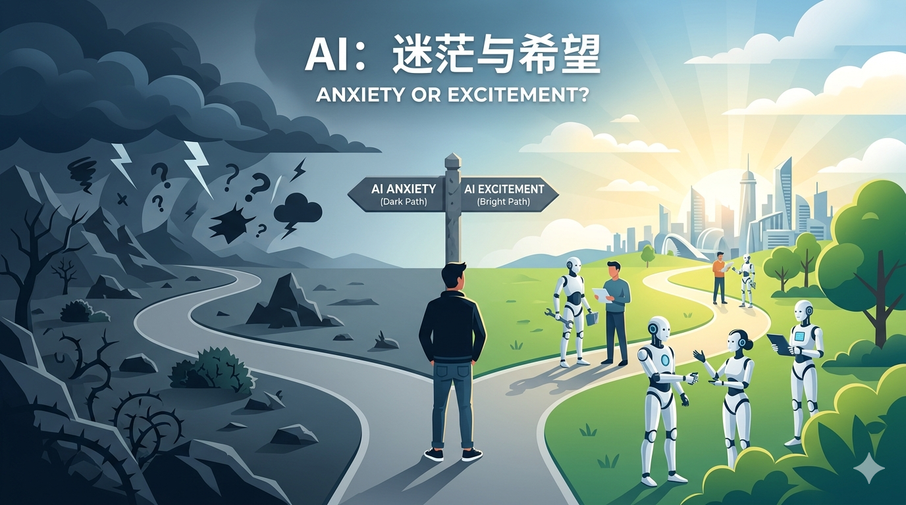
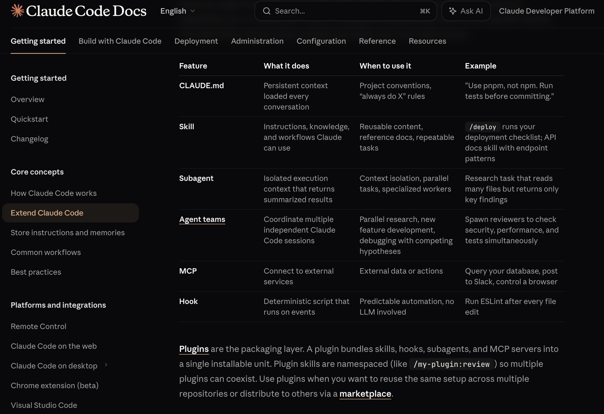
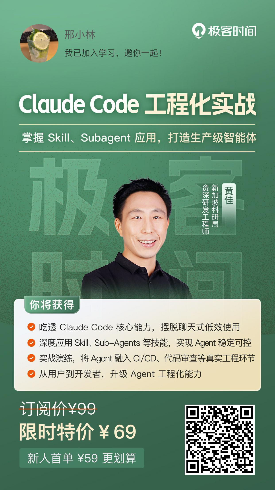

# AI 焦虑与彷徨｜越学习越无知，却越兴奋

---

先明确两个概念：AI 焦虑，是担心自己的工作被 AI 抢走，怕失业；AI 彷徨，则是面对 AI 技术爆炸般的发展，不知道该学什么、怎么学的迷茫。

举个通俗的例子：就像和竞争对手在同一条赛道上跑步。你拼尽全力跑了 2 天，他花了 20 天，你们之间拉开了 18 天的差距。本以为胜券在握，可 AI 技术突然往前迭代了一步——就像给对手装了个火箭助推器，18 天的差距他 10 分钟就追上了。更扎心的是，你之前跑的那些路，可能变成了技术债务，反而成了负担。

现在很多人都有这种感觉：AI 发展太快了，每天都很焦虑。现在做的很多工作，比如简单的 CRUD、脚本编写、问题排查、文档整理、重复性的业务开发，AI 已经能完成一大半，甚至比人写得更快、更规范。越用越慌，总觉得自己现在这套技能，再过一两年就彻底没用了，岗位迟早会被 AI 替代，到时候更被动。不是不努力，也不是不想学，就感觉学了也没用，越学越迷茫，不知道该往哪个方向补，每天上班都被"被替代"的恐惧感压着，心态已经扛不住了。

---

关键词：AI、彷徨、焦虑、职业危机、技术变革

*特别说明：本文是笔者与 AI "结对编程"式写作的产物。AI 是我的协作者，而我作为主导者，对文章质量负责。* 

## 越学习越无知

最近几个月，一直在实践和探索 AI 技术，从最初的兴奋到后来的迷茫，再到现在的清醒。这种感觉可以用一句话概括：越学习越无知。

“AI 的能力被自媒体夸大了”，而我的观点却截然相反，我认为 AI 的能力远超想象。它能理解复杂的业务逻辑，能生成完整的系统架构，甚至能辅助进行产品决策。但越深入，越发现自己的无知：AI 的技术栈太庞大了，从基础的 Prompt Engineering，到高级的 RAG、Fine-tuning，再到前沿的 Agent、Multi-Agent，每一个领域都需要深入学习。

更让人困惑的是，AI 技术的迭代速度太快了。今天刚学会的技能，明天可能就过时了；今天还在讨论的最佳实践，明天可能就被新的方法取代。这种"学不完"的焦虑，让人陷入深深的彷徨。

大模型是通用人工智能的基石，就如同英特尔 CPU 是通用计算机的基石，这是一个里程碑式的突破。通用人工智能的独特之处在于，其表达和扩展能力完全取决于业务方的想象力和创造力，技术本身只是提供了无限可能的基础。

## 从 AI 彷徨到 AI 兴奋

但换个角度想，AI 带来的不只是焦虑，更是前所未有的机会。

以前，一个全栈开发工程师想要独立完成一个项目，至少需要半年时间：前端、后端、数据库、部署、运维，每个环节都需要投入大量精力。现在，借助 AI 工具，一个人就可以完成整个项目：AI 辅助生成前端代码、后端接口、数据库设计，甚至可以自动化部署到云平台。

最近尝试用 AI 工具开发一个微信小程序，从需求分析、UI 设计、功能开发到测试上线，只用了两周时间。如果用传统方式，至少需要 2-3 个月。更重要的是，AI 工具让开发效率提升了 10 倍以上，而且代码质量、规范性都达到了专业水平。

同样的，想要开发一个 iOS 应用并上架 App Store，以前需要组建一个完整的团队：产品经理、UI 设计师、前端开发、后端开发、测试工程师。现在，借助 AI 工具，一个人就可以完成所有工作：AI 辅助设计 UI、生成代码、编写测试用例、准备上架材料。

这种"一人公司"的模式，让个人开发者拥有了前所未有的创造力和执行力。AI 不是在替代人类，而是在放大人类的能力边界。从 AI 彷徨到 AI 兴奋，关键在于转变思维：不要把 AI 当作竞争对手，而要把它当作最强大的协作者。

## 系统性学习

面对 AI 技术的快速发展，很多人选择在抖音、视频号、小红书等平台学习 AI。这些平台的内容确实丰富，但大多是碎片化的知识，缺乏系统性。

短视频的优势是快速获取信息，但缺点也很明显：内容浅尝辄止，缺乏深度；信息过载，难以筛选；容易形成"懂了"的错觉，实际应用时却无从下手。更重要的是，这些平台的内容大多是"术"的层面，很少涉及"道"的层面——即 AI 的基础理论和底层原理。

相比之下，系统性学习更有价值。比如，Claude Code 官方文档提供了完整的技术栈说明、最佳实践指南、API 参考手册，这些都是经过精心设计和验证的知识体系。

另外，根据我们公司采购的付费平台，在极客时间也会学习课程，都是大佬们的精品课。第一，文字课程能让阅读者专注度更高，吸收程度更高；第二，每节课会留有课后问题，评论区也会有志同道合的人回答评论，可以互相学习进步。

推荐一个我最近学习的 Claude Code 课程。

系统性学习的优势在于：知识结构清晰，便于建立完整的认知框架；内容深度足够，能够理解底层原理；实践导向强，能够快速应用到实际项目中；持续更新，能够跟上技术发展的步伐。

## 与 AI 共舞：行动起来

AI 素养不是某一项具体的技术，而是一种综合能力，包括：对 AI 技术的理解能力、使用 AI 工具的能力、评估 AI 输出的能力、与 AI 协作的能力。

### 1. 理论学习：理解底层原理

深入理解大模型的基本理论，包括 transformer(Decoder-Only) 架构、注意力机制、token 化等核心概念。这些理论是理解大模型工作原理的基础，只有理解了这些基础，才能更好地使用 AI 工具，才能在 AI 出现问题时进行有效的调试和优化。

**实践建议**：
- 学习大模型相关的入门教材和官方文档
- 关注 Anthropic 和 OpenAI 这两家先驱的技术博客和研究论文
- 订阅阿里、字节、腾讯国内大厂的微信公众号，获取最新的 AI 技术动态和案例分享

### 2. 编程实践：多 IDE 体验与通用工具探索

编程实践是提高 AI 素养的关键。通过使用不同的 AI IDE，可以学习不同的产品理念和侧重点，全面了解 AI 工具的能力边界。

当前，AI IDE 已经从编程工具延伸到通用工具，几乎所有能力都可以实现：
- **画图**：生成 UI 设计、架构图、流程图
- **写作**：生成代码注释、技术文档、产品文案
- **PPT 制作**：生成演示文稿、数据可视化
- **数据分析**：处理和分析业务数据
- **问题排查**：辅助定位和解决技术问题

使用多款 AI IDE 也有成本投入上的考虑，每家都有月度免费额度，要把都消耗掉。

我非常建议定一个 AI 编程目标，比如说开发一个微信小程序，或者小的 iOS 应用。或许是没有什么创意的玩具项目，但这是一个很好的开始，会带来应用上架时满满的成就感，或许也有一些收益。

## 结语

AI 时代已经到来，我们无法选择逃避，只能选择拥抱。从 AI 彷徨到 AI 兴奋，关键在于转变思维：不要把 AI 当作竞争对手，而要把它当作最强大的协作者。

AI 可以放大我们的能力，但不能替代我们的判断。AI 可以生成代码，但不能替代我们的架构设计；AI 可以分析数据，但不能替代我们的业务洞察；AI 可以提供方案，但不能替代我们的决策。

未来的竞争，不是人与 AI 的竞争，而是"会用 AI 的人"与"不会用 AI 的人"的竞争。提高 AI 素养，掌握 AI 工具，与 AI 协作，才能在 AI 时代立于不败之地。

越学习越无知，但这正是进步的开始。保持好奇心，保持学习力，保持开放的心态，与 AI 共舞，创造更大的价值。
